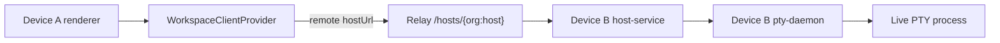

# Remote Workspace Terminal Attach Design

## Product Model

Remote Workspace Attach treats the device that created a Workspace as the owner
of files, git state, terminal sessions, and agent processes. Other signed-in
devices are clients of that owner host.

No local worktree is created as part of remote attach. If a future flow wants a
local copy, it should be a separate "Clone locally" action.

## Runtime Flow

1. Renderer reads the cloud `v2Workspaces` row.
2. `useWorkspaceHostTarget(workspaceId)` resolves whether the owning `hostId`
   is local or remote.
3. Local workspaces use the current host-service URL.
4. Remote workspaces use `${relayUrl}/hosts/${buildHostRoutingKey(orgId, hostId)}`.
5. Workspace-scoped tRPC calls and terminal WebSockets run through
   `WorkspaceClientProvider`.
6. Terminal panes attach to `/terminal/:terminalId?workspaceId=...`.

## Data And Contracts

- Cloud DB remains the source of truth for `v2Workspaces`, `v2Hosts`, and
  `v2UsersHosts`.
- Host-service SQLite remains the source of truth for actual local project,
  workspace, and terminal process/session state on the owning host.
- Existing host-service `terminal.listSessions({ workspaceId })` should be used
  to discover attachable terminal sessions for the selected workspace.
- Existing `GET /terminal/:terminalId` WebSocket should be used for attach.
- Existing relay auth/access checks remain the remote authorization boundary.
- `v2_remote_control_sessions` is not required for the MVP because same-account
  remote attach can use normal authenticated host relay access. It can later
  support share links, audit sessions, command-only mode, or viewer counts.

## UI Surfaces

### Workspace Route

- Preserve existing route identity: `/v2-workspace/$workspaceId`.
- If `hostId` is remote, show a clear remote owner indicator where workspace
  host status is already surfaced.
- If the remote host is offline or unreachable, render an actionable unavailable
  state instead of creating local panes or silently failing.

### Terminal Sessions

- Background terminal/session UI should query the current workspace host URL,
  not assume the local host.
- When an existing remote session is selected, add/focus a Terminal pane with
  the remote `terminalId`; the pane's WebSocket URL already comes from
  `useWorkspaceWsUrl`.
- Do not call `createSession` when adopting an existing session.

### Task Detail Properties

- The Properties sidebar should contain its controls within its width.
- Long names must truncate in the trigger, not expand the sidebar.
- Right-side action buttons must remain visible and clickable at the current
  sidebar width.

## Compatibility

- Existing local Workspace and Terminal flows should remain unchanged because
  local host URL resolution still returns the active local host-service URL.
- Remote attach requires the owner machine to be online and running
  host-service. A packaged app quit may stop host-service depending on current
  runtime supervision; this task does not add always-on background host
  supervision.
- Work machine can use the feature after installing a build with this change,
  signing into the same account, and reaching the same public API/relay/backend.

## Risks

- Relay WebSocket token handling must remain redacted and authenticated.
- A remote host can be online in cloud presence but temporarily unreachable via
  relay; UI should handle this as unavailable.
- Terminal byte path must stay binary. Do not add JSON/base64 terminal output
  transformations.
- Desktop Automation cannot simulate two physical machines by itself; lower
  level host URL/router tests plus one real-app UI smoke are the reliable local
  gate, followed by manual two-machine validation on canary.
