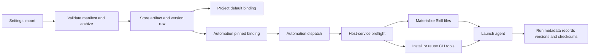
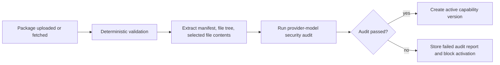

# Skill And CLI Management Design

## Product Shape

Use one underlying "capability package" system with two initial types:

- `skill`: static agent context, rooted at `SKILL.md`.
- `cli`: executable tooling, installed into a managed runtime directory.

The UI may present separate tabs, but the backend should share package import,
versioning, checksum, binding, and runtime materialization logic.

## Settings UI

The Settings page should behave like a readable capability library, not a raw
package inspector. The first screen should answer:

- What does this Skill or CLI help me do?
- Where can I use it?
- Is it enabled and safe to use?
- What do I need to configure before using it?

Technical fields remain available, but they are not the default reading path.

Recommended IA:

```text
Settings
  Editor & Workflow
    Agents
    Tools & Skills
    Terminal
    Models
```

Page layout:

```text
Tools & Skills
----------------------------------------------------------------
[Import] [Search...] [All] [Skills] [CLI Tools] [Used] [Unused]

Left/list library                    Right/detail panel
----------------------------------------------------------------
Weibo Hot Search  CLI   Safe          Title, type, enabled, safety badge
  Fetch trends                      Readable one-line summary
WPS Teacher      Skill Safe          Overview | How to use | Config | Details
  Teaching docs
```

List rows should show name, type, short description, active state, security
status, and usage count. Avoid leading with slug, checksum, raw version ids, or
archive internals.

Detail header:

```text
[WPS Teacher Assistant] [Skill] [Enabled] [Security passed]
Helps teachers draft, clean up, and review WPS teaching documents.

[Disable] [Delete]
```

Detail tabs:

```text
Overview | How to use | Configuration & permissions | Versions & details
```

Overview tab:

- Render Markdown through the shared desktop `MarkdownRenderer`, matching the
  Automation run result reading experience.
- Prefer `manifest.display.overviewMarkdown`.
- Fall back to README.md or selected Skill markdown when a package does not
  provide display Markdown.
- Show intended users, common use cases, and examples in plain language.

How to use tab:

- Skill: show activation guidance, supported agents, suitable Projects or
  Automations, and example tasks.
- CLI: show user-facing command cards first. Each card has an action title,
  description, and friendly examples. Raw command lines can sit inside a
  collapsible "Command examples" area.

Configuration & permissions tab:

- Show required information with human labels, for example "Weibo Cookie"
  instead of only `WEIBO_COOKIE`.
- Show whether the package needs network access, workspace file access, login
  secrets, or runtime installation.
- Explain runtime install in product language: "Installed automatically inside
  each Automation's managed directory" rather than global package-manager
  language.

Versions & details tab:

- Visualize common manifest fields as labeled metadata.
- Show source, version history, usage, and update state.
- Put file list, checksum, artifact sha, and raw manifest JSON behind an
  advanced disclosure.

Security audit:

- Show a compact status badge in the header and list.
- Normal statuses: passed, failed, pending, needs review, unavailable.
- Do not show provider/model identifiers in the ordinary Settings UI.
- Show readable audit summary/findings only when failed/warning/pending or when
  the user explicitly opens the report.

Import dialog:

```text
Step 1: Source
  - Drop zip
  - Git URL
  - Local folder/repo

Step 2: Validate
  - readable overview preview
  - visual manifest summary
  - detected type/version/checksum
  - CLI actions and required configuration
  - security status badge and readable findings
  - advanced archive details

Step 3: Add
  - import as new package
  - update existing package as a new version
  - resolve name conflict
```

Project settings should expose a compact "Default tools & skills" section.
Automation create/detail should expose a compact capability picker. Full
package inspection stays in Settings.

## Automation Create And Detail UX

Automation screens are for choosing runtime inputs, not inspecting packages.
They should reuse the same capability library data but present it as a compact
task configuration control.

Create dialog footer:

```text
[Device] [Project] [Schedule] [Runner] [Model] [Tools: 2 selected]   Cancel  Create
```

Picker content:

```text
Tools & Skills
Search...

[All] [Skills] [CLI]

Selected
  WPS Teacher Assistant       Skill   Security passed
  System Health CLI           CLI     Security passed

Available
  Weibo Hot Search            CLI     Security passed
  Fetch Weibo hot search rankings for scheduled reports.
```

Picker rules:

- Show active packages with passed audits as selectable.
- Show disabled, failed, pending, or needs-review packages only when useful for
  explanation, and keep them disabled with a clear status.
- Search over name, summary, slug, and keywords.
- Show readable name, type badge, security badge, and one-line summary.
- Do not show raw manifest JSON, checksums, archive paths, install commands, or
  audit provider/model ids.
- Include a subtle route to Settings for importing or managing packages, but do
  not make users leave the Automation flow to choose existing approved packages.

Project default behavior:

- Project settings own default Tools & Skills for that project.
- When the user selects a Project while creating an Automation, the dialog
  preselects that Project's enabled defaults.
- Creation still writes explicit Automation bindings with pinned version ids.
- Later Project default changes do not mutate existing Automation bindings.
- If the user changes Project context after editing selected tools, preserve the
  user's explicit edits unless they choose to apply the new Project defaults.

Detail sidebar:

```text
Details
  Device          This Mac
  Context         Algebra Class Materials
  Repeats         Every weekday at 9:00 AM
  Runner          Codex
  Model           GPT-5.5
  Tools & Skills  WPS Teacher Assistant, System Health CLI
  Timezone        Asia/Shanghai
```

The Tools & Skills row opens the same picker. Empty state copy should be short,
for example "No tools selected." Full package overview, versions, raw manifest,
disable/delete, and import remain in Settings.

## Package Format

Canonical zip layout:

```text
superset.capability.json
skill/
  SKILL.md
  ...
tool/
  package.json
  src/
  bin/
README.md
```

MVP uses one zip per capability. The manifest `type` is either `skill` or
`cli`; only the matching payload directory is active. A package should not
define multiple Skills, multiple CLIs, or a mixed Skill+CLI bundle in the first
implementation.

Common manifest fields:

```json
{
  "manifestVersion": 1,
  "id": "weibo-hot-search",
  "type": "cli",
  "name": "Weibo Hot Search",
  "version": "0.1.0",
  "description": "Fetch and format Weibo hot search rankings.",
  "entry": "tool",
  "keywords": ["weibo", "trends"],
  "author": "internal",
  "homepage": "https://example.com",
  "license": "UNLICENSED",
  "display": {
    "summary": "Fetch current Weibo hot search rankings for content planning.",
    "overviewMarkdown": "## What it does\n\n- Fetches current hot searches\n- Exports Markdown or JSON\n- Works well for scheduled trend digests",
    "intendedUsers": ["Content operators", "Editors"],
    "useCases": ["Daily trend monitoring", "Topic research"]
  }
}
```

Common display fields are optional but strongly recommended. Import should
extract and persist normalized display data so Settings can render package
details without downloading the archive each time.

Skill extension:

```json
{
  "type": "skill",
  "entry": "skill",
  "skill": {
    "entryFile": "SKILL.md",
    "targets": ["codex", "claude", "opencode"],
    "activation": "Use when the task needs Weibo trend analysis.",
    "categories": ["Research", "Writing"]
  }
}
```

CLI extension:

```json
{
  "type": "cli",
  "entry": "tool",
  "cli": {
    "install": {
      "strategy": "node",
      "commands": ["bun install --frozen-lockfile"]
    },
    "commands": [
      {
        "name": "weibo-hot",
        "bin": "weibo-hot",
        "title": "Fetch Weibo hot searches",
        "description": "Fetch current Weibo hot search rankings.",
        "examples": ["Fetch the top 20 trends as JSON"],
        "commandExamples": ["weibo-hot --limit 20 --format json"]
      }
    ],
    "env": [
      {
        "name": "WEIBO_COOKIE",
        "label": "Weibo Cookie",
        "required": false,
        "secret": true,
        "description": "Optional cookie for authenticated endpoints."
      }
    ],
    "network": true
  }
}
```

Validation rules:

- Manifest must be valid JSON and match the type-specific schema.
- `id` is slug-like and stable.
- `version` should be semver-like for display and comparison.
- `display.summary`, `display.overviewMarkdown`, `display.intendedUsers`, and
  `display.useCases` should be validated when present and truncated to safe
  display limits.
- README.md and Skill markdown extraction should be bounded by size and stored
  as sanitized display input, not treated as trusted HTML.
- All paths are relative, normalized, and inside the archive root.
- Reject absolute paths, `..`, unsafe symlinks, device files, and duplicate
  normalized paths.
- Enforce max file count, max per-file size, and max total package size.
- Hash the original archive and the normalized manifest.

## Data Model

Cloud PostgreSQL:

```text
capabilities
  id
  organization_id
  owner_user_id
  type                  skill | cli
  slug
  name
  description
  current_version_id
  status                active | disabled
  created_at
  updated_at

capability_versions
  id
  capability_id
  version
  manifest
  display_summary
  overview_markdown
  extracted_readme_markdown
  artifact_url
  artifact_sha256
  artifact_size_bytes
  source_type           zip | git | local_folder
  source_ref
  validation_summary
  audit_status          pending | passed | failed
  audit_model_provider_id
  audit_model_id
  audit_summary
  audit_findings
  created_by_user_id
  created_at

project_capabilities
  project_id
  capability_id
  capability_version_id
  enabled
  config
  created_at
  updated_at

automation_capabilities
  automation_id
  capability_id
  capability_version_id
  enabled
  config
  display_order
  created_at
  updated_at
```

`display_summary`, `overview_markdown`, and `extracted_readme_markdown` are
derived at import time from manifest `display`, README.md, and Skill content.
They are for Settings display only; runtime materialization still uses the
immutable artifact and manifest.

The zip-first Settings refinement can store the same normalized display data in
`validation_summary.display` before these columns are promoted into a generated
database migration. Promote to first-class columns when the product needs
server-side search/filtering over overview or audience fields.

Host-local state can live in the host-service local SQLite DB or in the managed
Automation directory. A local table is preferable for listing install status:

```text
host_capability_installs
  id
  host_id
  automation_id
  capability_version_id
  artifact_sha256
  install_dir
  status                installed | failed | installing
  error
  installed_at
  last_used_at
```

The install directory remains under the Automation directory even if the status
table is local.

## Runtime Layout

```text
~/.superset/dev/automations/<automationId>/
  capabilities/
    manifest.json
    archives/
      <capabilityVersionId>.zip
    skills/
      <slug>/
        SKILL.md
        ...
    tools/
      <slug>/
        package/
        install/
        bin/
        tool.md
        install-state.json
  runs/
    <runId>.prompt.md
    <runId>.metadata.json
    <runId>.stdout.log
    <runId>.stderr.log
```

`capabilities/manifest.json` is the host-service snapshot of selected package
versions for this Automation. `runs/<runId>.metadata.json` references the
snapshot and selected versions, but does not copy packages or secrets.

## Agent Runtime Contract

The Automation runner should tell the selected agent about Tools & Skills in
two complementary ways.

Execution environment:

```text
PATH=<automation>/capabilities/tools/system-health/bin:$PATH
SUPERSET_CAPABILITIES_DIR=<automation>/capabilities
SUPERSET_CAPABILITY_MANIFEST=<automation>/capabilities/manifest.json
```

- CLI packages expose generated shims in managed `bin` directories, and those
  directories are prepended to `PATH`.
- Skill packages are written to native agent discovery paths when supported, or
  kept in `capabilities/skills/<slug>` with prompt context as fallback.
- The generated manifest is machine-readable and contains selected capability
  ids, version ids, names, types, checksums, materialized paths, and generated
  docs paths. It must not contain secret values.

Prompt context:

```markdown
# Available Tools & Skills

Superset prepared these approved capabilities for this Automation.

Skills:
- WPS Teacher Assistant 1.0.0: use for drafting and reviewing WPS teaching docs.

CLI tools:
- system-health 1.0.1: inspect CPU, memory, and disk status.
  Example: system-health --json

Capability manifest:
/.../capabilities/manifest.json
```

The prompt block should be concise and action-oriented. It should list what the
agent can use and where generated docs live, rather than dumping package
manifests or archive internals into the user prompt.

## Runtime Flow



## Skill Materialization

Use provider-specific paths where known:

- Codex: managed `CODEX_HOME/skills/<slug>` or the current Codex integration's
  equivalent per-run home.
- Claude: `.claude/skills/<slug>/SKILL.md`.
- OpenCode: `.opencode/skills/<slug>/SKILL.md`.
- Antigravity/Gemini-style workspace skills: `.agents/skills/<slug>/SKILL.md`
  when applicable.
- Fallback: `capabilities/skills/<slug>` plus generated context text in the
  prompt/tool brief.

The exact mapping should be implemented near host-service agent launch logic so
it can use the selected `agent` and launch configuration.

## CLI Materialization

For each selected CLI version:

1. Verify local archive checksum or download it.
2. Extract into `capabilities/tools/<slug>/package`.
3. If install state matches version/checksum, reuse it.
4. Otherwise run the declared install strategy in a managed directory.
5. Write shims into `capabilities/tools/<slug>/bin`.
6. Prepend all selected `bin` directories to `PATH`.
7. Generate a `tools.md` or JSON manifest explaining commands and examples.
8. Add a concise tool summary to the Available Tools & Skills prompt block.
9. Add capability metadata to run metadata.

The first iteration should support a small set of strategies:

- `node`: use bundled Bun or configured Node package manager.
- `python`: use `uv` or `pipx` style isolated install if available.
- `binary`: mark packaged executable files as runnable inside the managed dir.

Arbitrary install commands are a product/security decision, not just an
implementation detail.

## API Boundaries

Cloud tRPC/API:

- `capability.list`
- `capability.get`
- `capability.importZip`
- `capability.auditImport`
- `capability.createVersion`
- `capability.disable`
- `capability.delete`
- `capability.listUsage`
- `capability.setProjectDefaults`
- `capability.setAutomationBindings`

Automation API changes:

- `createAutomationSchema` and `updateAutomationSchema` should accept pinned
  capability version ids or a structured binding payload.
- Dispatch should include selected capabilities in the relay payload to
  `agents.runAutomation`.

Host-service API changes:

- Extend `automationAgentRunInputSchema` with selected capability versions and
  signed/downloadable artifact references or a cloud API token path to fetch
  them.
- Add a materialization module that runs before model injection and agent
  launch.

## Security Audit Flow

Every Skill and CLI import must pass a pre-admission audit before it becomes
bindable:



Audit inputs should include:

- manifest
- file tree
- `SKILL.md` or tool docs
- package manager scripts and declared install commands
- CLI entrypoints and shell scripts
- suspicious files sampled by extension and size
- requested env/secrets and network flag

Audit outputs should be structured:

```json
{
  "status": "passed",
  "risk": "low",
  "summary": "No dangerous install behavior detected.",
  "findings": [],
  "model": {
    "providerId": "openai-provider-id",
    "modelId": "gpt-5.5"
  }
}
```

Do not hardcode `gpt-5.5` into DB or validators. Treat it as an example of the
preferred class of audit model. The selected model should come from model
provider configuration or a small audit-model policy resolver. Provider/model
ids are stored for internal auditability but are not shown in the normal
Settings UI.

## Compatibility

- Existing Automations continue to run with an empty capability set.
- Existing `mcpScope` remains separate. MCP can later become another
  capability type, but this task should not merge it prematurely.
- Existing model provider `capabilities` JSON is unrelated and should not be
  reused for package management.

## Open Risks

- CLI packages execute code. UX must make trust explicit, and host-service must
  never install into global locations.
- LLM security audit is useful but not a sandbox. It should block obvious
  malicious packages and produce reviewable findings, while runtime isolation
  still controls where packages can write.
- Uploading large zip archives over tRPC JSON may be a poor fit. Existing image
  upload uses Vercel Blob helpers; package archive upload may need a generalized
  blob upload route.
- Git/local-folder import has more edge cases than zip import. Zip-first keeps
  the MVP shippable.
- Automation runs may race on first install. Use lock files or local DB
  `installing` state to avoid duplicate installs.
