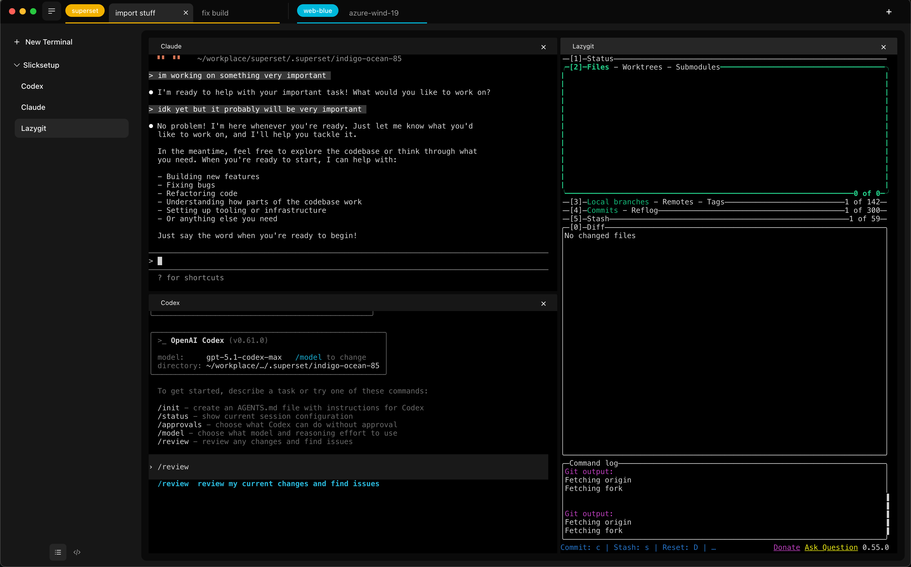

<!-- Improved compatibility of back to top link: See: https://github.com/othneildrew/Best-README-Template/pull/73 -->
<div align="center">


<h3 align="center">Superset</h3>
  <p align="center">
    The last developer tool you'll ever need
  </p>

[](https://x.com/superset_sh)

</div>

## Motivation
What do you do when your coding agent is running? Our answer is to start another coding task in parallel. The best developer can run 10+ tasks in parallel. 

With Superset, you can run 100.

## What you can do with Superset:

- [X] Create and organize parallel coding environment
- [X] Get notified when an agent needs your review
- [ ] Share context between agents
- [ ] Code on the go with a cloud environment
- [ ] Automate reviewing and feedback
- [ ] Create and manage Git pull requests



## Getting Started

Prerequesite:


Install dependencies:
```bash
bun install
```

Run in dev mode:
```bash
bun install
bun run dev
```

Build for release:
```bash
bun run build
open apps/desktop/release
```

> [!NOTE]  
> While Electron is cross-platform, Superset Desktop has only been built and tested on **macOS**. Other platforms are currently untested and may not work as expected.

### Usage

For each parallel tasks, Superset uses git worktree to clone a new branch on your machine. 

Automate copying env variables, installing dependencies, etc. through the app or with a setup script `./superset/setup.json`

<!-- [TODO: Add Image] -->
<!--  -->
<br>

Each workspace gets their own organized terminal system. You can create default presets.

<!-- [TODO: Add Image] -->
<!--  -->
<br>

Superset monitors your running processes, notify you when changes are ready, and help coordinate between multiple agents. 

<!-- [TODO: Add Image] -->
<!--  -->
<br>

### Tech Stack


[](https://www.electronjs.org/)
[](https://reactjs.org/)
[](https://tailwindcss.com/)

[](https://bun.sh/)
[](https://turbo.build/)
[](https://vitejs.dev/)
[](https://biomejs.dev/)

[](https://orm.drizzle.team/)
[](https://neon.tech/)
[](https://trpc.io/)


## Contributing

If you have a suggestion that would make this better, please fork the repo and
create a pull request. You can also
[open issues](https://github.com/superset-sh/superset/issues).

See the [CONTRIBUTING.md](CONTRIBUTING.md) for instructions and code of conduct.

<a href="https://github.com/superset-sh/superset/graphs/contributors">
  
</a>

## Cookbook

See tips and motivation under `docs`: [docs/cookbook/README.md](docs/cookbook/README.md).

## Follow Us
- [](https://x.com/avimakesrobots)
- [](https://x.com/flyakiet)
- [](https://x.com/saddle_paddle)

## License

Distributed under the Apache 2.0 License. See [LICENSE.md](LICENSE.md) for more
information.

<!-- https://www.markdownguide.org/basic-syntax/#reference-style-links -->

[superset-twitter]: https://x.com/supersetdev
[kiet-twitter]: https://x.com/flyakiet
[satya-twitter]: https://x.com/saddle_paddle
[avi-twitter]: https://x.com/avimakesrobots
[contributors-shield]: https://img.shields.io/github/contributors/superset-sh/studio.svg?style=for-the-badge
[contributors-url]: https://github.com/superset-sh/superset/graphs/contributors
[forks-shield]: https://img.shields.io/github/forks/superset-sh/studio.svg?style=for-the-badge
[forks-url]: https://github.com/superset-sh/superset/network/members
[stars-shield]: https://img.shields.io/github/stars/superset-sh/studio.svg?style=for-the-badge
[stars-url]: https://github.com/superset-sh/superset/stargazers
[issues-shield]: https://img.shields.io/github/issues/superset-sh/studio.svg?style=for-the-badge
[issues-url]: https://github.com/superset-sh/superset/issues
[license-shield]: https://img.shields.io/github/license/superset-sh/studio.svg?style=for-the-badge
[license-url]: https://github.com/superset-sh/superset/blob/master/LICENSE.txt
[linkedin-shield]: https://img.shields.io/badge/-LinkedIn-black.svg?logo=linkedin&colorB=555
[linkedin-url]: https://www.linkedin.com/company/superset-sh
[twitter-shield]: https://img.shields.io/badge/-Twitter-black?logo=x&colorB=555
[twitter-url]: https://x.com/supersetdev
[discord-shield]: https://img.shields.io/badge/-Discord-black?logo=discord&colorB=555
[discord-url]: https://discord.gg/hERDfFZCsH
[React.js]: https://img.shields.io/badge/react-%2320232a.svg?logo=react&logoColor=%2361DAFB
[React-url]: https://reactjs.org/
[TailwindCSS]: https://img.shields.io/badge/tailwindcss-%2338B2AC.svg?logo=tailwind-css&logoColor=white
[Tailwind-url]: https://tailwindcss.com/
[Electron.js]: https://img.shields.io/badge/Electron-191970?logo=Electron&logoColor=white
[Electron-url]: https://www.electronjs.org/
[Vite.js]: https://img.shields.io/badge/vite-%23646CFF.svg?logo=vite&logoColor=white
[Vite-url]: https://vitejs.dev/
[product-screenshot]: assets/brand.png