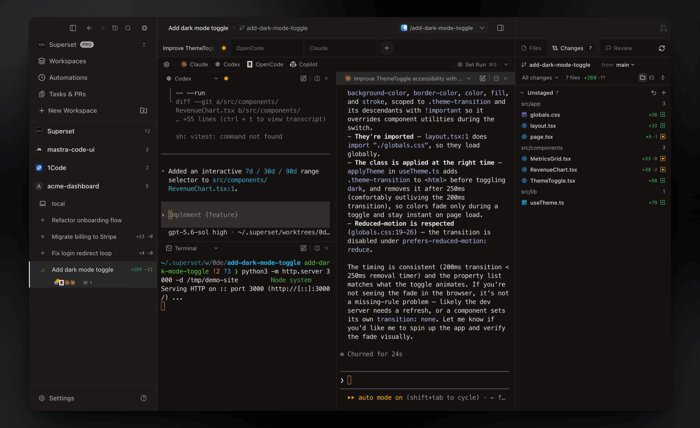

<div align="center">



### The Code Editor for AI Agents

**Fork [quueli/superset-windows](https://github.com/quueli/superset-windows)** — Windows 10+ desktop builds, cross-platform `postinstall`, and Windows CI workflows. Upstream: [superset-sh/superset](https://github.com/superset-sh/superset).

[](https://github.com/quueli/superset-windows/stargazers)
[](https://github.com/quueli/superset-windows/releases)
[](LICENSE.md)
[](https://x.com/superset_sh)
[](https://discord.gg/cZeD9WYcV7)

<br />

Orchestrate swarms of Claude Code, Codex, and more in parallel.<br />
Works with any CLI agent. Built for local worktree-based development.

<br />

[**Windows installer (x64)**](https://github.com/quueli/superset-windows/releases/latest) &nbsp;&bull;&nbsp; [**macOS (upstream)**](https://github.com/superset-sh/superset/releases/latest) &nbsp;&bull;&nbsp; [Documentation](https://docs.superset.sh) &nbsp;&bull;&nbsp; [Changelog (upstream)](https://github.com/superset-sh/superset/releases) &nbsp;&bull;&nbsp; [Discord](https://discord.gg/cZeD9WYcV7)

<br />


</div>

## Code 10x Faster With No Switching Cost

Superset orchestrates CLI-based coding agents across isolated git worktrees, with built-in terminal, review, and open-in-editor workflows.

- **Run multiple agents simultaneously** without context switching overhead
- **Isolate each task** in its own git worktree so agents don't interfere with each other
- **Monitor all your agents** from one place and get notified when they need attention
- **Review and edit changes quickly** with the built-in diff viewer and editor
- **Open any workspace where you need it** with one-click handoff to your editor or terminal

Wait less, ship more.

## Features

| Feature | Description |
|:--------|:------------|
| **Parallel Execution** | Run 10+ coding agents simultaneously on your machine |
| **Worktree Isolation** | Each task gets its own branch and working directory |
| **Agent Monitoring** | Track agent status and get notified when changes are ready |
| **Built-in Diff Viewer** | Inspect and edit agent changes without leaving the app |
| **Workspace Presets** | Automate env setup, dependency installation, and more |
| **Universal Compatibility** | Works with any CLI agent that runs in a terminal |
| **Quick Context Switching** | Jump between tasks as they need your attention |
| **IDE Integration** | Open any workspace in your favorite editor with one click |

## Supported Agents

Superset works with any CLI-based coding agent, including:

| Agent | Status |
|:------|:-------|
| [Amp Code](https://ampcode.com/) | Fully supported |
| [Claude Code](https://github.com/anthropics/claude-code) | Fully supported |
| [OpenAI Codex CLI](https://github.com/openai/codex) | Fully supported |
| [Cursor Agent](https://docs.cursor.com/agent) | Fully supported |
| [Gemini CLI](https://github.com/google-gemini/gemini-cli) | Fully supported |
| [GitHub Copilot](https://github.com/features/copilot) | Fully supported |
| [OpenCode](https://github.com/opencode-ai/opencode) | Fully supported |
| [Pi](https://github.com/badlogic/pi-mono/tree/main/packages/coding-agent) | Fully supported |
| Any CLI agent | Will work |

If it runs in a terminal, it runs on Superset

## Requirements

| Requirement | Details |
|:------------|:--------|
| **OS** | **Windows 10+ x64** (builds from this fork). macOS / Linux — same as upstream. On Windows, run `git config --global core.longpaths true` **before** cloning to avoid long-path errors. |
| **Runtime** | [Bun](https://bun.sh/) v1.0+ |
| **Version Control** | Git 2.20+ |
| **GitHub CLI** | [gh](https://cli.github.com/) |
| **Caddy** | [caddy](https://caddyserver.com/docs/install) (for dev server) |

## Getting Started

### Quick Start (Pre-built)

- **Windows x64:** [последний релиз форка](https://github.com/quueli/superset-windows/releases/latest) — установщик NSIS (`Superset-*-x64.exe` или стабильное имя `Superset-x64.exe` в релизе).
- **macOS:** [официальные сборки upstream](https://github.com/superset-sh/superset/releases/latest).

### Build from Source

<details>
<summary>Click to expand build instructions</summary>

**1. Clone the repository**

```bash
git clone https://github.com/quueli/superset-windows.git
cd superset-windows
```

На **Windows** перед клоном (при ошибке «Filename too long»): `git config --global core.longpaths true`.

Для нативных модулей десктопа на Windows нужны **Visual Studio Build Tools** с рабочей нагрузкой **Desktop development with C++** (MSVC + Windows SDK).

**2. Set up environment variables** (choose one):

Option A: Full setup
```bash
cp .env.example .env
# Edit .env and fill in the values
```

Option B: Skip env validation (for quick local testing)
```bash
cp .env.example .env
echo 'SKIP_ENV_VALIDATION=1' >> .env
```

**3. Set up Caddy** (reverse proxy for Electric SQL streams):

```bash
# Install caddy: brew install caddy (macOS) or see https://caddyserver.com/docs/install
cp Caddyfile.example Caddyfile
```

**4. Install dependencies and run**

```bash
bun install
bun run dev
```

**5. Build the desktop app**

```bash
bun run build
```

Артефакты: `apps/desktop/release/` — на Windows установщик **NSIS** `*-x64.exe`, на macOS `.dmg` / `.zip`, на Linux `.AppImage`.

Локально только Windows-инсталлятор:

```bash
cd apps/desktop
bun run clean:dev && bun run generate:icons && bun run compile:app
set CSC_IDENTITY_AUTO_DISCOVERY=false   # cmd
# PowerShell: $env:CSC_IDENTITY_AUTO_DISCOVERY='false'
bun run package
```

</details>

## Releases in this fork / Релизы в форке

GitHub Actions собирает **macOS**, **Linux** и **Windows (x64)**. Финальный **GitHub Release** с файлами создаётся **только при push тега** вида `desktop-v*.*.*` (например `desktop-v1.4.8`). Job `release` не запускается от обычного push в ветку.

### Вариант A — релиз через тег (рекомендуется)

1. Убедитесь, что секреты для environment **`production`** в репозитории заданы (как у upstream: переменные для `compile:app`, при необходимости Sentry и т.д.). Без них шаг компиляции в CI может упасть.
2. Обновите версию в [`apps/desktop/package.json`](apps/desktop/package.json) (`version`), закоммитьте.
3. Создайте и отправьте тег:

```bash
git checkout main
git pull origin main
git tag desktop-v1.4.8
git push origin desktop-v1.4.8
```

4. Откройте **Actions** → workflow **Release Desktop App** → дождитесь окончания job **build** (все платформы) и **release**.
5. В репозитории появится **черновик** релиза (draft). Проверьте вложения (`.dmg`, `.AppImage`, `.exe`, манифесты), затем нажмите **Publish release**.

Стабильные имена для прямых ссылок (скрипт релиза создаёт копии): например `Superset-x64.exe`, `Superset-arm64.dmg`, `latest-linux.yml`.

### Вариант B — только сборка без автоматического релиза

В **Actions** запустите **Release Desktop App** вручную (**Run workflow**). Соберутся артефакты для скачивания из вкладки run, но шаг **Create GitHub Release** выполняется только при условии `refs/tags/desktop-v*` — для полноценного релиза всё равно используйте тег из варианта A.

### Вариант C — локальная сборка и ручная загрузка

Соберите `apps/desktop/release/*` локально (см. выше), затем в GitHub: **Releases** → **Draft a new release** → прикрепите файлы и опубликуйте.

### Синхронизация с upstream

```bash
git remote add upstream https://github.com/superset-sh/superset.git   # один раз
git fetch upstream
git checkout main
git merge upstream/main
# разрешите конфликты, проверьте сборку, затем push в origin
```

## Keyboard Shortcuts

All shortcuts are customizable via **Settings > Keyboard Shortcuts** (`⌘/`). See [full documentation](https://docs.superset.sh/keyboard-shortcuts).

### Workspace Navigation

| Shortcut | Action |
|:---------|:-------|
| `⌘1-9` | Switch to workspace 1-9 |
| `⌘⌥↑/↓` | Previous/next workspace |
| `⌘N` | New workspace |
| `⌘⇧N` | Quick create workspace |
| `⌘⇧O` | Open project |

### Terminal

| Shortcut | Action |
|:---------|:-------|
| `⌘T` | New tab |
| `⌘W` | Close pane/terminal |
| `⌘D` | Split right |
| `⌘⇧D` | Split down |
| `⌘K` | Clear terminal |
| `⌘F` | Find in terminal |
| `⌘⌥←/→` | Previous/next tab |
| `Ctrl+1-9` | Open preset 1-9 |

### Layout

| Shortcut | Action |
|:---------|:-------|
| `⌘B` | Toggle workspaces sidebar |
| `⌘L` | Toggle changes panel |
| `⌘O` | Open in external app |
| `⌘⇧C` | Copy path |

## Configuration

Configure workspace setup and teardown in `.superset/config.json`. See [full documentation](https://docs.superset.sh/setup-teardown-scripts).

```json
{
  "setup": ["./.superset/setup.sh"],
  "teardown": ["./.superset/teardown.sh"]
}
```

| Option | Type | Description |
|:-------|:-----|:------------|
| `setup` | `string[]` | Commands to run when creating a workspace |
| `teardown` | `string[]` | Commands to run when deleting a workspace |

### Example setup script

```bash
#!/bin/bash
# .superset/setup.sh

# Copy environment variables
cp ../.env .env

# Install dependencies
bun install

# Run any other setup tasks
echo "Workspace ready!"
```

Scripts have access to environment variables:
- `SUPERSET_WORKSPACE_NAME` — Name of the workspace
- `SUPERSET_ROOT_PATH` — Path to the main repository

## Mastra Dependencies

This repo uses the published upstream `mastracode` and `@mastra/*` packages directly. Avoid adding custom tarball overrides unless there is a repo-specific blocker.

## Tech Stack

<p>
  <a href="https://www.electronjs.org/"></a>
  <a href="https://reactjs.org/"></a>
  <a href="https://tailwindcss.com/"></a>
  <a href="https://bun.sh/"></a>
  <a href="https://turbo.build/"></a>
  <a href="https://vitejs.dev/"></a>
  <a href="https://biomejs.dev/"></a>
  <a href="https://orm.drizzle.team/"></a>
  <a href="https://neon.tech/"></a>
  <a href="https://trpc.io/"></a>
</p>

## Private by Default

- **Source Available** — Full source is available on GitHub under Elastic License 2.0 (ELv2).
- **Explicit Connections** — You choose which agents, providers, and integrations to connect.

## Contributing

Contributions to **this fork** (Windows, CI, документация):

1. Клонируйте [quueli/superset-windows](https://github.com/quueli/superset-windows) (или свой форк от него).
2. Ветка фичи: `git checkout -b feature/amazing-feature`
3. Коммит: `git commit -m 'Add amazing feature'`
4. Пуш: `git push origin feature/amazing-feature`
5. Откройте **Pull Request в `quueli/superset-windows`**.

Issues и обсуждения по **апстриму**: [superset-sh/superset/issues](https://github.com/superset-sh/superset/issues). По сборке Windows и релизам форка удобнее заводить issue в [quueli/superset-windows/issues](https://github.com/quueli/superset-windows/issues).

Общие правила проекта: [CONTRIBUTING.md](CONTRIBUTING.md) (ориентир — upstream).

<a href="https://github.com/superset-sh/superset/graphs/contributors">
  
</a>

## Community

Join the Superset community to get help, share feedback, and connect with other users:

- **[Discord](https://discord.gg/cZeD9WYcV7)** — Chat with the team and community
- **[Twitter](https://x.com/superset_sh)** — Follow for updates and announcements
- **[GitHub Issues (upstream)](https://github.com/superset-sh/superset/issues)** — Report bugs and request features
- **[Issues (this fork)](https://github.com/quueli/superset-windows/issues)** — Windows build / fork-specific
- **[GitHub Discussions](https://github.com/superset-sh/superset/discussions)** — Ask questions and share ideas

### Team

[](https://x.com/avimakesrobots)
[](https://x.com/flyakiet)
[](https://x.com/saddle_paddle)

## License

Distributed under the Elastic License 2.0 (ELv2). See [LICENSE.md](LICENSE.md) for more information.
