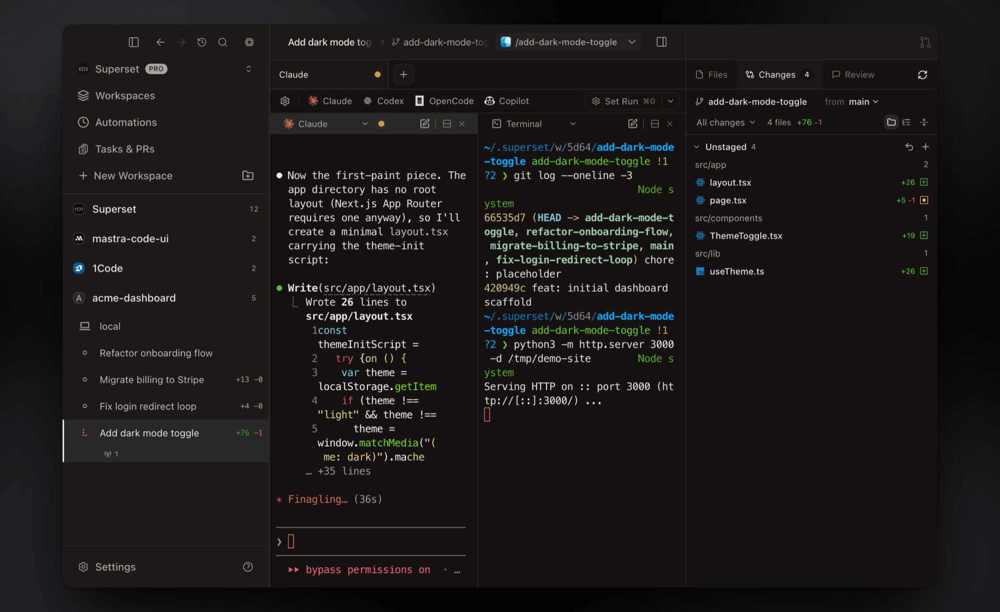
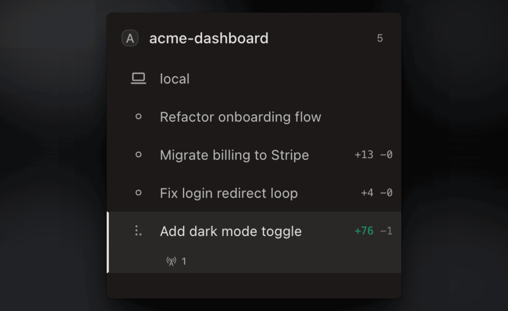
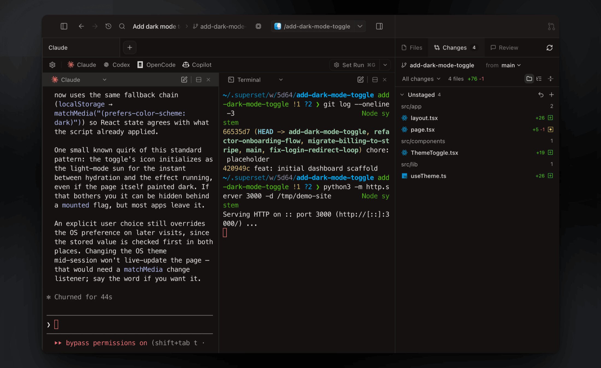
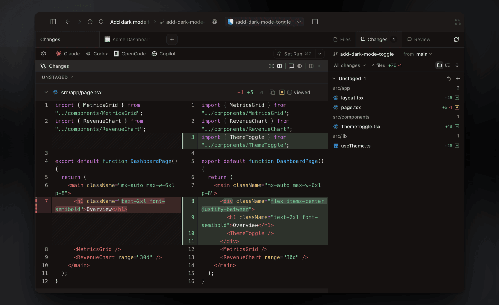
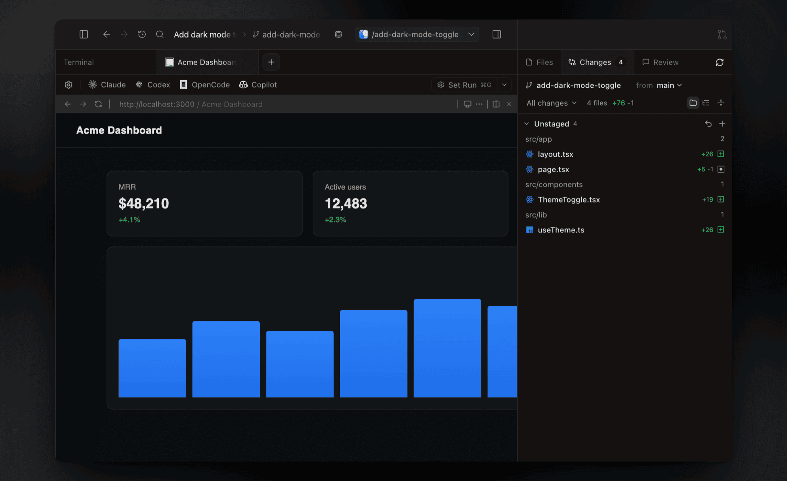
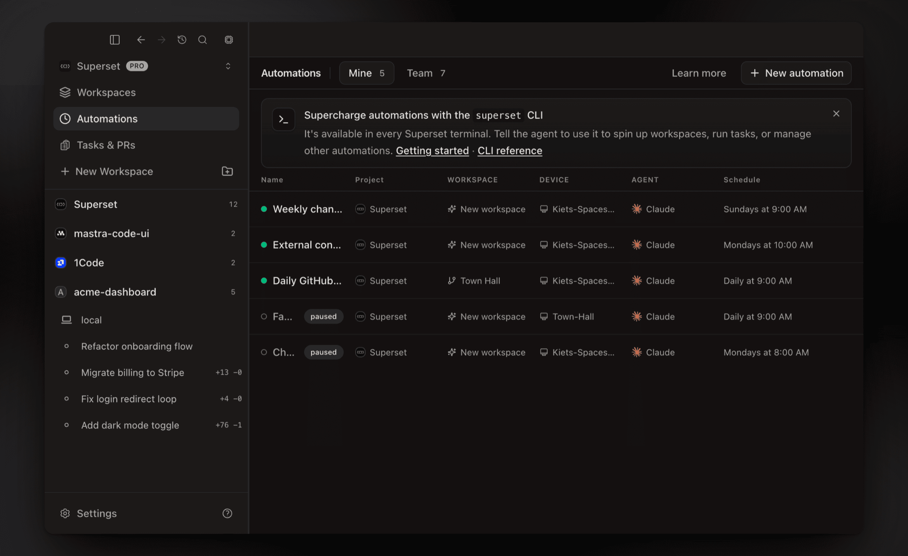
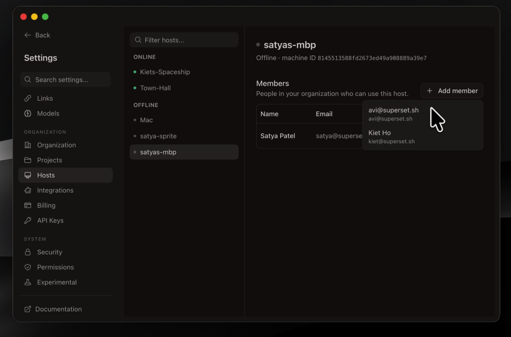
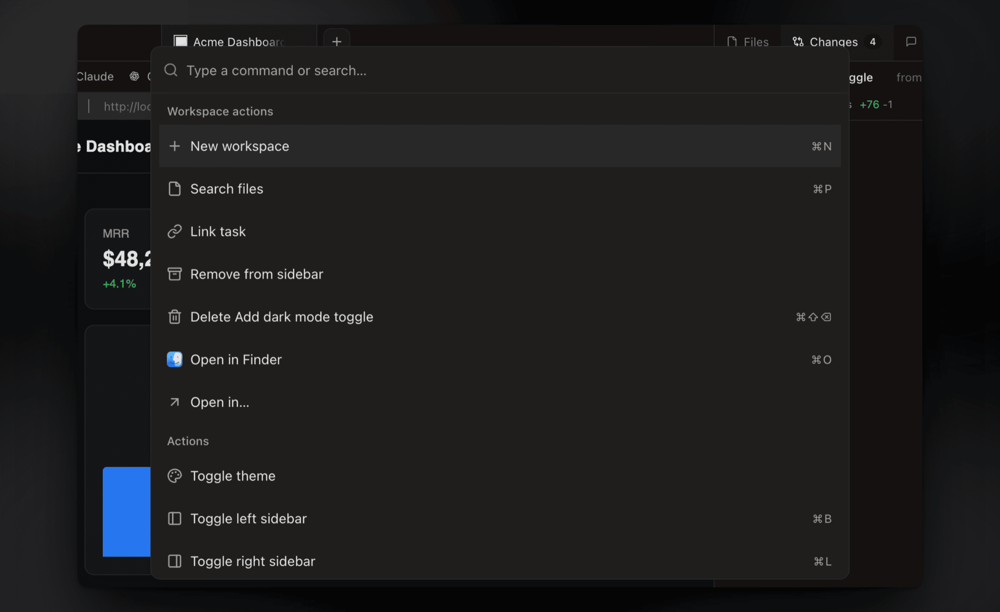

<div align="center">


### The Code Editor for AI Agents

[](https://github.com/superset-sh/superset/stargazers)
[](https://github.com/superset-sh/superset/releases)
[](LICENSE.md)
[](https://x.com/superset_sh)
[](https://discord.gg/cZeD9WYcV7)

<br />

Orchestrate swarms of Claude Code, Codex, and more in parallel.<br />
Works with any CLI agent. Built for local worktree-based development.

<br />

[**Download for macOS**](https://github.com/superset-sh/superset/releases/latest) &nbsp;&bull;&nbsp; [Documentation](https://docs.superset.sh) &nbsp;&bull;&nbsp; [Changelog](https://github.com/superset-sh/superset/releases) &nbsp;&bull;&nbsp; [Discord](https://discord.gg/cZeD9WYcV7)

<br />


</div>

## Code 10x Faster With No Switching Cost

Superset orchestrates CLI-based coding agents across isolated git worktrees, with built-in terminal, review, and open-in-editor workflows.

- **Run multiple agents simultaneously** without context switching overhead
- **Isolate each task** in its own git worktree so agents don't interfere with each other
- **Monitor all your agents** from one place and get notified when they need attention
- **Review and edit changes quickly** with the built-in diff viewer and editor
- **Open any workspace where you need it** with one-click handoff to your editor or terminal
- **Reach your workspaces from anywhere** via remote hosts, the CLI, the SDK, or MCP

Wait less, ship more.

## Features

<table>
<tr>
<td width="50%" valign="middle">

### Parallel Workspaces

Run 10+ coding agents at once, each in its own git worktree with its own branch, terminal, and environment. Compare the results and merge the winner.

[Docs →](https://docs.superset.sh/workspaces)

</td>
<td width="50%">
  <a href="https://docs.superset.sh/workspaces"></a>
</td>
</tr>
<tr>
<td width="50%" valign="middle">

### Agent Monitoring

Track every agent from the sidebar, with working indicators, completion chimes, and dock badges when one needs your attention.

[Docs →](https://docs.superset.sh/agent-integration)

</td>
<td width="50%">
  <a href="https://docs.superset.sh/agent-integration"></a>
</td>
</tr>
<tr>
<td width="50%" valign="middle">

### Built-in Terminal

Tabs, infinite splits, presets, and persistent sessions that survive restarts. Press ⌘I for a rich prompt editor with multiline editing and @-file mentions.

[Docs →](https://docs.superset.sh/terminal-integration)

</td>
<td width="50%">
  <a href="https://docs.superset.sh/terminal-integration"></a>
</td>
</tr>
<tr>
<td width="50%" valign="middle">

### Built-in Diff Viewer

Inspect, comment on, and edit agent changes without leaving the app, then commit and push when it's ready.

[Docs →](https://docs.superset.sh/diff-viewer)

</td>
<td width="50%">
  <a href="https://docs.superset.sh/diff-viewer"></a>
</td>
</tr>
<tr>
<td width="50%" valign="middle">

### In-App Browser & Ports

Preview running dev servers in a browser pane. Ports are detected per workspace, so every worktree gets its own preview.

[Docs →](https://docs.superset.sh/browser)

</td>
<td width="50%">
  <a href="https://docs.superset.sh/browser"></a>
</td>
</tr>
<tr>
<td width="50%" valign="middle">

### Automations

Run agent sessions on a schedule: triage issues overnight, draft the weekly changelog, keep dependencies fresh.

[Docs →](https://docs.superset.sh/automations)

</td>
<td width="50%">
  <a href="https://docs.superset.sh/automations"></a>
</td>
</tr>
<tr>
<td width="50%" valign="middle">

### Remote Workspaces

Connect another machine and reach its workspaces from anywhere: the desktop app, the CLI, or your phone. Wake offline hosts with a custom command.

[Docs →](https://docs.superset.sh/remote-workspaces)

</td>
<td width="50%">
  <a href="https://docs.superset.sh/remote-workspaces"></a>
</td>
</tr>
<tr>
<td width="50%" valign="middle">

### Command Palette

Jump to any workspace, action, or setting from one search box.

[Docs →](https://docs.superset.sh/keyboard-shortcuts)

</td>
<td width="50%">
  <a href="https://docs.superset.sh/keyboard-shortcuts"></a>
</td>
</tr>
</table>

**Also in the box:**

- **[Model picker & custom agents](https://docs.superset.sh/agent-integration)**: choose a model and reasoning effort at launch, and add any terminal agent with its own icon
- **[Workspace setup scripts](https://docs.superset.sh/setup-teardown-scripts)**: automate env setup, dependency installs, and dev servers per workspace
- **[Terminal presets](https://docs.superset.sh/terminal-presets)**: save agent and shell layouts and open them with one keystroke
- **[Slack & Linear](https://docs.superset.sh/use-with-linear)**: spin up workspaces from Slack messages or Linear issues
- **[Open in your IDE](https://docs.superset.sh/use-with-ide)**: one-click handoff to Cursor, VS Code, or any editor
- **[Custom themes](https://docs.superset.sh/custom-themes)**: build, edit, and import theme files
- **[Keyboard shortcuts](https://docs.superset.sh/keyboard-shortcuts)**: every action is remappable via **Settings → Keyboard Shortcuts** (⌘/)
- **[Bring your own providers](https://docs.superset.sh/providers)**: connect OpenRouter, Bedrock, Vertex, or Vercel AI Gateway
- **And many more**: we ship daily, so this list is perpetually behind. The [changelog](https://superset.sh/changelog) is the real feature list.

## Supported Agents

Superset works with any CLI-based coding agent, including:

| Agent | Status |
|:------|:-------|
|  &nbsp;[Amp Code](https://ampcode.com/) | Fully supported |
|  &nbsp;[Claude Code](https://github.com/anthropics/claude-code) | Fully supported |
| <picture><source media="(prefers-color-scheme: dark)" srcset="packages/ui/src/assets/icons/preset-icons/codex-white.svg" /></picture> &nbsp;[OpenAI Codex CLI](https://github.com/openai/codex) | Fully supported |
|  &nbsp;[Cursor Agent](https://docs.cursor.com/agent) | Fully supported |
| <picture><source media="(prefers-color-scheme: dark)" srcset="packages/ui/src/assets/icons/preset-icons/droid-white.svg" /></picture> &nbsp;[Droid](https://www.factory.ai/) | Fully supported |
|  &nbsp;[Gemini CLI](https://github.com/google-gemini/gemini-cli) | Fully supported |
| <picture><source media="(prefers-color-scheme: dark)" srcset="packages/ui/src/assets/icons/preset-icons/copilot-white.svg" /></picture> &nbsp;[GitHub Copilot](https://github.com/features/copilot) | Fully supported |
| <picture><source media="(prefers-color-scheme: dark)" srcset="packages/ui/src/assets/icons/preset-icons/mastracode-white.svg" /></picture> &nbsp;[Mastra Code](https://mastra.ai/) | Fully supported |
|  &nbsp;[Mistral Vibe](https://mistral.ai/) | Fully supported |
| <picture><source media="(prefers-color-scheme: dark)" srcset="packages/ui/src/assets/icons/preset-icons/opencode-white.svg" /></picture> &nbsp;[OpenCode](https://github.com/opencode-ai/opencode) | Fully supported |
| <picture><source media="(prefers-color-scheme: dark)" srcset="packages/ui/src/assets/icons/preset-icons/pi-white.svg" /></picture> &nbsp;[Pi](https://github.com/badlogic/pi-mono/tree/main/packages/coding-agent) | Fully supported |
| <picture><source media="(prefers-color-scheme: dark)" srcset="packages/ui/src/assets/icons/preset-icons/polygraph-white.svg" /></picture> &nbsp;[Polygraph](https://trypolygraph.com/) | Fully supported |
| Any other CLI agent | Works without configuration |

If it runs in a terminal, it runs on Superset

Agents get more than a terminal:

- **Model picker**: choose a model and reasoning effort when you launch an agent
- **Per-agent settings**: tune launch commands, prompt templates, and model overrides in Settings → Agents
- **Custom agents**: add any terminal agent with its own icon and it works like a built-in
- **Status and notifications**: working indicators, completion chimes, and dock badges when an agent needs you
- **Built-in chat**: talk to models in a chat pane, with inline tool approvals and plan review

## More Than a Desktop App

Every surface talks to the same workspaces, so you can start a task in the app and check on it from anywhere.

| Surface | What you get |
|:--------|:-------------|
| [**Desktop App**](https://github.com/superset-sh/superset/releases/latest) | The full IDE: terminals, diff viewer, in-app browser, automations |
| [**CLI**](https://docs.superset.sh/cli/getting-started) | A single `superset` binary to manage workspaces, agents, terminals, and hosts from any shell |
| [**TypeScript SDK**](https://docs.superset.sh/sdk/getting-started) | Drive Superset programmatically with [`@superset_sh/sdk`](https://www.npmjs.com/package/@superset_sh/sdk) from Node, Bun, or Deno |
| [**MCP Server**](https://docs.superset.sh/mcp) | Let Claude Code, Codex, Cursor, and other agents create and manage workspaces themselves |

The CLI comes bundled with the desktop app, or install it standalone:

```bash
curl -fsSL https://superset.sh/cli/install.sh | sh
# or
brew install superset-sh/tap/superset
```

An iOS app is coming soon so you can check on your agents from your phone.

## Requirements

| Requirement | Details |
|:------------|:--------|
| **OS** | macOS (Windows/Linux untested) |
| **Runtime** | [Bun](https://bun.sh/) v1.0+ |
| **Version Control** | Git 2.20+ |
| **GitHub CLI** | [gh](https://cli.github.com/) |
| **Caddy** | [caddy](https://caddyserver.com/docs/install) (for dev server) |

## Install

**[Download Superset for macOS](https://github.com/superset-sh/superset/releases/latest)**

Builds for Windows and Linux are not yet available.

## Development

Want to hack on Superset or contribute a PR? Spin up a local dev environment in one command:

```bash
git clone https://github.com/superset-sh/superset.git
cd superset
./.superset/setup.local.sh
bun run dev
```

No Neon account or third-party credentials needed. `setup.local.sh` brings up a local Postgres + Electric stack via Docker and seeds a dev account. Sign in with the **"Sign in as dev"** button (or `admin@local.test` / `supersetdev`).

Prereqs: `bun`, `docker`, `jq`, `caddy` (`brew install jq caddy && caddy trust`).

See [**DEVELOPMENT.md**](./DEVELOPMENT.md) for the full guide: what the setup script does, manual setup against real services, common commands, troubleshooting, and how to build the desktop app. Contribution process lives in [**CONTRIBUTING.md**](./CONTRIBUTING.md).

## Configuration

Configure workspace setup, teardown, and run scripts in `.superset/config.json`. See [full documentation](https://docs.superset.sh/setup-teardown-scripts).

```json
{
  "setup": ["./.superset/setup.sh"],
  "teardown": ["./.superset/teardown.sh"],
  "run": ["./.superset/run.sh"]
}
```

Keyboard shortcuts are customizable via **Settings → Keyboard Shortcuts** (⌘/); see the [full shortcut list](https://docs.superset.sh/keyboard-shortcuts).

## Tech Stack

<p>
  <a href="https://www.electronjs.org/"></a>
  <a href="https://reactjs.org/"></a>
  <a href="https://tailwindcss.com/"></a>
  <a href="https://bun.sh/"></a>
  <a href="https://turbo.build/"></a>
  <a href="https://vitejs.dev/"></a>
  <a href="https://biomejs.dev/"></a>
  <a href="https://orm.drizzle.team/"></a>
  <a href="https://neon.tech/"></a>
  <a href="https://trpc.io/"></a>
</p>

## Private by Default

- **Source Available**: full source is on GitHub under Elastic License 2.0 (ELv2).
- **Explicit Connections**: you choose which agents, providers, and integrations to connect.

## Contributing

We welcome contributions! See [CONTRIBUTING.md](CONTRIBUTING.md) for how to get set up and open a PR. Bugs and feature requests go in [issues](https://github.com/superset-sh/superset/issues).

<a href="https://github.com/superset-sh/superset/graphs/contributors">
  
</a>

## Community

Join the Superset community to get help, share feedback, and connect with other users:

- **[Discord](https://discord.gg/cZeD9WYcV7)**: chat with the team and community
- **[Twitter](https://x.com/superset_sh)**: follow for updates and announcements
- **[GitHub Issues](https://github.com/superset-sh/superset/issues)**: report bugs and request features
- **[GitHub Discussions](https://github.com/superset-sh/superset/discussions)**: ask questions and share ideas

### Team

[](https://x.com/avimakesrobots)
[](https://x.com/flyakiet)
[](https://x.com/saddle_paddle)

## License

Distributed under the Elastic License 2.0 (ELv2). See [LICENSE.md](LICENSE.md) for more information.
