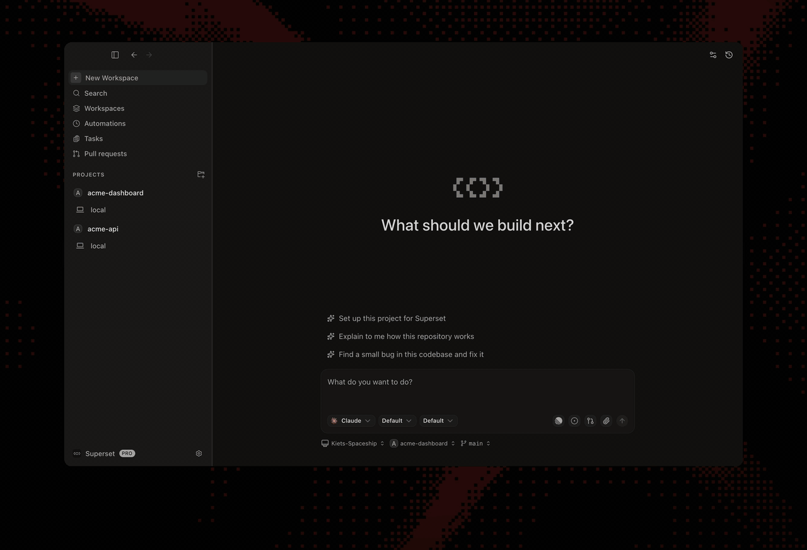
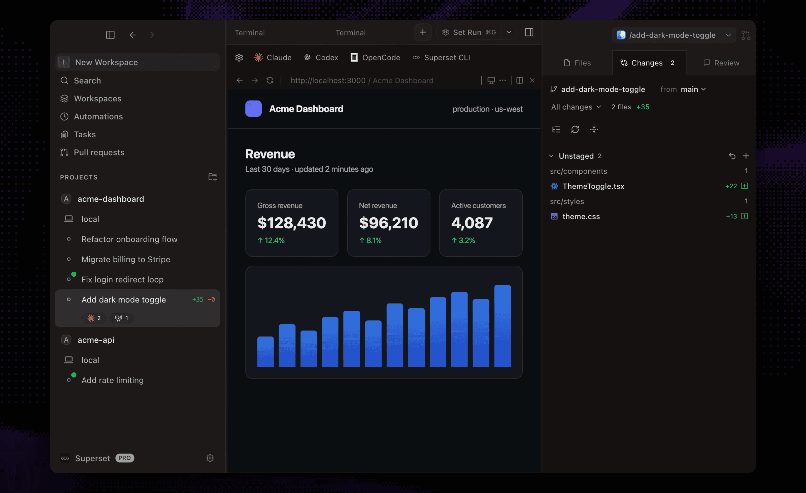
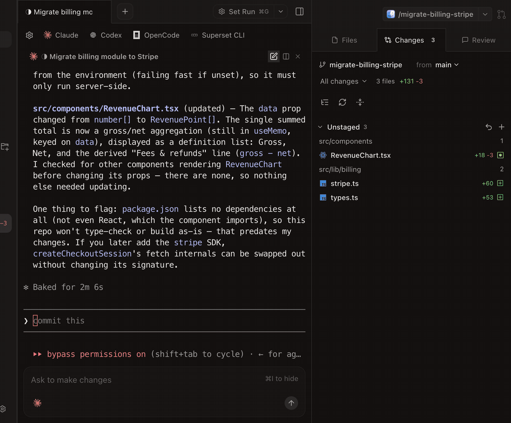
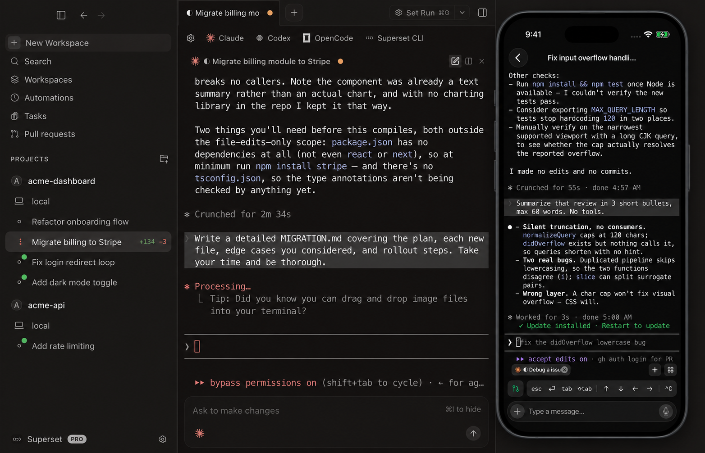
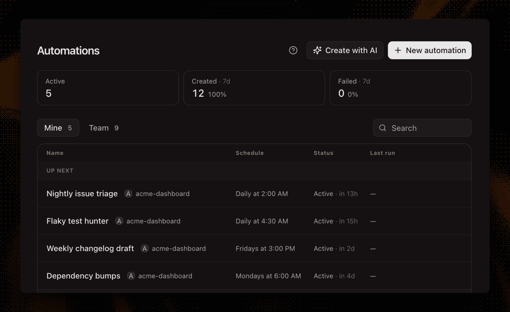
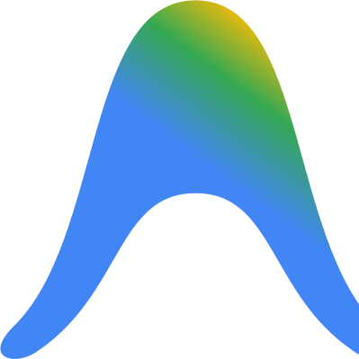
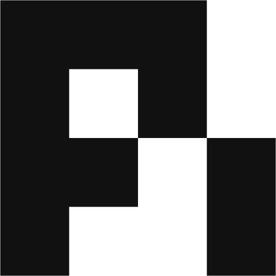

<div align="center">

# Superset

### A workspace for your CLI coding agents


Run Claude Code, Codex, or another CLI agent in persistent terminals.<br />
Review its changes and preview your app in the same workspace.


[**Download for macOS**](https://github.com/superset-sh/superset/releases/latest) &nbsp;&bull;&nbsp; [Documentation](https://docs.superset.sh) &nbsp;&bull;&nbsp; [Changelog](https://github.com/superset-sh/superset/releases) &nbsp;&bull;&nbsp; [Discord](https://discord.gg/cZeD9WYcV7)

</div>

Keep your existing agent subscriptions. Open the workspace in your preferred editor when you need it.

<p align="center">
  
</p>

[First task](#start-with-one-task) · [Review and revise](#review-and-revise) · [Parallel tasks](#run-independent-tasks) · [Remote and scheduled work](#work-across-devices-and-on-a-schedule) · [Agents](#supported-agents) · [Install](#install) · [Contributing](#contributing)

## Install

Download the desktop app:

- **macOS**: [Apple Silicon (.dmg)](https://github.com/superset-sh/superset/releases/latest/download/Superset-arm64.dmg) · [Intel (.dmg)](https://github.com/superset-sh/superset/releases/latest/download/Superset-x64.dmg)
- **Linux**: [x64 AppImage](https://github.com/superset-sh/superset/releases/latest/download/Superset-x86_64.AppImage) (experimental; macOS is the primary target)
- **Windows**: not yet available
- [All builds](https://github.com/superset-sh/superset/releases/latest)

All you need installed is [Git](https://git-scm.com/). [gh](https://cli.github.com/) is optional and enables the PR workflows; Superset offers to install it for you.

## Start with one task

1. [Install Superset](#install) and add a repository from your computer or clone one.
2. Create a workspace, choose your CLI agent, and describe a small change you want to make.
3. Inspect its patch in **Changes**, run the relevant tests, and preview your app in the browser pane before committing.

For a walkthrough of workspace creation and review, see [Your First Parallel Session](https://docs.superset.sh/first-workspace).

## Review and revise

- **Change your app's UI.** Use **Design** in the browser pane to select an element and send your requested change to an agent with element context. [Walkthrough](https://superset.sh/blog/change-ui-with-your-coding-agent) · [Design Mode docs](https://docs.superset.sh/browser#design-mode)
- **Ask an agent to fix a PR.** Open **Pull requests → Code**, select diff lines, and send feedback to a running or new agent session. Posting to GitHub is optional. [Walkthrough](https://superset.sh/blog/send-pr-feedback-to-your-agent) · [PR docs](https://docs.superset.sh/pull-requests#comment-straight-to-an-agent)
- **Review a report with your team.** Ask an agent to publish a Page. Teammates pin comments, and a watching agent can revise it at the same link. Keep its host and session running for feedback delivery. [Walkthrough](https://superset.sh/blog/review-agent-work-with-pages) · [Pages docs](https://docs.superset.sh/pages)

<details>
<summary>See the diff viewer and browser previews</summary>

### Built-in Diff Viewer

Inspect, comment on, and edit agent changes without leaving the app, then commit and push when it's ready.

[Docs →](https://docs.superset.sh/diff-viewer)

<a href="https://docs.superset.sh/diff-viewer"></a>

### In-App Browser & Ports

Preview running dev servers in a browser pane. Ports are detected per workspace, so every worktree gets its own preview.

[Docs →](https://docs.superset.sh/browser)

<a href="https://docs.superset.sh/browser"></a>

</details>

## Run independent tasks

Give each task a Git worktree with its own branch and terminals. Worktrees separate working files; they do not sandbox processes or prevent merge conflicts.

[Workspace docs](https://docs.superset.sh/workspaces) · [Terminal docs](https://docs.superset.sh/terminal-integration) · [Agent status](https://docs.superset.sh/agent-integration)

<details>
<summary>See workspaces, monitoring, terminals, and the command palette</summary>

### Parallel Workspaces

Review each result before merging, or try two approaches to the same problem and keep the one you prefer.

[Docs →](https://docs.superset.sh/workspaces)

<a href="https://docs.superset.sh/workspaces"></a>

### Agent Monitoring

Track every agent from the sidebar, with working indicators, completion chimes, and dock badges when one needs your attention.

[Docs →](https://docs.superset.sh/agent-integration)

<a href="https://docs.superset.sh/agent-integration"></a>

### Built-in Terminal

Tabs, infinite splits, presets, and persistent sessions that survive restarts. Press ⌘I for a rich prompt editor with multiline editing and @-file mentions.

[Docs →](https://docs.superset.sh/terminal-integration)

<a href="https://docs.superset.sh/terminal-integration"></a>

### Command Palette

Jump to any workspace, action, or setting from one search box.

[Docs →](https://docs.superset.sh/keyboard-shortcuts)

<a href="https://docs.superset.sh/keyboard-shortcuts"></a>

</details>

## Work across devices and on a schedule

Connect another machine to reach its workspaces remotely, or schedule an agent to work on a recurring task. The CLI, SDK, and MCP server also let agents and scripts manage workspaces.

Mobile requires **Superset Pro**, **iOS 26 or later**, and a computer with **Remote Access enabled**.

[Remote access](https://docs.superset.sh/remote-access) · [Automations](https://docs.superset.sh/automations) · [iPhone](https://superset.sh/mobile) · [CLI](https://docs.superset.sh/cli/getting-started)

<details>
<summary>See mobile, automations, remote access, and the CLI</summary>

### Superset for iPhone

Remotely control Claude Code, Codex, and other terminal agents running on your connected computer. Pick up the same workspaces and terminal sessions, send follow-up prompts, review diffs, and merge PRs from your iPhone.

[**Download on the App Store**](https://apps.apple.com/us/app/id6788926383) &nbsp;&bull;&nbsp; [Learn more →](https://superset.sh/mobile)

<a href="https://superset.sh/mobile"></a>

### Automations

Run agent sessions on a schedule: triage issues overnight, draft the weekly changelog, keep dependencies fresh.

[Docs →](https://docs.superset.sh/automations)

<a href="https://docs.superset.sh/automations"></a>

### Remote Access

Connect another machine and reach its workspaces from anywhere: the desktop app, the CLI, or your phone. Wake offline hosts with a custom command.

[Docs →](https://docs.superset.sh/remote-access)

<a href="https://docs.superset.sh/remote-access"></a>

### Superset CLI

Script it from any shell: create workspaces, launch agents, read their terminals, and manage automations with a single binary. If an agent can run a command, it can drive Superset.

[Docs →](https://docs.superset.sh/cli/getting-started)

<a href="https://docs.superset.sh/cli/getting-started"></a>

</details>

## Customize your workflow

- **[Built-in skills](https://docs.superset.sh/skills)**: agents come pre-loaded with `superset:*` skills (orchestrate parallel agents, schedule automations, file feedback, diagnose issues), provisioned automatically at launch
- **[Workspace setup scripts](https://docs.superset.sh/setup-teardown-scripts)**: automate env setup, dependency installs, and dev servers per workspace
- **[Terminal presets](https://docs.superset.sh/terminal-presets)**: save agent and shell layouts and open them with one keystroke
- **[Slack & Linear](https://docs.superset.sh/use-with-linear)**: spin up workspaces from Slack messages or Linear issues
- **[Open in your IDE](https://docs.superset.sh/use-with-ide)**: one-click handoff to Cursor, VS Code, or any editor
- **[Custom themes](https://docs.superset.sh/custom-themes)**: build, edit, and import theme files
- **[Keyboard shortcuts](https://docs.superset.sh/keyboard-shortcuts)**: every action is remappable via **Settings → Keyboard Shortcuts** (⌘/)
- **[Bring your own providers](https://docs.superset.sh/providers)**: connect OpenRouter, Bedrock, Vertex, or Vercel AI Gateway
- **And many more**: we ship daily, so this list is perpetually behind. The [changelog](https://superset.sh/changelog) is the real feature list.

## Supported Agents

Use Claude Code, Codex, OpenCode, Cursor Agent, or another CLI coding agent.

<details>
<summary>Browse supported agents</summary>

| Agent | Status |
|:------|:-------|
|  &nbsp;[Amp Code](https://ampcode.com/) | Fully supported |
|  &nbsp;[Antigravity CLI](https://antigravity.google/) | Fully supported |
|  &nbsp;[Claude Code](https://github.com/anthropics/claude-code) | Fully supported |
| <picture><source media="(prefers-color-scheme: dark)" srcset="packages/ui/src/assets/icons/preset-icons/codex-white.svg" /></picture> &nbsp;[OpenAI Codex CLI](https://github.com/openai/codex) | Fully supported |
|  &nbsp;[Cursor Agent](https://docs.cursor.com/agent) | Fully supported |
| <picture><source media="(prefers-color-scheme: dark)" srcset="packages/ui/src/assets/icons/preset-icons/droid-white.svg" /></picture> &nbsp;[Droid](https://www.factory.ai/) | Fully supported |
| <picture><source media="(prefers-color-scheme: dark)" srcset="packages/ui/src/assets/icons/preset-icons/fx-white.svg" /></picture> &nbsp;[fx](https://fx.sh/) | Fully supported |
|  &nbsp;[Gemini CLI](https://github.com/google-gemini/gemini-cli) | Fully supported |
| <picture><source media="(prefers-color-scheme: dark)" srcset="packages/ui/src/assets/icons/preset-icons/copilot-white.svg" /></picture> &nbsp;[GitHub Copilot](https://github.com/features/copilot) | Fully supported |
| <picture><source media="(prefers-color-scheme: dark)" srcset="packages/ui/src/assets/icons/preset-icons/grok-white.svg" /></picture> &nbsp;[Grok](https://x.ai/) | Fully supported |
| <picture><source media="(prefers-color-scheme: dark)" srcset="packages/ui/src/assets/icons/preset-icons/hermes-white.svg" /></picture> &nbsp;[Hermes](https://github.com/NousResearch/hermes-agent) | Fully supported |
| <picture><source media="(prefers-color-scheme: dark)" srcset="packages/ui/src/assets/icons/preset-icons/muse-white.svg" /></picture> &nbsp;[Muse Code](https://developer.meta.com/ai/products/muse-code/) | Fully supported |
| <picture><source media="(prefers-color-scheme: dark)" srcset="packages/ui/src/assets/icons/preset-icons/devin-white.svg" /></picture> &nbsp;[Devin](https://devin.ai/cli) | Fully supported |
| <picture><source media="(prefers-color-scheme: dark)" srcset="packages/ui/src/assets/icons/preset-icons/kimi-white.svg" /></picture> &nbsp;[Kimi Code](https://www.kimi.com/) | Fully supported |
|  &nbsp;[Kiro](https://kiro.dev/cli/) | Fully supported |
| <picture><source media="(prefers-color-scheme: dark)" srcset="packages/ui/src/assets/icons/preset-icons/mastracode-white.svg" /></picture> &nbsp;[Mastra Code](https://mastra.ai/) | Fully supported |
|  &nbsp;[Mistral Vibe](https://mistral.ai/) | Fully supported |
| <picture><source media="(prefers-color-scheme: dark)" srcset="packages/ui/src/assets/icons/preset-icons/pi-white.svg" /></picture> &nbsp;[Oh My Pi](https://github.com/can1357/oh-my-pi) | Fully supported |
| <picture><source media="(prefers-color-scheme: dark)" srcset="packages/ui/src/assets/icons/preset-icons/opencode-white.svg" /></picture> &nbsp;[OpenCode](https://github.com/opencode-ai/opencode) | Fully supported |
| <picture><source media="(prefers-color-scheme: dark)" srcset="packages/ui/src/assets/icons/preset-icons/pi-white.svg" /></picture> &nbsp;[Pi](https://github.com/badlogic/pi-mono/tree/main/packages/coding-agent) | Fully supported |
| <picture><source media="(prefers-color-scheme: dark)" srcset="packages/ui/src/assets/icons/preset-icons/polygraph-white.svg" /></picture> &nbsp;[Polygraph](https://trypolygraph.com/) | Fully supported |
| Any other CLI agent | Works without configuration |


</details>

Agents get more than a terminal:

- **Model picker**: choose a model and reasoning effort when you launch an agent
- **Per-agent settings**: tune launch commands, prompt templates, and model overrides in Settings → Agents
- **Custom agents**: add any terminal agent with its own icon and it works like a built-in
- **Built-in chat**: talk to models in a chat pane, with inline tool approvals and plan review

## More Than a Desktop App

Every surface talks to the same workspaces, so you can start a task in the app and check on it from anywhere.

| Surface | What you get |
|:--------|:-------------|
| [**Desktop App**](https://github.com/superset-sh/superset/releases/latest) | The full IDE: terminals, diff viewer, in-app browser, automations |
| [**CLI**](https://docs.superset.sh/cli/getting-started) | A single `superset` binary to manage workspaces, agents, terminals, and hosts from any shell |
| [**TypeScript SDK**](https://docs.superset.sh/sdk/getting-started) | Drive Superset programmatically with [`@superset_sh/sdk`](https://www.npmjs.com/package/@superset_sh/sdk) from Node, Bun, or Deno |
| [**MCP Server**](https://docs.superset.sh/mcp) | Let Claude Code, Codex, Cursor, and other agents create and manage workspaces themselves |

The CLI comes bundled with the desktop app, or install it standalone:

```bash
curl -fsSL https://superset.sh/cli/install.sh | sh
# or
brew install superset-sh/tap/superset
```

## Development

Want to hack on Superset or contribute a PR? Clone the repository, add it to the
installed Superset app, and create a workspace for your change:

```bash
git clone https://github.com/superset-sh/superset.git
```

Then run the development setup from that workspace terminal:

```bash
./.superset/setup.local.sh
bun run dev
```

Run `setup.local.sh` once in every new worktree. It configures workspace-specific
app identity and ports so the development desktop app can run alongside the
installed Superset app and other development worktrees.

No Neon account or third-party credentials are needed. `setup.local.sh` brings
up a local Postgres + Electric stack via Docker and seeds a dev account. Sign in
with the **"Sign in as dev"** button (or `admin@local.test` / `supersetdev`).

Prereqs: [Bun](https://bun.sh/) v1.3.14+ (pinned in `.bun-version`), `docker`, `jq`, and `caddy`, which `bun dev` runs as the local HTTPS proxy (`brew install jq caddy && caddy trust`).

See [**DEVELOPMENT.md**](./DEVELOPMENT.md) for the full guide: what the setup script does, manual setup against real services, common commands, troubleshooting, and how to build the desktop app. Contribution process lives in [**CONTRIBUTING.md**](./CONTRIBUTING.md).

## Configuration

Configure workspace setup, teardown, and run scripts in `.superset/config.json`. See [full documentation](https://docs.superset.sh/setup-teardown-scripts).

```json
{
  "setup": ["./.superset/setup.sh"],
  "teardown": ["./.superset/teardown.sh"],
  "run": ["./.superset/run.sh"]
}
```

## Tech Stack

<details>
<summary>Browse the implementation stack</summary>

<p>
  <a href="https://www.electronjs.org/"></a>
  <a href="https://reactjs.org/"></a>
  <a href="https://tailwindcss.com/"></a>
  <a href="https://bun.sh/"></a>
  <a href="https://turbo.build/"></a>
  <a href="https://vitejs.dev/"></a>
  <a href="https://biomejs.dev/"></a>
  <a href="https://orm.drizzle.team/"></a>
  <a href="https://neon.tech/"></a>
  <a href="https://trpc.io/"></a>
</p>

</details>

## Private by Default

- **Explicit Connections**: you choose which agents, providers, and integrations to connect.

## Contributing

We welcome contributions! See [CONTRIBUTING.md](CONTRIBUTING.md) for how to get set up and open a PR. Bugs and feature requests go in [issues](https://github.com/superset-sh/superset/issues).

<a href="https://github.com/superset-sh/superset/graphs/contributors">
  
</a>

[](https://github.com/superset-sh/superset/stargazers)
[](https://github.com/superset-sh/superset/releases)
[](LICENSE.md)
[](https://x.com/superset_sh)
[](https://discord.gg/cZeD9WYcV7)

<details>
<summary>🌐 Read this in other languages</summary>
<br />

[English](README.md) | [日本語](readme/README.ja.md) | [简体中文](readme/README.zh-CN.md) | [繁體中文](readme/README.zh-TW.md) | [한국어](readme/README.ko.md) | [Français](readme/README.fr.md) | [Español](readme/README.es.md) | [Deutsch](readme/README.de.md) | [Português](readme/README.pt-BR.md) | [Italiano](readme/README.it.md) | [Русский](readme/README.ru.md) | [Türkçe](readme/README.tr.md) | [Polski](readme/README.pl.md) | [Nederlands](readme/README.nl.md) | [Bahasa Indonesia](readme/README.id.md) | [Čeština](readme/README.cs.md) | [Tiếng Việt](readme/README.vi.md)

</details>

## Community

Join the Superset community to get help, share feedback, and connect with other users:

- **[Discord](https://discord.gg/cZeD9WYcV7)**: chat with the team and community
- **[Twitter](https://x.com/superset_sh)**: follow for updates and announcements
- **[GitHub Issues](https://github.com/superset-sh/superset/issues)**: report bugs and request features
- **[GitHub Discussions](https://github.com/superset-sh/superset/discussions)**: ask questions and share ideas

### Team

[](https://x.com/avimakesrobots)
[](https://x.com/flyakiet)
[](https://x.com/saddle_paddle)

## License & what's free forever

**The desktop app is free forever.** Running agents in parallel on your own machine will never require payment. Anything we charge for will be an optional service on top.

The whole app is in this repo under the [Elastic License 2.0](LICENSE.md): use it, fork it, modify it, self-host it for your team. The only thing off the table is repackaging Superset itself as a service you sell to others.
