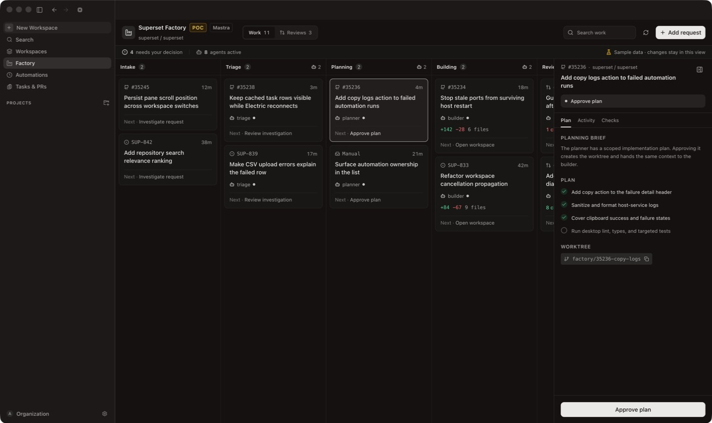
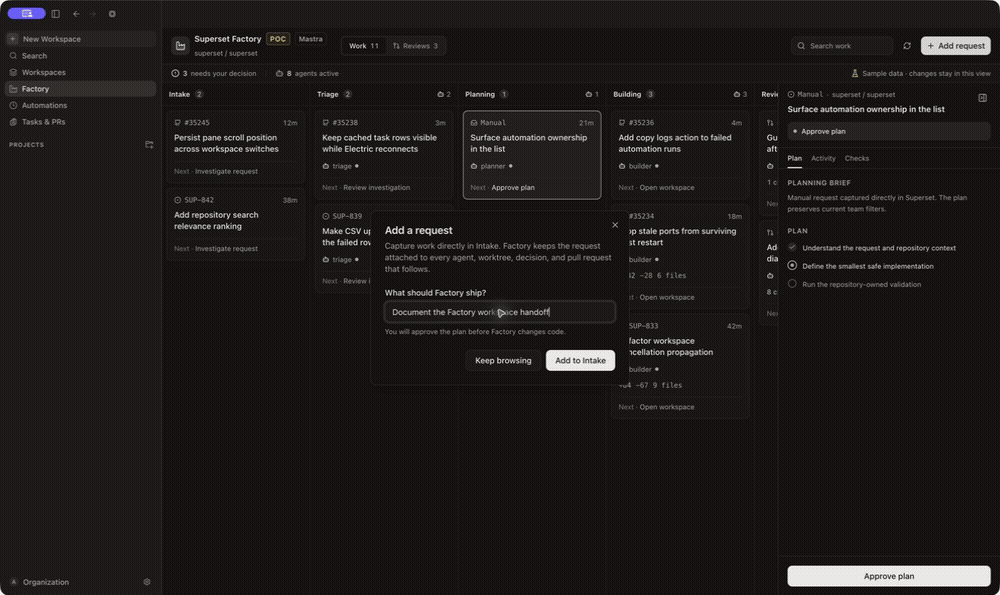
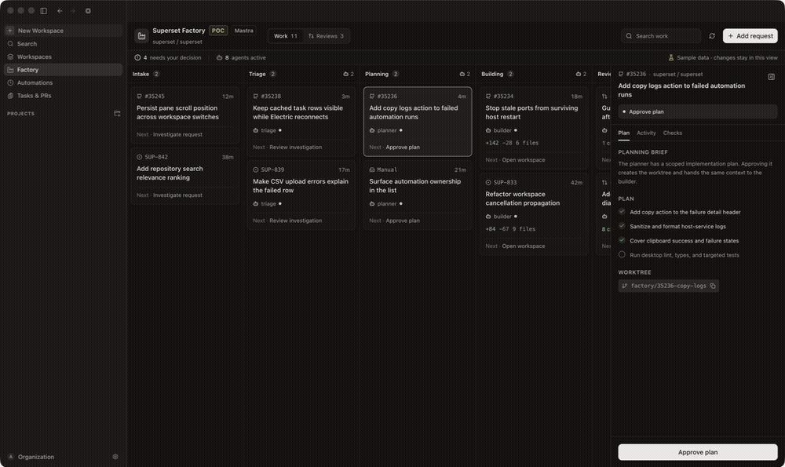
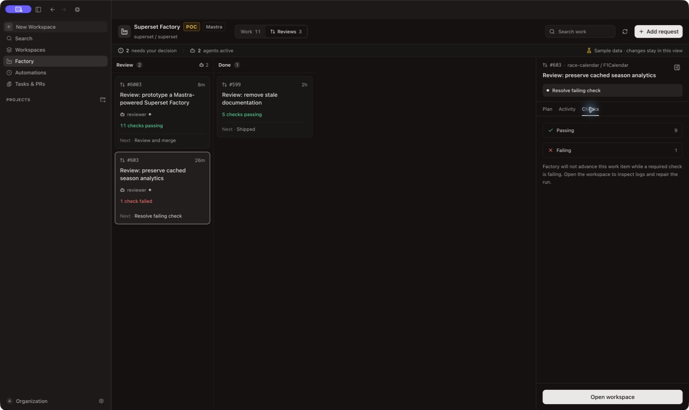
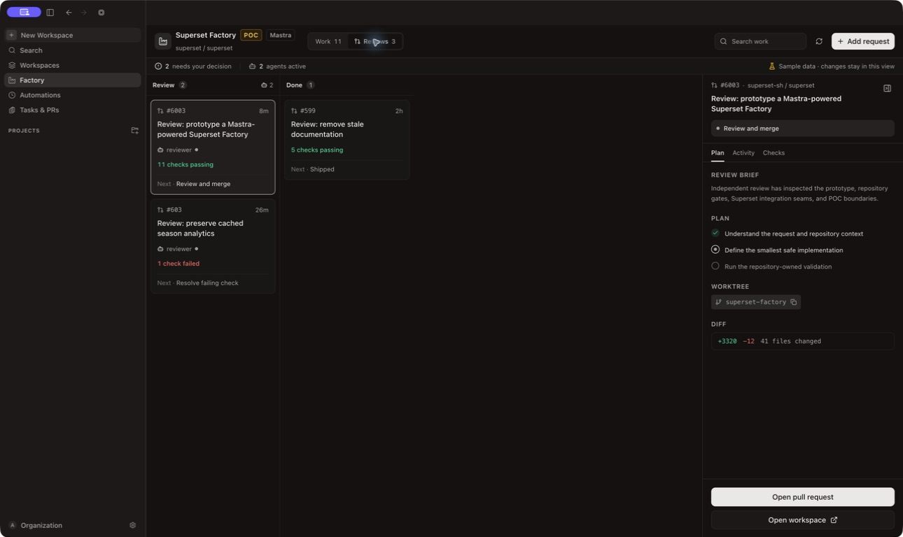

# Superset Factory

> [!IMPORTANT]
> **Proof of concept only.** This draft explores a possible future direction.
> It is not a roadmap commitment, production architecture, or merge-ready
> feature.

Superset Factory is an idea prototype for exploring what a future
agent-orchestration surface could look like inside Superset. It combines Mastra
Factory's work-item state machine, agents, workflows, rules, storage, and
sandboxing with the context and execution primitives Superset already owns:
projects, hosts, worktrees, workspaces, terminals, running agents, checks,
diffs, and pull requests.

This is not a roadmap commitment or a merge-ready feature. The prototype exists
to make the idea concrete enough to use, critique, and learn from.



## Why Factory belongs in Superset

Mastra Factory is well suited to coordinating long-running software work. It
provides the controller, work-item lifecycle, specialized agents, workflows,
rules, scheduling, storage, and observability. Superset is well suited to being
the human and execution surface around that controller because it already knows
where the repositories live, which host can run the work, how to create and
open an isolated workspace, which agents and terminals are active, and where a
developer should intervene.

Putting the experience in Superset avoids a second control plane that would
need to rediscover repositories, credentials, machines, worktrees, sessions,
and pull requests. Factory can coordinate the work while Superset remains the
place where people inspect it, approve consequential transitions, and take
over in the real development environment.

The intended responsibility split is:

| Need | Mastra Factory | Superset |
| --- | --- | --- |
| Coordinate work | Projects, work items, stages, agents, workflows, rules | Native Work and Reviews views |
| Choose where work runs | Sandbox contract | Organization host and repository context |
| Execute and intervene | Agent and workflow dispatch | Worktrees, workspaces, panes, terminals, and agent sessions |
| Preserve trust boundaries | Factory auth hooks | Host token, organization scope, and credential providers |
| Judge outcomes | Stage history and observability | Repository checks, diffs, pull requests, and human gates |

## Prototype experience

Factory lives beside Workspaces, Automations, and Tasks & PRs in the dashboard
sidebar. The screen is organized around two questions:

1. What is every agent working on?
2. What needs a person right now?

The Work board follows a request from Intake through Triage, Planning,
Building, Review, and Done. Each card keeps the source, current agent, diff or
check state, and next human gate visible without opening it. Selecting a card
opens an inspector with the brief, plan, activity, checks, worktree, and the
single contextual action that can advance the work.

The Reviews board removes the rest of the pipeline and focuses on pull requests
that are ready to merge or need repair. A passing review opens the pull request;
a failed review opens the Superset workspace so the developer can inspect logs
and repair the run.

Plan approval is an explicit handoff. The work item moves to Building, the
builder becomes active, and the primary action changes to opening its workspace.

The inspector is persistent on wide windows and becomes a dismissible overlay
when space is constrained. The board remains horizontally scrollable, the
toolbar exposes compact search at narrow widths, and closing the inspector
keeps it closed until another item is selected.

## End-to-end POC flows

These flows were exercised in the exact `superset-factory` Electron worktree at
`http://localhost:45785/#/factory?demo=true`. The amber `POC` badge and
"Sample data" status remain visible in every capture.

### 1. Capture a request in Superset

A person can create work without leaving the dashboard. The request enters
Intake, becomes the selected item, and exposes `Start triage` as the next human
decision. In a future integration, GitHub issues, Linear issues, Tasks, and
Automations could enter the same Factory work-item model.



### 2. Approve a plan and hand work to a builder

The planner keeps repository context and the proposed worktree attached to the
item. Approval transitions the item from Planning to Building, changes the
active role from planner to builder, and makes the Superset workspace the next
handoff.



### 3. Repair a failed review in its workspace

Factory stops on a failed repository gate instead of advancing or hiding the
failure. The inspector makes the passing/failing counts explicit and routes the
person into the associated Superset workspace to inspect logs, terminals,
files, and the running agent session.



### 4. Hand a passing review to the pull request

When the repository-owned checks pass, Factory keeps merge as a human action.
This sample item represents this POC itself and links to draft PR `#6003`,
demonstrating the final handoff from Factory orchestration to the real review
surface.



## Superset primitives used today

The prototype deliberately enters Superset through existing seams rather than
building parallel infrastructure:

- The dashboard route and sidebar make Factory a native destination.
- The renderer discovers the selected machine through
  `LocalHostServiceProvider`.
- `getHostServiceHeaders()` applies the same host-service authentication used
  by the rest of the desktop app.
- React Query owns server-state caching, refresh, mutations, and invalidation.
- Shared `@superset/ui` buttons, dialogs, inputs, labels, and toasts keep Factory
  inside the desktop design system.
- `navigateToV2Workspace()` performs the native handoff from a Factory item to
  its Superset workspace.
- The existing Hono host app, `PskHostAuthProvider`, organization ID, host
  database location, and shutdown lifecycle contain the Mastra runtime.

The prototype work-item metadata carries Superset linkage such as repository,
branch, pull request, and `workspaceId`. A future adapter would create the
workspace through Superset's workspace-creation path, attach its ID to the
Factory item, and let the existing workspace initialization, panes, terminals,
agent sessions, and sidebar state take over.

## Human-control model

Factory is designed around gates rather than ambient autonomy:

- Intake and triage can gather context without creating a worktree.
- A person approves the scoped plan before a builder starts.
- Repository-owned checks remain the source of truth.
- Review is independent from the builder.
- Merge remains a human action in the pull request.
- Credentials stay in Superset's host boundary; Factory receives only the
  authenticated organization identity.

Sample mode is explicit. It is entered from the empty state, carries a visible
"Sample data" label, and keeps every mutation in renderer memory.

## Architecture

```text
Superset renderer
  /factory
      |
      | host-service token + organization scope
      v
Superset host service (Hono)
  /factory/web/*     /factory/api/*
      |
      v
MastraFactory.prepare()
      |
      +-- agents, workflows, rules, scheduling, observability
      +-- LibSQLFactoryStorage -> organization-local factory.db
      +-- LocalSandbox -> organization-local factory-sandboxes/
      |
      v
new Mastra(...) -> MastraServer -> MastraFactory.finalize()
```

`@superset/factory-service` is the package boundary around the published
`@mastra/factory`, `@mastra/core`, `@mastra/hono`, and `@mastra/libsql`
primitives. It does not reimplement Factory's controller or state machine.

The runtime is mounted into the existing Hono app. Superset's host-token
provider authenticates every request and maps the caller to the current
organization. Factory state and sandboxes live beside, but never inside, the
Drizzle-owned host database.

The renderer consumes Factory's project, work-item, and transition routes.
Zod validates every response before it reaches the board. Source-specific data
is normalized into a small view model while the original Factory revision and
stage history are preserved for transitions and activity.

The implementation follows the official
[Mastra Factory announcement](https://mastra.ai/blog/announcing-mastra-factory),
[usage model](https://factory.mastra.ai/usage), and
[API reference](https://factory.mastra.ai/reference).

## Prototype boundary

This prototype deliberately keeps the remaining integration boundaries visible:

- The real Factory runtime is mounted and integration-tested in the standalone
  `@superset/host-service` entry used by remote/CLI hosts.
- The Electron child-host entry does not yet import the runtime. The published
  Factory graph makes the current Electron/Vite build transform more than
  8,000 modules and exceed its 8 GB heap. Shipping it there should use a
  separately built runtime sidecar or an upstream lean server entrypoint rather
  than increasing the desktop bundle's memory ceiling.
- The UI opens a native Superset workspace when an integration attaches
  `metadata.workspaceId`. The adapter that creates that workspace from a
  Factory sandbox is future prototype work.

That is enough real integration to evaluate the responsibility split without
pretending the packaging, workspace provisioning, or long-term product shape
has been decided. Local desktop reviewers use the explicit sample path; remote
or standalone hosts exercise the real Mastra routes.

## Verification

- Real runtime integration test:
  unauthorized requests return `401`; project creation returns `201`; a work
  item enters Intake, moves through Triage, Planning, Building, Review, and
  Done using Factory's governed transition route; the full stage history
  persists; and a stale revision is rejected with `409`.
- Factory path, runtime, and renderer utility tests: 5 tests and 31 assertions
  pass across project-path isolation, authentication, durable work-item
  lifecycle, stale-write protection, board routing, latest-stage selection,
  and immutable demo transitions.
- `@superset/factory-service`, `@superset/host-service`, and
  `@superset/desktop` typechecks pass.
- Root Biome formatting and lint pass with zero warnings.
- The exact latest-main Electron worktree was matched at renderer
  `http://localhost:3165`, CDP `3180`, and authenticated local organization.
  The non-demo `/factory` journey currently observes a `404` from the Electron
  child host's `/factory/web/factory/projects` route, confirming the packaging
  boundary above rather than treating sample mode as live-runtime proof.
- End-to-end sample journeys cover manual request to Intake (Work increases
  from 11 to 12), plan approval from Planning to Building (Planning 2 to 1,
  Building 2 to 3), a failed check to the workspace-handoff affordance, and a
  passing review to draft PR `#6003`. Refresh resets the sample to Work 11 and
  does not leak the live-runtime `404` into sample state.
