# Native composer

Rewrite of the mobile composer as a full-native iOS component. Living document — keep `Progress`
and `Decision log` current.

## Why

Today's composer is `screens/(authenticated)/components/GlassComposer/GlassComposer.tsx`: a SwiftUI
tree hosted inside React Native via `@expo/ui/swift-ui`, shared by `NewChatWidget` (home) and
`TerminalComposer` (workspace). Every defect in it is an artifact of the **RN↔SwiftUI seam**, not of
SwiftUI:

1. `Host matchContents` under-reports the settled glass height, so RN reserves too little room and
   the pill slips under the keyboard — patched by having SwiftUI report its geometry back into RN
   state via `onGeometryChange`.
2. Child identity is positional, so no row may ever unmount or the `TextField` is recreated and
   loses first responder. Every row stays mounted and collapses via `frame(0)/opacity(0)`.
3. Two animation systems — a SwiftUI spring inside the `Host`, RN layout outside — reconciled by
   hand through an `animationKey` bitmask.
4. Keyboard avoidance is caller-owned and hand-rolled. A native Stack header offsets
   `KeyboardAvoidingView`'s frame measurement, so the terminal tracks `keyboardWillShow` height
   itself and absolutely positions the composer.
5. `GLASS_BLEED = 10` — the glass material paints outside its layout frame, padded around manually.
6. Focus state is mirrored in React because programmatic focus and sheet-dismissal restore never
   fire `onFocusChange`.

A single native view tree erases 1–4 outright. 5 and 6 become local details.

---

## Spec

Reference frames captured 2026-08-21, in `assets/20260821-native-composer/`. Everything below is
settled unless the Open questions section says otherwise.

### Frames

| # | Frame | What it pins down |
|---|---|---|
| 1 | 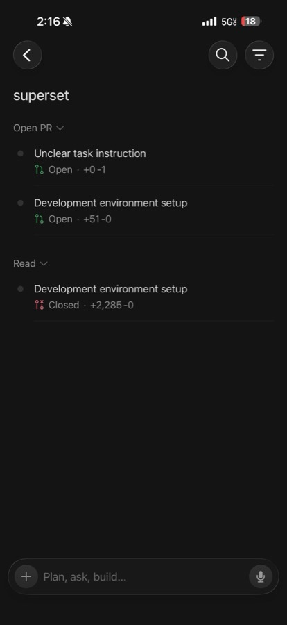 | Resting state: `+`, placeholder, mic. **No send without a draft.** |
| 2 | 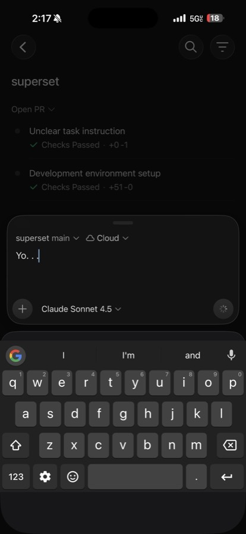 | Voice `finalizing`: spinner owns the trigger slot, send hidden. |
| 3 |  | Send is **added beside** the mic, never replaces it. |
| 4 | 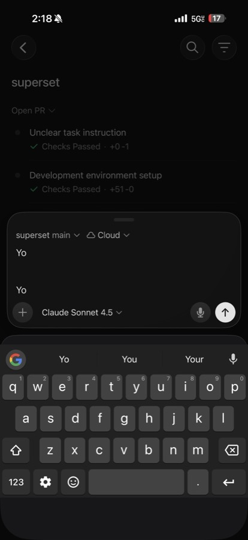 | Card grows with the text from its floor; bottom edge fixed. |
| 5 | 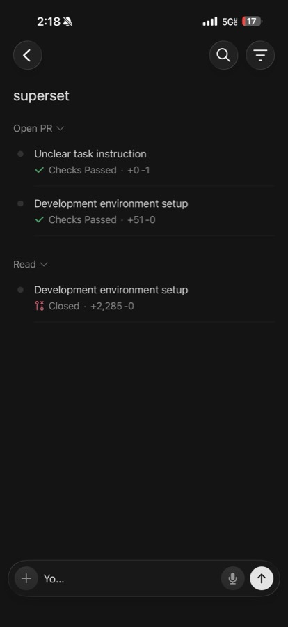 | Long draft collapses to the **head**, tail-truncated. No scroll, no caret, no preserved offset. |
| 6 | 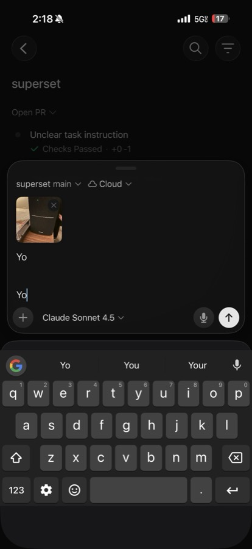 | Attachment row between header and text. ✕ badge overlaps the thumb's top-right. |
| 7 | 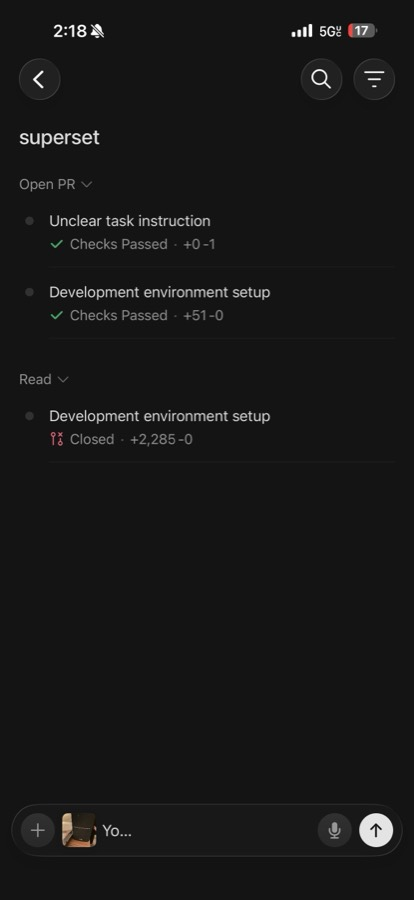 | Collapsed keeps a mini thumb between `+` and the text. No remove badge. |
| 8 | 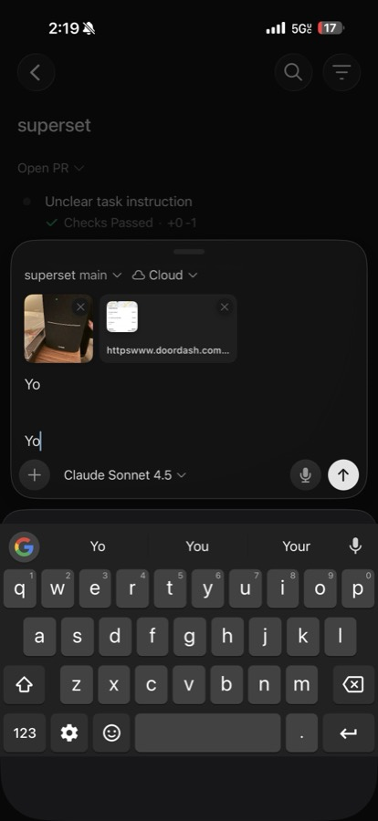 | Link chips are a wider shape: preview + truncated URL. *(Out of scope — see below.)* |
| 9 | 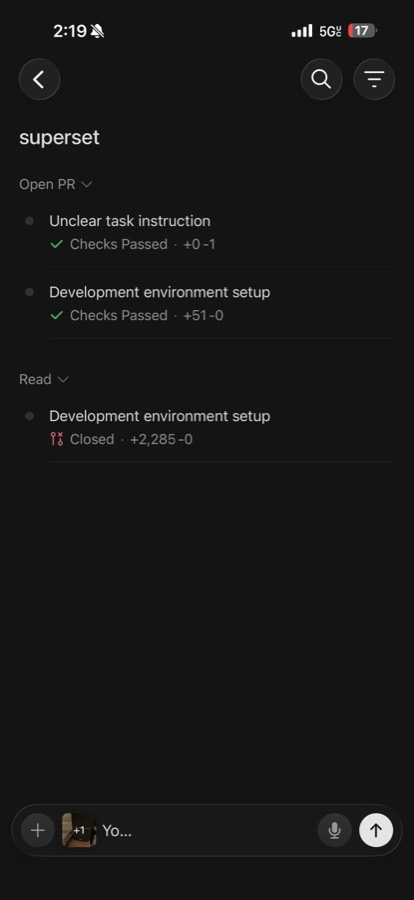 | One mini thumb + `+1`. Collapsed is O(1) in count. |
| 10 | 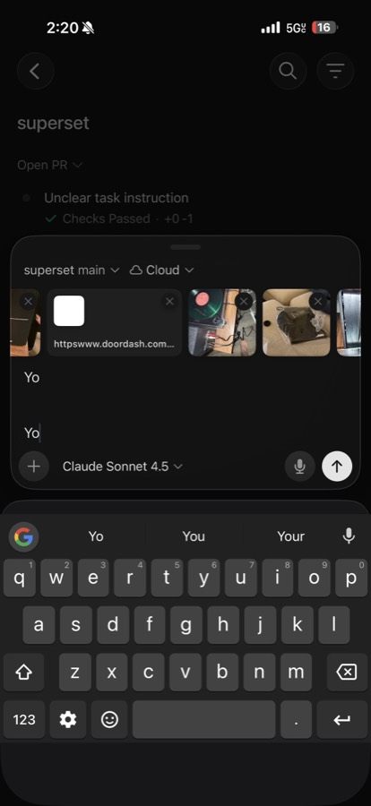 | Carousel: full-bleed, free scroll, card height constant. |
| 11 |  | `+4`. |
| 12 | 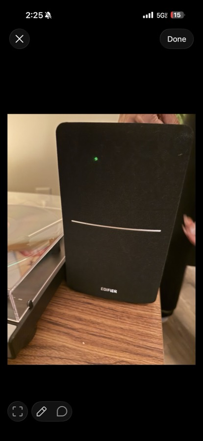 | Tapping an image chip opens a full-screen viewer. |
| 13 | 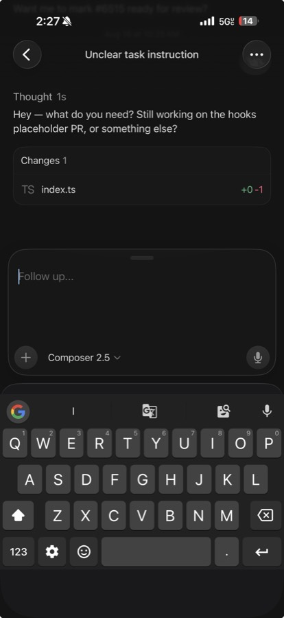 | Session surface: identical card, **header row absent**. |
| 14 | 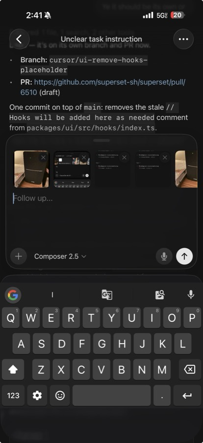 | Surface is **translucent glass**. Send appears for **attachments alone**. |

### Structure

**Expanded** — a translucent glass card, inset from both edges, bottom-anchored above the keyboard,
growing upward:

- Grabber centered at the top edge.
- Header row (home only): `superset main ⌄` (project + branch, one chip) · `☁ Cloud ⌄` (target).
- Attachment carousel, when non-empty.
- Text area: multi-line, top-aligned, ~4-line minimum height.
- Toolbar row: `+` · model picker as text + chevron · spacer · mic · send.

**Collapsed** — a single-line pill at the bottom safe area: `+` · mini thumb · text · mic · send.

### The collapse transition

**Nothing moves.** The expanded toolbar row and the collapsed pill are *the same row*. Measured
across frames (displayed px on a 921-wide render):

| | `+` | middle band | mic | send |
|---|---|---|---|---|
| Frame 4, expanded | 83 | model picker at 157 | 744 | 836 |
| Frame 3, collapsed | 83 | text at 140 | 744 | 836 |
| Frame 7, collapsed + attachment | 83 | thumb 137–218, text at 228 | 744 | 836 |

So collapsing is two independent things:

- **Above the row** — header, carousel and multi-line text area collapse away. The top edge comes
  down; the bottom edge never moves.
- **Inside the row** — the middle band cross-fades: model picker out, mini-thumb stack and
  single-line field in. `+`, mic and send hold position throughout; they are the anchor.

Expanding runs it backwards. The surface translating down when the keyboard dismisses is the
*keyboard's* animation, not the collapse — two separate things that today's implementation
conflates.

### Behaviour table

| | Collapsed | Expanded |
|---|---|---|
| Header row | hidden | visible (home only) |
| Attachments | one mini thumb + `+N`, no remove | full-bleed carousel, ✕ per item |
| Text | one line, head shown, tail-truncated | multi-line, ~4-line floor |
| Model picker | hidden | text + chevron |
| Mic | always | always |
| Send | with draft **or** attachments, beside the mic | same |
| Voice recording | recording pill owns the trigger slot, send hidden | same |
| Voice finalizing | spinner in the trigger slot, send hidden | frame 2 |
| Backdrop | undimmed | dimmed, not shifted |

### Carousel

Horizontal scroll view spanning the full card width, content inset to the card's padding, so
scrolled content runs edge to edge. **No snapping. Adding an attachment does not scroll it** — the
new item appends off the right edge and the offset stays put. Card height is constant regardless of
count.

### Voice

Ported unchanged: `useVoiceDictation`'s state machine, `RecordingPill` (stop square + elapsed
`m:ss` + live level bars, whole pill taps to stop), `FinalizingChip` (spinner). Send stays hidden
while either is active.

### Scope

| In | Out |
|---|---|
| Home + session surfaces | Terminal — ports after the card proves itself |
| Images + doc fallback in the carousel | Link chips (preview + URL) |
| Image viewer: ✕, Done, zoom | Markup pill (pencil, speech bubble) |

---

## Architecture

### Full-screen overlay, not an inline view

The composer is a **full-screen child view controller** over the RN screen, not a Yoga-sized view
inside the RN view tree. This is the decision everything else rests on:

- SwiftUI gets a genuine full-screen safe area, so keyboard insets propagate the way the framework
  expects, and `safeAreaBar` / automatic keyboard avoidance become usable at all.
- It is what the mocks already describe. The composer floats over a **dimmed** list that **does not
  shift** — it was never in the content flow.

Costs, all one-time:

- **Hit-testing** — `hitTest` returns nil outside the composer's own bounds, or the collapsed pill
  blocks the list underneath.
- **Bottom content inset** — the RN list must reserve room for the collapsed pill, since the overlay
  occupies no layout space.
- **Lifecycle** — attaches per-screen as a child view controller, tears down on navigation. Fabric
  drops events from unmounted screens, so teardown ordering needs care.

### Keyboard mechanism — spike, then pick

> **Resolved 2026-08-21: SwiftUI automatic avoidance, zero code.** The comparison below is kept
> because it is why the spike was run and what would bring `keyboardLayoutGuide` back. See
> Progress → Milestone 2 for the result.

Once full-screen, both are available. They differ precisely on our case: a *growing* multiline input
during a keyboard transition.

| | UIKit `keyboardLayoutGuide` | SwiftUI `safeAreaBar` + automatic avoidance |
|---|---|---|
| Tracking | Auto Layout against the guide | Framework-managed |
| Interactive dismiss | `keyboardDismissPadding` extends the drag zone over the card | Framework-managed |
| Growing multiline input | Explicit constraints, predictable | Historically SwiftUI's weakest area |
| Known iOS 26 defects | Wrong constraints with third-party keyboards | `safeAreaBar` reported no-op in beta (FB18350439); large-title scroll-edge bug; `.toolbar(placement: .keyboard)` spacing |

Failure mode on either path is subtle jitter that only shows on device. **Prototype both, measure,
then commit.** The overlay is required either way, so the spike is not off the critical path.

Default if inconclusive: `keyboardLayoutGuide` — explicit constraints fail visibly rather than
subtly.

Two `keyboardLayoutGuide` properties matter if we land there:

- `usesBottomSafeArea = false` — surface sits at the screen bottom with the keyboard down, snaps
  above it when raised. Apple's own framing: "behaving similar to an InputAccessoryView."
- `keyboardDismissPadding` — by default the swipe-to-dismiss gesture only begins once the touch
  intersects the *keyboard*. Setting this to the composer's height makes dragging the card, grabber
  included, drive the **system's** interactive dismissal. **The grabber gesture is a property
  assignment, not a recognizer we write.**

Not `inputAccessoryView`: it is the legacy API `keyboardLayoutGuide` replaced, and it does not
support growing multiline inputs — which is our text area.

### Component boundary — one view, configured by data

Home, session and terminal differ in four ways:

| | Home | Session | Terminal (later) |
|---|---|---|---|
| Header row | project+branch, target | none | none (quick keys) |
| Extra row | — | — | quick keys above the card |
| Attachments | yes | yes | agent sessions only — a plain shell *executes* the path |
| Autocapitalization | default | default | never |
| Submit | create workspace → first message | append to session | write bytes to a PTY |

Everything else is identical, so it is one component. But the sharing must not work the way it does
today: the current surface-specific bits (`header`, `toolbarLeading`, `above`) are **React children
injected into a SwiftUI tree**, which is the direct cause of defects 1–3 above. Splitting into three
components would remove none of them and would drift — which is exactly what happened before the
2026-08-14 unification.

So the native view owns the whole tree and RN passes a *description*, never children:

    <NativeComposer
      headerChips={[…]}        // [{ id, label, systemImage?, menu: [{ id, label }] }]
      quickKeys={[…]}          // terminal only; [] elsewhere
      modelLabel="Claude Sonnet 4.5"
      allowAttachments={…}
      autocapitalize="never"
      onSubmit={…}  onChipSelect={…}  onQuickKey={…}  onAttachmentTap={…}
    />

A picker is a label, an optional SF Symbol, and a list of options — `modules/alert-prompt` and
`modules/attachments-sheet` already prove that shape. The cost is that anything bespoke must become
a chip descriptor rather than arbitrary UI. Worth it: the moment one RN child re-enters the tree,
every seam artifact comes back with it.

**The boundary has leaked if** a `ReactNode`, a measured height, or a manual animation key ever
appears in the prop list.

### Nothing deprecated

| Concern | Using | Avoided |
|---|---|---|
| Keyboard | `keyboardLayoutGuide` / SwiftUI safe area | `inputAccessoryView`, `NotificationCenter` tracking |
| Native module | Expo Modules API, as our three existing modules do | Legacy RN bridge, `requireNativeComponent` |
| Renderer | Fabric | Paper |
| UI | SwiftUI in a `UIHostingController` | Hand-rolled UIKit view tree |
| Material | `glassEffect`, unguarded at an iOS 26 floor | Version-gated glass + solid fallback |

---

## Milestones

Landing as one PR, built in this order so each step is independently verifiable on device.

0. **Prep.** Bump Expo 56 → 57 (`expo@57.0.9`+, RN 0.86.2) and raise the iOS deployment floor to 26
   via `expo-build-properties`; raise the three local module podspecs off 15.1/16.0. Rebuild the dev
   client and confirm the app still runs before touching anything else.
1. **Module skeleton.** `modules/composer` on the Expo Modules API: full-screen overlay child view
   controller, hit-test passthrough, RN mounting and teardown. Renders a static pill. Proves the
   overlay lifecycle before any composer logic exists.
2. **Keyboard spike.** Both mechanisms behind the same skeleton, measured on device with a growing
   multiline input. Pick one, record the result in the Decision log.
3. **Collapsed and expanded states** with the cross-fading middle band and the fixed button row.
   The transition is the product here — get it right before adding content.
4. **Text area** — growth from the ~4-line floor, tail-truncated collapse, draft preserved across
   collapse/expand.
5. **Attachment carousel** — full-bleed scrolling, ✕ badges, mini-thumb + `+N` collapsed
   representation, wired to the existing `PromptInputProvider` tray.
6. **Header chips and model picker** as data-driven native menus.
7. **Voice** — port `useVoiceDictation`, `RecordingPill`, `FinalizingChip` into the native tree.
8. **Image viewer** — ✕, Done, zoom.
9. **Cut over home, then session.** Delete `GlassComposer` once both are moved and the terminal's
   copy is the only remaining caller.

## Verification

On-device, not simulator, for anything keyboard- or dictation-related — the simulator has no speech
recognition and its keyboard timing is not representative.

- Keyboard raise/dismiss with the text area at 1, 4 and 12 lines.
- Interactive swipe-to-dismiss from the grabber, from the card body, and from the keyboard.
- Third-party keyboard active (a known iOS 26 `keyboardLayoutGuide` defect, and the mocks were
  captured with one).
- Collapse and expand with 0, 1 and 5 attachments; draft survives both.
- Dictate → finalize → send; dictate after typing; permission denied.
- Attachments sheet round trip — it blurs the field on the way in and iOS restores first responder
  on dismissal without emitting a focus event.
- Navigate away mid-draft and back.

## Decision log

| Date | Decision |
|---|---|
| 2026-08-21 | The uniwind × worklets `react-native` resolver cycle is fixed in `metro.config.js`, not as a fourth bun patch — our config is what composes the two resolvers. |
| 2026-08-21 | Full-native rewrite, home + session first, terminal after. |
| 2026-08-21 | One component configured by data, not React children. |
| 2026-08-21 | Full-screen overlay child view controller, not an inline RN view. |
| 2026-08-21 | Material stays translucent glass (frame 14), unguarded at an iOS 26 floor. |
| 2026-08-21 | Grabber does normal dismissal via `keyboardDismissPadding`, not a hand-written gesture. |
| 2026-08-21 | Voice ported unchanged. |
| 2026-08-21 | Link chips and markup tools out of scope. |
| 2026-08-21 | Raise floor to iOS 26 and bump Expo to 57 as milestone 0, in the same PR. |
| 2026-08-21 | Keyboard: SwiftUI automatic avoidance, not `keyboardLayoutGuide`. Verified on simulator incl. the growing-multiline case; interactive dismissal still owes a real-device check. |

## Progress

### Milestone 0 — prep (done)

Expo 56 → **57.0.15** (RN **0.86.2**, reanimated **4.5.1**, worklets **0.10.1** — the Hermes V1
memory regression is gone), iOS floor raised to **26.0**, `expo-router` patch retired, local module
podspecs raised.

**Verified end to end on an iPhone 17 Pro / iOS 26.5 simulator: the app builds, launches and renders
the home screen.** Along the way: cold `expo export --platform ios --clear` after wiping
`react-native-worklets/.worklets` produces a 13 MB Hermes bundle; `expo prebuild` + `pod install`
clean; `xcodebuild` **BUILD SUCCEEDED** with zero errors and no deployment-target warnings; app
target Debug **and** Release at `IPHONEOS_DEPLOYMENT_TARGET = 26.0`; both patch guard tests pass;
mobile's own source typechecks clean.

`expo-speech-recognition` compiles fine against `ExpoModulesCore 57.0.12` despite having no SDK 57
release of its own — the risk flagged below did not materialise.

#### The one real regression: a `react-native` resolver cycle

The first launch died before `AppRegistry` ever ran:

    [runtime not ready]: RangeError: Maximum call stack size exceeded (native stack depth)
    [runtime not ready]: Invariant Violation: "main" has not been registered.

with a stack of nothing but `get NativeModules` repeating at one fixed bundle offset. Reading the
dev bundle at that offset found a two-module cycle: module 439
(`react-native-worklets/bundleMode/shims/reactNativeShim.js`) depends on module 440
(`uniwind/src/components/index.ts`), whose `_dependencyMap[22]` is 439.

**Both packages alias `react-native`, and neither knows about the other.** Bundle Mode redirects
every `react-native` import to its shim *except* the shim's own, which is meant to fall through to
the real module. uniwind has an equivalent guard, but it recognises react-native internals by
looking for `/react-native/` in the importer's path — and the shim lives in
`/react-native-worklets/`, which does not match. So the fall-through lands in uniwind's component
index, whose every export is a getter that re-requires `react-native`, straight back to the shim.

Fixed in `metro.config.js` rather than with a patch: our config is what composes the two resolvers,
so an outermost `resolveRequest` there resolves the shim's own `react-native` import to the real
module and the cycle cannot form. Everything else still passes through both resolvers untouched.
Reordering the wrappers does **not** work — both want to *be* `react-native` — and uniwind 1.11.0's
resolver is byte-identical to 1.8.0's, so bumping it does not help either.

#### Five other things worth knowing before repeating the bump

1. **`expo install --fix` downgrades packages the repo is deliberately ahead of.** It aligns to the
   SDK's known-good versions, which are floors, not ceilings. It silently took
   `@sentry/react-native` **8.23.0 → 7.11.0** (a major downgrade) and `@shopify/flash-list`
   **2.3.2 → 2.0.2** — the latter is what removed `stickyHeaderConfig` and broke
   `FilesChangedScreen`. Both restored. **Always diff `package.json` for downgrades after `--fix`.**
2. **`--fix` writes `~` ranges**, but this repo pins exact (`exact = true` in `bunfig.toml`). The 32
   touched packages had to be re-pinned to their resolved versions.
3. **`minimumReleaseAge = 259200`** (3 days) in `bunfig.toml` blocks freshly published Expo
   releases, and `expo install --fix` shells out to `bun add` so the flag can't be threaded through.
   Worked around with `bun add --minimum-release-age=0` per install. **Before this PR lands, confirm
   a clean install succeeds with the gate on** — the pinned versions age past it on their own
   (57.0.15 clears 2026-08-23), so this should resolve itself rather than needing an exclusion.
4. **The metro patch still applies and still matters.** `@expo/cli@57.0.17` depends on
   `@expo/metro ~56.0.0`, which pins **metro 0.84.4** — the patched version. The unpatched
   **0.87.0** in the lockfile arrives only via `@react-native/metro-config`, which our
   `metro.config.js` never touches (it goes through `@sentry/react-native/metro` →
   `expo/metro-config`). The cold export above is the proof.
5. **SDK 57 stopped autolinking config plugins.** Every installed plugin must now be listed in
   `app.config.ts` or its native setup is skipped silently — added `expo-asset`, `expo-font`,
   `expo-image`, `expo-secure-store`, `expo-status-bar`, `expo-web-browser`.

Pre-existing and not caused by this bump: 18 typecheck errors in `packages/port-scanner`,
`packages/pty-daemon` and `packages/workspace-fs` (`allowImportingTsExtensions`, `unref` on
`number`) that mobile's tsconfig sweeps in. `@types/node` did not move in this bump.

### Milestone 1 — module skeleton (done)

`modules/composer` exists on the Expo Modules API and autolinks. `ComposerAnchorView` is a
zero-size `ExpoView` that follows React's mount lifecycle and attaches
`ComposerOverlayController` as a child view controller of the screen's *own* view controller
(found by walking the responder chain, not `currentViewController()` — the overlay belongs to the
screen and must leave with it).

Rendering happens in `ComposerRootView`, SwiftUI, currently just the collapsed pill: `+`,
placeholder, mic, on `glassEffect(.regular.interactive())`. The iOS 26 floor means that is
unguarded — it compiled first try.

Verified on device with Maestro, both directions plus lifecycle:

- Taps outside the pill reach the list underneath.
- Taps on the pill are absorbed and do **not** reach the row behind it.
- The SwiftUI content is in the accessibility tree (so it is really rendering, not just painted).
- Navigating away detaches the overlay; navigating back reattaches it.
- Prop changes reach the live overlay.

Two bugs found and fixed while getting there, both worth remembering:

1. **You cannot substitute `UIHostingController`'s view.** The first cut subclassed it and assigned
   a passthrough view in `loadView()` before calling `super`. `UIHostingController` builds its own
   view there and throws yours away, so hit-testing stayed stock and the overlay ate every touch
   meant for the screen. The fix is to *wrap*: a `ComposerPassthroughView` container holds the
   hosting view as a subview, and returns `nil` before descending into it.
2. **A named SwiftUI coordinate space is anchored inside the safe area.** Frames reported that way
   came out a top inset too high — on a notched device the hit region would sit ~59pt above the
   visible pill. The composer reports `.global` instead, and `hitTest` converts its point to window
   coordinates to match.

### Milestone 2 — keyboard spike (decided, with one caveat)

**SwiftUI's automatic keyboard avoidance wins. It costs zero code.**

With a `TextField(axis: .vertical)` in the pill and nothing else — no `keyboardLayoutGuide`, no
notification tracking, no manual offsets — on an iPhone 17 Pro / iOS 26.5 simulator:

- Focusing raises the composer to sit directly above the keyboard.
- Typing until the field wrapped to six lines grew the composer **upward** with its bottom edge
  pinned above the keyboard, and the keyboard did not move.
- The list behind never shifted, in either state.
- Touch passthrough still worked with the overlay moved and grown — a row above the composer took a
  tap normally.

That growing-multiline case is the one this document predicted would be SwiftUI's weak spot, and it
is the whole reason the spike existed. It is not a weak spot here. **Defect #4 — the keyboard
avoidance today's composer hand-rolls, because a native Stack header offsets
`KeyboardAvoidingView`'s frame measurement — disappears for free** the moment the composer owns a
full-screen hosting controller. That is the payoff of the overlay decision, earlier than expected.

So `keyboardLayoutGuide` is **not** needed, and neither is `safeAreaBar` — plain SwiftUI layout
inside a full-screen `UIHostingController` is enough.

**Caveat, and it is the important half:** two things the simulator cannot answer and that still need
a real device before this is settled —

1. **Interactive swipe-down dismissal**, where the composer tracks the finger. A simulator drag is
   not a real one. If this turns out not to track, the fix is `keyboardDismissPadding`, which needs
   `keyboardLayoutGuide` — i.e. mechanism B returns for that one behaviour.
2. **Keyboard timing.** Simulator animation timing is not representative, so "no visible jitter
   here" is weak evidence about a device.

Simulator note for whoever repeats this: the software keyboard will not appear while Simulator.app
has a hardware keyboard connected, and `ConnectHardwareKeyboard` is read by Simulator.app at launch.
Setting it per-device in `DevicePreferences` does not survive — Simulator rewrites the plist on
quit. What works: `defaults write com.apple.iphonesimulator ConnectHardwareKeyboard -bool false`
**then** launch Simulator.app. Note also that quitting Simulator.app **shuts down every booted
device**, including other sessions'.

### Milestone 3 — collapse transition (done, reworked after review)

The first cut was wrong in ways Satya caught immediately on device. What it got right: the
container's grow/shrink, and keyboard avoidance. What it got wrong, and why:

**1. Glass buttons were janky — pressing bled outside the container, and the circles were taller
than the pill.** Root cause: `.buttonStyle(.glass)` inside a glass surface. Apple's Liquid Glass
guidance is *layer economy* — one glass sheet per view, and controls inside it sit on **solid
fills**, not on more glass. Nesting double-layers the material, which renders badly and leaks the
press state past the container. The stock glass styles also add their own padding, which is what
made a 30pt label render taller than the row enclosing it. Replaced with `ComposerControlStyle`, a
plain `ButtonStyle` on a solid fill with its own press feedback and a `.contentShape` hit target.

**2. The text visibly slid across the surface when expanding.** Satya's hunch — that real apps use
two inputs — is right, and it is the documented chat-composer pattern: a **read-only `Text` preview
when collapsed**, the **real editor when expanded**, cross-faded. Nothing translates because nothing
moves; one fades out as the other fades in. It also matches frame 5, which is a truncated summary,
not an editable field with a caret.

That deleted `ComposerLayout.swift` entirely. The custom `Layout` + `AnyLayout` only existed to
relocate a single shared field without losing first responder — with two views there is nothing to
relocate, and a plain bottom-anchored `VStack` keeps the controls fixed for free. Verified with the
hardware keyboard connected (so expanding does not raise a keyboard and both states share an
anchor): `+` at (80, 1859) and mic at (838, 1859) in **both** states.

**3. Nothing faded.** `.opacity(...)` inside a custom `Layout` does not animate. Conditional views
with `.transition(.opacity)`, driven by `withAnimation` in `expand()`/`collapse()`, do.

**4. The grabber would not drag to dismiss.** Two causes. The gesture was attached with `.gesture`,
so the surface's `.onTapGesture` — which *wraps* the grabber — won arbitration and swallowed it;
`.highPriorityGesture` fixes that. And the surface now only expands on tap when collapsed, rather
than re-running expansion while already open. The drag tracks the finger live and springs back if
released short of the threshold.

**5. A chicken-and-egg the rework introduced.** `isExpanded` can no longer derive from
`@FocusState`: focus would have to be set on an editor that exists only *because* focus was set, and
SwiftUI drops focus on a view not in the tree, so the composer never opened. Expansion is now its
own `@State`, leads the transition, and the editor claims focus in `onAppear`. `onChange(of:
isFocused)` collapses when the keyboard leaves by any other route.

Also still true from the first cut: the composer owns its own dismissal. Expanded it claims the
whole screen and dims the backdrop, because a React Native view underneath cannot resign a SwiftUI
first responder — a tap that merely passes through would leave it stuck open.

Two things worth carrying forward: opacity-collapsed views stay in the accessibility tree and need
`.accessibilityHidden`; and Maestro's `assertNotVisible` on iOS reads the XCUITest element tree, not
actual visibility, so it reports zero-opacity text as present.

**Still needs a device and Satya's eyes:** whether the transition *feels* right. The
`.snappy(duration: 0.3, extraBounce: 0.05)` curve is a guess, and interactive keyboard dismissal
needs real fingers.

### Audit — anything else fighting the framework?

Prompted by the text-translation mistake: what else in the module reaches around SwiftUI instead of
letting it answer? Checked the whole module (485 lines across four Swift files and a 6-line TS
surface).

**Attacked and put back: the hit-test frame.** SwiftUI reports the composer's frame out so
`ComposerPassthroughView` can decide what falls through — the same *shape* as the mistake. The
obvious replacement is to ask UIKit what was hit and pass through when the answer is the hosting
view. **Tried it; it does not work.** SwiftUI services taps on non-control content — the collapsed
draft preview, the surface's own tap target — with recognizers on the hosting view rather than child
platform views, so "hit the hosting view" is indistinguishable from "hit nothing", and real taps on
the pill fell through to the list. The frame stays, now documented with that evidence so it is not
re-attempted blind. It differs from the `GlassComposer` seam in the way that matters: it never
crosses into React Native and never drives layout, only hit-testing.

**Fixed:** dead `isAttached`; and `.environment(\.colorScheme, .dark)` replaced with
`overrideUserInterfaceStyle` on the hosting controller, which is what actually reaches the
UIKit-backed pieces — keyboard appearance, selection handles, the caret.

**Two bugs the audit itself introduced, both caught by the Maestro suite rather than by reading:**

1. The patch that removed the frame plumbing also dropped `renderRootView()` from `attach()`, so the
   root view kept its no-op callback, `interactiveFrame` stayed `.zero`, and **every touch fell
   through** — the composer rendered perfectly and responded to nothing. Note the near-miss:
   `blocking` still passed, because the point it taps happens to land in the gap *between* two rows,
   so "the row did not change" was true for the wrong reason. A passing test proved nothing there.
2. Mirroring `isExpanded = focused` in the focus observer reads tidier and breaks opening — the
   editor claims focus in `onAppear`, and that re-entrant change lands back in the observer
   mid-update and knocks `isExpanded` down again. Closing follows focus; opening has to lead it.

**Left alone, flagged for milestone 5/6:** props reach the view by reassigning
`hosting.rootView`. Fine for one string, awkward once `headerChips`, `quickKeys`, `modelLabel` and
`allowAttachments` arrive — and the draft currently lives in the view's `@State`, which cutover
needs to read and clear. Both point at the same fix: an `@Observable` model owned by the controller
and injected once. Worth doing *before* the props multiply, not after.

Scaffolding to delete at cutover: `app/(authenticated)/composer-preview.tsx` and
`screens/(authenticated)/composer-preview/`. Unlinked from all navigation — reachable only via
`superset://composer-preview` — so it adds no discoverable route. Its placeholder is deliberately
`Native composer` rather than the real one, so it can be told apart from the home composer when
driving the app.

## Open questions

1. **Collapsed mini-thumb tap** — opens the viewer, or expands the composer? Assuming *expands*:
   at ~30pt inside a pill whose whole surface expands, a distinct target would be a mis-tap
   generator.
2. **Interactive swipe-down dismissal on a real device** — the one part of the keyboard spike a
   simulator cannot answer. If the composer does not track the finger, `keyboardDismissPadding`
   (and so `keyboardLayoutGuide`) comes back for that behaviour alone.

## Sources

- [Keep up with the keyboard — WWDC23](https://developer.apple.com/videos/play/wwdc2023/10281/)
- [`keyboardLayoutGuide` — Apple Developer Documentation](https://developer.apple.com/documentation/uikit/uiview/3752221-keyboardlayoutguide)
- [Improving iOS keyboard avoidance using keyboardLayoutGuide — react-native-community](https://github.com/react-native-community/discussions-and-proposals/discussions/867)
- [Expo SDK 57 changelog](https://expo.dev/changelog/sdk-57)
- [Expo SDK 56 changelog (iOS 16.4 floor)](https://expo.dev/changelog/sdk-56)
- [iOS 26: keyboardLayoutGuide does not give the correct constraint](https://developer.apple.com/forums/thread/792086)
- [Build an iMessage-style chat input in pure SwiftUI](https://www.theswift.dev/posts/swiftui-chat-input-keyboard-safe-area/)
- [SwiftUI `.safeAreaBar` issue with large navigation title](https://developer.apple.com/forums/thread/812480)
