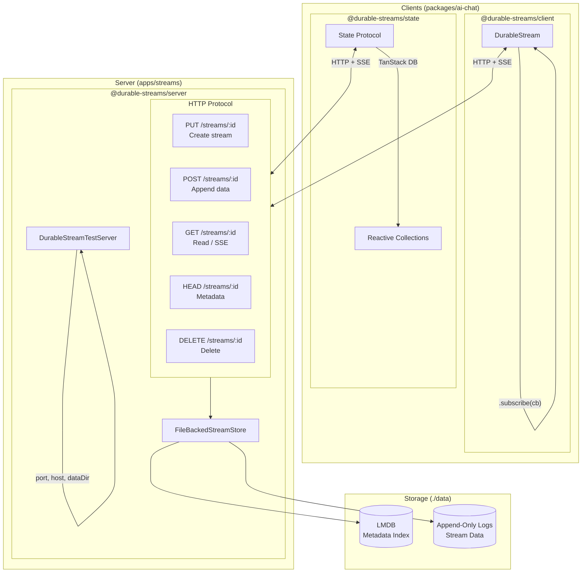
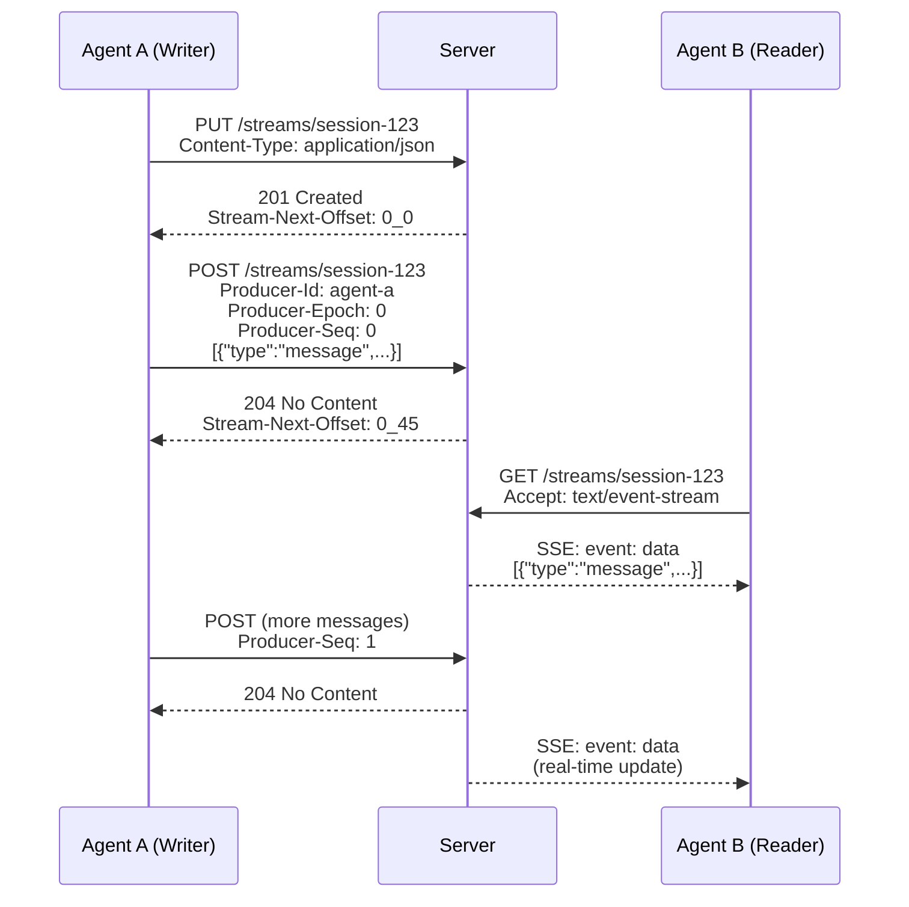
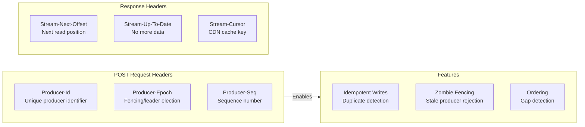
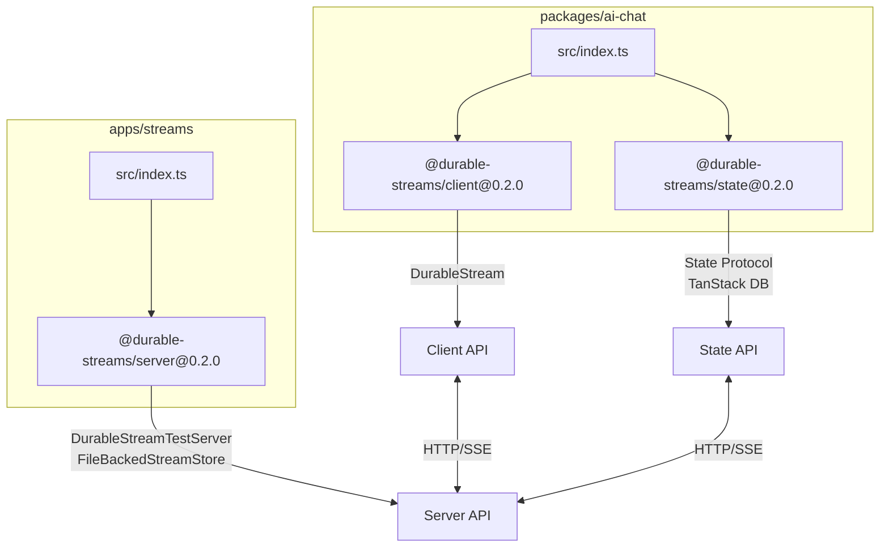

# Durable Streams Architecture

## System Overview

```mermaid
flowchart TB
    subgraph Clients["Clients (packages/ai-chat)"]
        subgraph ClientPkg["@durable-streams/client"]
            DS[DurableStream]
            DS --> |".create(url)"| DS
            DS --> |".append(data)"| DS
            DS --> |".read(offset?)"| DS
            DS --> |".subscribe(cb)"| DS
        end
        subgraph StatePkg["@durable-streams/state"]
            State[State Protocol]
            State --> |"TanStack DB"| Collections[Reactive Collections]
        end
    end

    subgraph Server["Server (apps/streams)"]
        subgraph ServerPkg["@durable-streams/server"]
            DST[DurableStreamTestServer]
            DST --> |"port, host, dataDir"| DST

            subgraph HTTP["HTTP Protocol"]
                PUT["PUT /streams/:id<br/>Create stream"]
                POST["POST /streams/:id<br/>Append data"]
                GET["GET /streams/:id<br/>Read / SSE"]
                HEAD["HEAD /streams/:id<br/>Metadata"]
                DELETE["DELETE /streams/:id<br/>Delete"]
            end

            Store[FileBackedStreamStore]
        end
    end

    subgraph Storage["Storage (./data)"]
        LMDB[(LMDB<br/>Metadata Index)]
        Logs[(Append-Only Logs<br/>Stream Data)]
    end

    DS <--> |"HTTP + SSE"| HTTP
    State <--> |"HTTP + SSE"| HTTP
    HTTP --> Store
    Store --> LMDB
    Store --> Logs
```

## Request/Response Flow

```mermaid
sequenceDiagram
    participant A as Agent A (Writer)
    participant S as Server
    participant B as Agent B (Reader)

    A->>S: PUT /streams/session-123<br/>Content-Type: application/json
    S-->>A: 201 Created<br/>Stream-Next-Offset: 0_0

    A->>S: POST /streams/session-123<br/>Producer-Id: agent-a<br/>Producer-Epoch: 0<br/>Producer-Seq: 0<br/>[{"type":"message",...}]
    S-->>A: 204 No Content<br/>Stream-Next-Offset: 0_45

    B->>S: GET /streams/session-123<br/>Accept: text/event-stream
    S-->>B: SSE: event: data<br/>[{"type":"message",...}]

    A->>S: POST (more messages)<br/>Producer-Seq: 1
    S-->>A: 204 No Content
    S-->>B: SSE: event: data<br/>(real-time update)
```

## Producer Idempotency Headers

```mermaid
flowchart LR
    subgraph Request["POST Request Headers"]
        PID[Producer-Id<br/>Unique producer identifier]
        PE[Producer-Epoch<br/>Fencing/leader election]
        PS[Producer-Seq<br/>Sequence number]
    end

    subgraph Response["Response Headers"]
        SNO[Stream-Next-Offset<br/>Next read position]
        SUD[Stream-Up-To-Date<br/>No more data]
        SC[Stream-Cursor<br/>CDN cache key]
    end

    Request --> |"Enables"| Features

    subgraph Features["Features"]
        Idem[Idempotent Writes<br/>Duplicate detection]
        Fence[Zombie Fencing<br/>Stale producer rejection]
        Order[Ordering<br/>Gap detection]
    end
```

## Package Dependencies

```mermaid
flowchart TB
    subgraph apps/streams
        Index[src/index.ts]
        Index --> DSServer["@durable-streams/server@0.2.0"]
    end

    subgraph packages/ai-chat
        AiChat[src/index.ts]
        AiChat --> DSClient["@durable-streams/client@0.2.0"]
        AiChat --> DSState["@durable-streams/state@0.2.0"]
    end

    DSServer --> |"DurableStreamTestServer<br/>FileBackedStreamStore"| ServerAPI[Server API]
    DSClient --> |"DurableStream"| ClientAPI[Client API]
    DSState --> |"State Protocol<br/>TanStack DB"| StateAPI[State API]

    ClientAPI <--> |"HTTP/SSE"| ServerAPI
    StateAPI <--> |"HTTP/SSE"| ServerAPI
```
