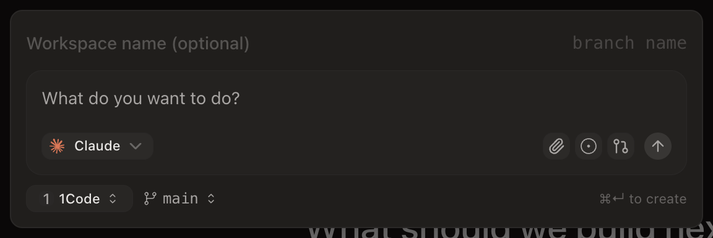
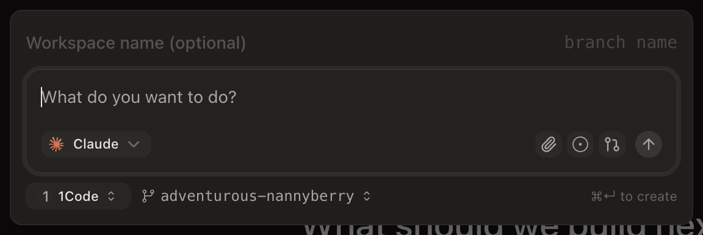
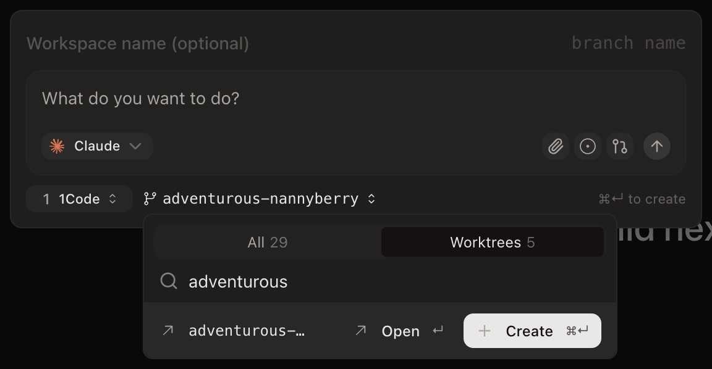
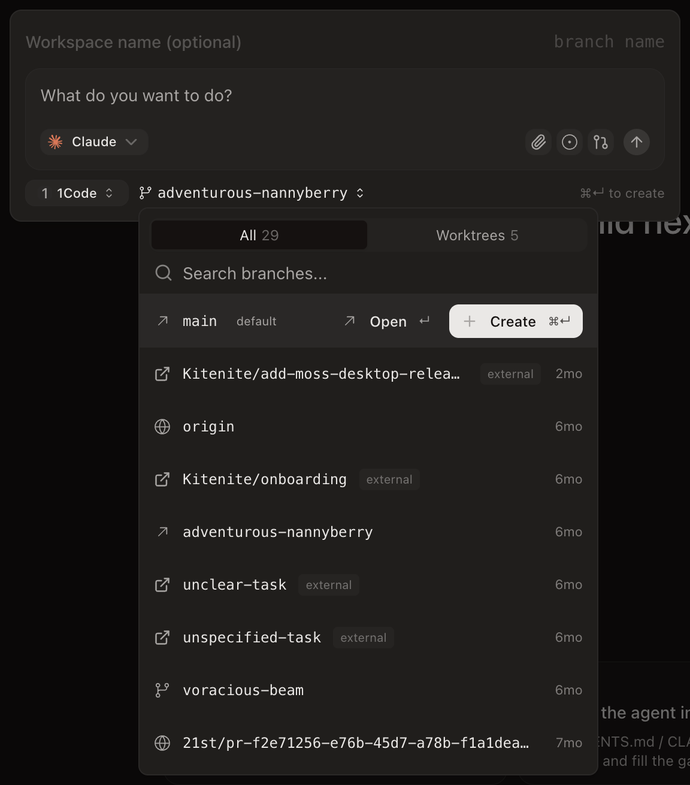

# Shared input-group popup audit

The new-workspace search dismissal was reproduced in the real Electron renderer before the fix: clicking Linear, GitHub issue, or pull-request search moved focus into the composer and closed the popup. After the fix, search retains focus and the popup remains open. The guard only excludes React portal events originating outside the addon's DOM subtree.

## Consumers audited

| Consumer | Finding |
| --- | --- |
| NewWorkspaceScreen | Confirmed affected. The shared guard fixes Linear/GitHub/PR search interaction and protects its agent/model/effort portals. Verified in the running app. |
| DashboardNewWorkspaceForm/PromptGroup | Shares the contenteditable composer, InputGroupAddon footer and issue pickers with NewWorkspaceScreen. Receives the same fix; this modal variant was audited in source rather than separately exercised live. |
| Legacy NewWorkspaceModal/PromptGroup | Uses the same footer, but a textarea. Its GitHub/PR popovers also explicitly prevent focus-out dismissal. Verified its textarea footer focus, branch picker close/reopen behavior, and GitHub/PR search focus in the real legacy modal via CDP. |
| TerminalRichInput | Footer contains a terminal icon and submit button, with no portaled picker inside the footer. The ordinary contenteditable focus path remains intact. |
| Web PreviewPromptComposer / AgentPromptInput | Model, attachment and submit controls are currently disabled; no active popup journey exposes this bug. |
| Web InputsSection | Direct InputGroupAddon consumers have an icon, suffix text, or send button. The guard allows their normal DOM events through. |
| PromptInputHeader | Exposes the same addon wrapper; no application consumers found. Protected for future portaled children. |
| Mobile PromptInputFooter | Separate React Native View implementation; does not consume the changed DOM primitive. |

Search covered all TS/TSX references to InputGroupAddon, PromptInputFooter and PromptInputHeader in apps/ and packages/, plus similar ancestor click/focus handlers. Other click guards found in the sidebars do not share this composer refocus path.

## Additional findings fixed

- **Legacy branch picker retained filters after selection.** CompareBaseBranchPickerInline now routes selection, Open, Create, and dismissal through the same close handler, clearing both branchSearch and filterMode. The component was extracted unchanged apart from close handling so the actual picker can be mounted in regression tests. Mouse row selection, keyboard selection, Open, and Create all failed the reset assertion before the fix; all pass afterward, along with Escape.
- **Addon padding did not focus textarea controls.** InputGroupAddon now includes textarea in its focus target lookup. The textarea padding regression failed before the change and passes afterward. Tests cover input, textarea, and contenteditable focus, popup search clicks/typing, checkbox labels, and trigger actions, using the actual shared addon and Radix popup.

Both additional findings were also reproduced before their fixes and verified afterward in the full legacy modal through CDP. The app was switched to v1 using Settings > Experimental > Try Superset v2, then the modal was opened with Cmd+N. The original v2 setting was restored after verification.

## Verification

- New regression tests mount actual InputGroupAddon + Radix Popover together and exercise search clicks/typing, a checkbox label, normal addon clicks and trigger action. The search interaction test fails with the portal guard removed; the interaction tests pass with the fix for input, textarea, and contenteditable composers.
- Both Radix integration test files and the legacy picker tests pass together (12 tests, 60 assertions).
- Full new-workspace-page UI audit covered issue search/selection/scrolling/toggles, projects, branches, agent/model/effort menus and nested model choices, device and nested host menus, cloud environments, create/clone dialogs, native chooser opening/cancellation, tooltips and image previews. Nine repeated search interactions after page navigation retained focus, with zero captured console errors. Six further Linear/GitHub/PR search interactions passed after the textarea and legacy picker changes.
- The branch picker cleanup was reproduced before the fix and verified after pointer and keyboard selection: reopening clears the search.
- Native file selection and populated prompt history were not verified end-to-end. Image preview used a repo icon supplied through CDP file-input setup. OMP launch mode was unavailable in the installed agent list. Remote host selection, image download, and v2 branch Open workspace actions were not exercised. The legacy branch Open action was verified as described below.

## Legacy modal CDP evidence

Target: this worktree's Electron process, renderer `http://localhost:4245`, CDP `9337`, verified signed-in session. Real pointer/keyboard input was used throughout. For the baseline, only the textarea lookup and legacy internal close-handler calls were temporarily reverted; both files were restored before the after checks. The working tree is clean.

| Journey | Before | After |
| --- | --- | --- |
| Click workspace name, then blank composer footer | Focus ends on a DIV, not the textarea | Focus ends on TEXTAREA; typing reaches the prompt |
| Worktrees filter, search `adventurous`, select Create, reopen | Search remains `adventurous`, Worktrees stays selected, 1 result | Search is empty, All selected, 29 results |
| Select a branch row with mouse or Enter, reopen | Covered by regression tests | Empty search, All selected, 29 results in CDP |
| Escape or outside click, reopen | Existing behavior | Empty search, All selected, 29 results in CDP |
| Open an existing workspace, then Cmd+N and reopen picker | Covered by regression tests | Navigates to the existing workspace; reopened picker has empty search, All selected, 29 results |
| Footer focus after modal remount | — | Textarea receives focus |
| GitHub issue and PR search inside textarea composer | — | Click and type keep search focused and popup open |

No console errors or uncaught runtime exceptions were captured during the lifecycle and Open-workspace runs. No workspace was created. Test prompt text was cleared, the draft base branch restored to main, and the original unset v2 override restored.

Before/after footer focus (after shows the prompt focus ring and caret):

Before/after branch picker reopening:

