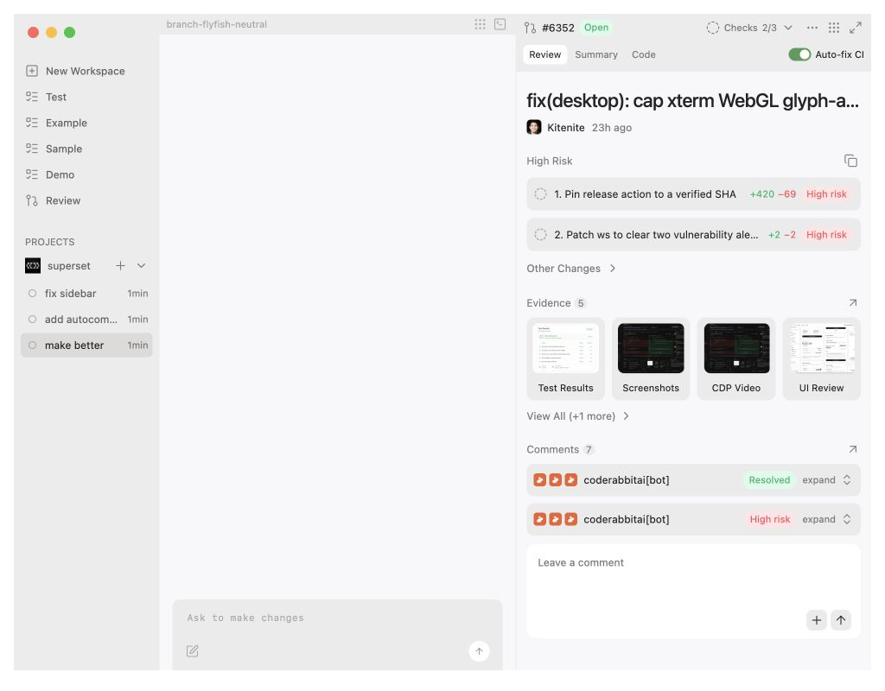
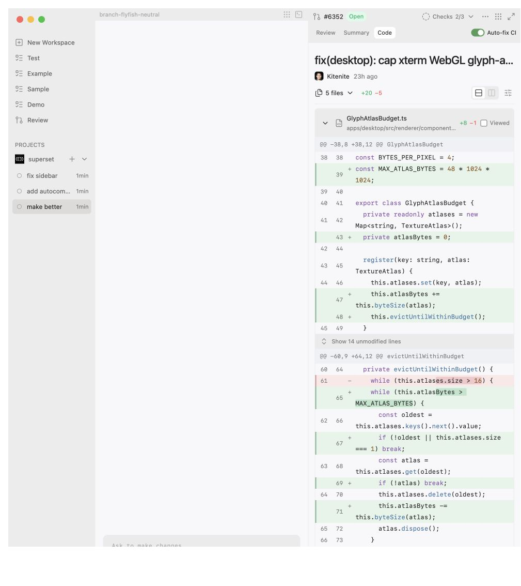

# Product feedback and PR pane design

Avi's product review, September 29, 2026. This handoff preserves the feedback from the design conversation, the final interactive UI prototype, and ticket drafts for engineering. The prototype uses sample data; this PR does not implement the product fixes.

## Review the design

Open the [Superset page](https://app.superset.sh/page/pr-pane-design-and-product-feedback-2k3bxd) to interact with the design and pin comments. It is published to the Superset organization. The publish source is [page/index.html](page/index.html), with local scripts beside it so the page works under Superset Pages' content policy.

To republish this same page, use a current Superset CLI (1.29 or later):

```sh
superset pages publish plans/20260929-product-feedback/page \
  --page ae412ce5-b5a9-408f-be8e-babaa729e193 \
  --workspace 9dbc22cb-8f1a-480f-bac9-66bdcb9d0beb \
  --label "Describe the design changes" --no-watch
```

The page bundles Lucide 1.17.0 locally with its ISC license and uses a bounded local state adapter. It has no remote scripts or script network requests. [Hosted preview](references/superset-page.jpg).

Open [pr-pane-prototype.html](pr-pane-prototype.html) in a browser. It is a standalone export with its own preview shell and state storage. [pr-pane-source.html](pr-pane-source.html) preserves the editable UI fragment from the design session. Icons use the bundled preview runtime's CDN dependency, so the preview needs internet access for icons.

For a local HTTP preview, run this from the repository root:

```sh
python3 -m http.server 8000 --directory plans/20260929-product-feedback
```

Then open <http://localhost:8000/pr-pane-prototype.html>. GitHub's HTML file viewer shows source; it does not run the prototype.



<details>
<summary>Code view</summary>



</details>

## Feedback to implement

| Draft | Outcome | State |
| --- | --- | --- |
| [Plugins: Try now and Copy link](tickets/plugin-activation.md) | Open an editable example prompt with the plugin selected; share a stable detail-page link. | Requirements and references captured |
| [Gmail: intended account selection](tickets/gmail-account-selection.md) | Recover from account mismatches and connect the intended Gmail address. | Root cause needs reproduction |
| [Desktop: window dragging](tickets/window-drag.md) | Move the window without resizing it first. | Intermittent bug needs reproduction |
| [PR/Changes pane experience](tickets/pr-pane.md) | Fit PR review, summary, and realistic code diffs into the existing freeform pane system. | Interactive design prototype complete |

These are ticket drafts, not issues already filed in an issue tracker. The first three are also captured on [Product Feedback rn](https://app.notion.com/p/3eab9d5bf61680b9a6ded9e98069b80a).

## Accepted UI direction

- Use the full PR page as the visual reference. Keep the terminal and PR as independent sibling panes in the existing workspace. No second pane manager inside a terminal.
- Put Review, Summary, and Code navigation and functional PR actions in the pane toolbar. Keep the title and author in the body.
- Consolidate checks into a compact status list/popover with per-check state. No separate Checks tab. Use an **Auto-fix CI** toggle in the toolbar instead of a prominent **Fix issue** button.
- Remove the agent prompt input from the bottom of the PR pane. Keep agent instructions in the sibling terminal; a PR comment field remains part of review.
- Match the supplied **High Risk** findings reference: muted heading, copy action, rounded gray rows, dashed-circle markers, numbered titles, green/red change counts, pale risk badges, and expandable **Other Changes**.
- Make Code look and behave like a real diff viewer: file navigation, syntax, old/new line numbers, hunk headers, word changes, unified/split layouts, line wrapping, viewed state, collapsed context, inline comments, and review threads.
- Keep Code controls in one compact row. Put wrapping in display options and viewed progress in file navigation instead of adding a second controls row below the author.
- Preserve readability as panes shrink. The findings metadata wraps below the title at narrow sizes; Code falls back to unified layout when a split diff no longer fits.

## What the prototype demonstrates

The final prototype includes the sibling-pane layout, pane movement/maximize controls, toolbar tabs and menus, the checks popover, Auto-fix CI state, reference-style findings, evidence/comments, and five sample file diffs. Findings and Other Changes navigate to the corresponding sample diff. Code supports display options, per-file viewed/collapse state, line selection, and local inline comment drafts. A review-thread action prepares context in the sibling terminal while preserving an existing instruction draft.

No real checks, OAuth, plugin installation, agents, comments, or GitHub mutations run from the prototype. The Auto-fix CI switch only changes local demo state. The sample #6352 title, two risk findings, evidence tiles, and diff counts are illustrative content from the references, not verified findings about this repository. The code presentation is a mockup; production already uses `@pierre/diffs/react` and should reuse that implementation.

## Validation

- UI checked at a 1024px browser width (about a 410px PR pane) and a 320px browser width (about a 273px stacked pane): no horizontal overflow in the findings, counts and badges remain visible.
- Both high-risk findings open the expected release/dependency file. Other Changes expands and its regression-test item opens the test diff.
- Code controls, file navigation, viewed state, wrapping, and split/unified behavior were exercised during the design iteration. The committed standalone export was also checked: Review-to-Code navigation, file picker, and narrow-width findings layout work; no browser console errors were recorded.
- Published Superset page checked under its hosted content policy: all 56 icons rendered, the findings opened the correct Code file, and no browser console errors were recorded.
- This is a design/documentation PR. Desktop production behavior and the reported bugs have not been verified or changed by it.

## References

| Image | Purpose |
| --- | --- |
| [Plugin actions](references/plugin-actions.png) | Try now and Copy link placement |
| [Plugin composer](references/plugin-composer.png) | Selected Gmail plugin and editable example prompt |
| [Full PR page](references/full-pr-reference.png) | Overall visual language and review content |
| [Code toolbar before](references/code-toolbar-before.png) | Controls that were too bulky and fragmented |
| [Findings target](references/review-findings.png) | Exact High Risk row treatment |

The initial half-width pane image and the compact checks crop were supplied in the conversation, but their temporary source files were no longer present when this handoff was packaged. Their requirements are recorded in the accepted UI direction and PR pane ticket.
