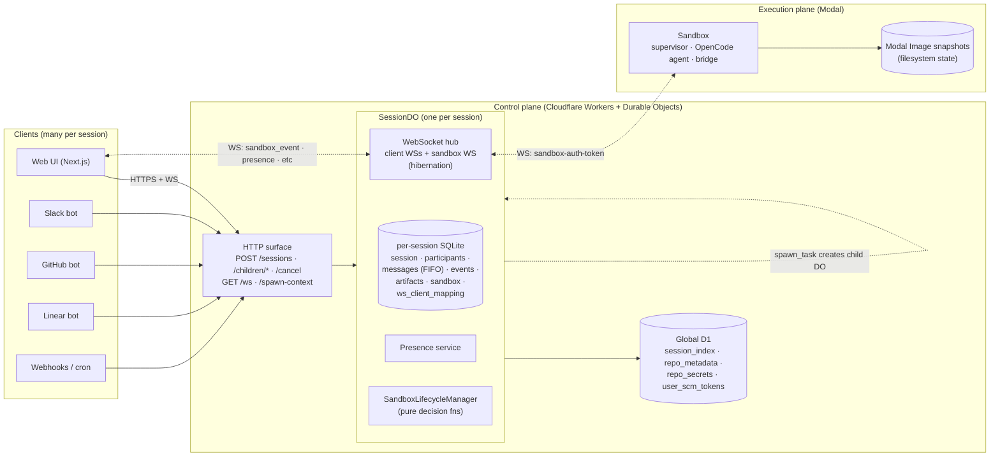

# Background Agents (Open-Inspect) Chat Architecture — Reference Notes

Research notes on how [Open-Inspect](./temp/background-agents) implements chat for background coding agents with multiplayer real-time collaboration. Written as background for the v2 chat transport rearchitecture (see `host-service-chat-architecture.md`, `v2-chat-greenfield-architecture.md`, and the companion `t3code-chat-architecture-reference.md` and `opencode-electron-chat-architecture-reference.md`). All paths below are relative to `temp/background-agents/` unless noted.

## TL;DR

Open-Inspect (inspired by Ramp's Inspect) is the most directly relevant reference architecture for what we're building. It uses **Cloudflare Durable Objects as the control plane** — one DO per session holding per-session SQLite, a WebSocket hub, and a FIFO prompt queue — and **Modal sandboxes as the execution plane**. Multiple humans can collaborate on one session in real time: every connected client subscribes to the same DO, the DO broadcasts events, and a small participant-presence service keeps everyone aware of who's there. WebSocket hibernation makes thousands of idle sessions cheap. Sessions can spawn child sessions into separate sandboxes. Input can originate from the web UI, Slack, GitHub, Linear, or webhooks — they all converge on the same session DO. This is **exactly the DO-based architecture I proposed as P5 of our plan, already built, production-style.**

## Architecture diagram

```
┌──────────────────────────┐       ┌─────────────────────────────────┐       ┌─────────────────────┐
│  Clients (many per       │       │  Control plane                  │       │  Execution plane    │
│  session, many types)    │       │  Cloudflare Workers + DO        │       │  Modal sandbox      │
├──────────────────────────┤       ├─────────────────────────────────┤       ├─────────────────────┤
│                          │       │                                 │       │                     │
│  Web UI                  │       │  SessionDO  (one per session)   │       │  supervisor         │
│  (Next.js + React)       │────┐  │  ┌──────────────────────────┐   │       │  ├─ entrypoint.py   │
│                          │    │  │  │ per-session SQLite       │   │       │  ├─ OpenCode agent  │
│  Slack bot               │────┼─▶│  │   session · participants │   │   ┌──▶│  └─ bridge          │
│                          │    │  │  │   messages (FIFO queue)  │   │   │   │     (WS back)      │
│  GitHub bot (PR hooks)   │────┤  │  │   events (indexed stream)│   │   │   │                     │
│                          │    │  │  │   artifacts · sandbox    │   │   │   │  filesystem:       │
│  Linear bot              │────┤  │  │   ws_client_mapping      │   │   │   │   workspace +      │
│                          │    │  │  └──────────────────────────┘   │   │   │   dev environment  │
│  Webhooks / cron         │────┘  │                                 │   │   │                     │
│                          │       │  WebSocket hub (hibernation)    │◀──┼───│  emits:            │
│  ────────────────────────│       │   many client WS +              │   │   │   token events    │
│                          │       │   one sandbox WS per session    │   │   │   tool-call events│
│  open a session:         │       │                                 │   │   │   step-finish     │
│    POST /sessions        │─────▶ │  HTTP surface:                  │───┘   │   cost · errors   │
│    (web / bot / hook)    │       │   POST /sessions                │       │                     │
│                          │       │   POST /sessions/:id/ws-token   │       │                     │
│  join its stream:        │       │   GET  /sessions/:id/ws         │       │                     │
│    GET /sessions/:id/ws  │─────▶ │   POST /sessions/:id/children/* │       │                     │
│    (WS, hibernation tag) │       │   POST /sessions/:id/cancel     │       │                     │
│                          │       │   GET  /sessions/:id/spawn-ctx  │       │                     │
│                          │       │                                 │       │                     │
└──────────────────────────┘       └─────────────────────────────────┘       └─────────────────────┘
                                             │                                         ▲
                                             ▼                                         │
                                   ┌───────────────────┐                               │
                                   │  Global D1        │                               │
                                   │  session_index    │                               │
                                   │  repo_metadata    │                               │
                                   │  repo_secrets     │      Modal lifecycle: spawn,  │
                                   │  user_scm_tokens  │      ready, snapshot, stop,   │
                                   └───────────────────┘      restore-from-snapshot    │
                                                                                       │
                                             spawn_task (agent-initiated) ─────────────┘
                                             child session = new SessionDO + new sandbox

  Transports:
    • Client ↔ Control plane : HTTPS + WebSocket (with hibernation)
    • Control plane ↔ Sandbox: WebSocket (sandbox-auth-token handshake)
    • Control plane ↔ D1     : HTTP (global metadata, secrets, session index)
    • Sandbox ↔ git remote   : HTTPS (GitHub App token, ephemeral)
```

### Same thing as a Mermaid diagram



Solid arrows = requests. Dotted arrows = long-lived streaming connections.

## Topology

Three explicit tiers and the middle one is a Durable Object:

1. **Clients** — web, Slack, GitHub, Linear, webhooks. All converge on the same HTTP + WS surface.
2. **Control plane** — Cloudflare Workers routing requests to per-session Durable Objects. Each DO owns one session: its SQLite database, its WebSocket connections, its lifecycle state. Stateless D1 database underneath for global indexes and repo metadata.
3. **Execution plane** — Modal sandboxes. One sandbox per session (or per child session). Runs OpenCode agent inside a real dev environment. Connects back to its session's DO via WebSocket.

## Packages

- `shared/` — TypeScript types, auth utilities, session/spawn context shapes. Consumed by everything.
- `control-plane/` — Cloudflare Workers + Durable Objects. The brain. Hosts `SessionDO`.
- `web/` — Next.js 16 + React 19 app. Session UI, OAuth, dashboard, real-time streaming.
- `slack-bot/`, `github-bot/`, `linear-bot/` — Cloudflare Workers (Hono). Translate external events into control-plane HTTP calls.
- `modal-infra/` — Python 3.12 Modal app. Sandbox supervisor + OpenCode runner + bridge that talks to the session DO.
- `sandbox-runtime/` — Python. Shared sandbox utilities.
- `daytona-infra/` — alternative sandbox provider, less used. Modal is the default.
- `terraform/` — IaC for Cloudflare Workers, Vercel, Modal, D1 schema migrations. Production deployment model, not demo-ware.

## Control plane: Durable Objects

Every session is a `SessionDO` addressed by session ID. Each DO owns:

- **Per-session SQLite database** (lives inside the DO). Tables (`control-plane/src/session/schema.ts`):
  - `session` — repo, branch, model, status (`created | active | completed | failed | archived | cancelled`), cost.
  - `participants` — users present in this session with encrypted SCM tokens and `ws_auth_token` hashes.
  - `messages` — prompt queue, FIFO by insertion order.
  - `events` — sandbox events (tokens, tool calls, step-finish, errors). Indexed on `(created_at, id)` for cursor-paginated reads.
  - `artifacts` — PRs, screenshots, branch refs.
  - `sandbox` — current sandbox id, status, auth token, snapshot image id.
  - `ws_client_mapping` — stable `wsId → participantId` so hibernated WebSockets can be rehydrated.
- **Active WebSocket connections** — many client WSs + one sandbox WS per session.
- **Sandbox lifecycle state machine** — implemented as pure decision functions (`evaluateSpawnDecision`, `evaluateCircuitBreaker`, `evaluateInactivityTimeout`, `evaluateHeartbeatHealth` in `control-plane/src/sandbox/lifecycle/manager.ts`).

**Why DOs earn their keep here:**

- Single-threaded per session → no concurrency races inside one session.
- SQLite-backed storage → durable, survivable across deploys, supports range reads.
- WebSocket hibernation → sessions can be idle for hours with zero cost and wake instantly when a message arrives.
- Global addressability → a Slack bot in one Worker can route to the exact DO holding the session.

**Global state in D1** (regular Cloudflare D1, not per-session):

- `session_index` — list of all sessions, keyed by user_id, for dashboards.
- `repo_metadata` — descriptions, aliases, Slack channel associations.
- `repo_secrets` — AES-256-GCM encrypted environment variables per repo.
- `user_scm_tokens` — cached OAuth tokens with refresh logic.

## Transport: WebSocket with hibernation

One WS per client, plus one WS per sandbox, all terminating at the session's DO.

**Authentication flow:**

1. User OAuths against GitHub → gets user id and SCM token.
2. Client calls `POST /sessions/:id/ws-token` and receives a 24-hour JWT.
3. Client opens `GET /sessions/:id/ws` WebSocket.
4. Client sends `{ type: "subscribe", token, clientId }` as first message.
5. DO validates the token hash against `participants.ws_auth_token`, looks up the participant, tags the WS with `wsid:<clientId>` via `ctx.acceptWebSocket(ws, [tag])`, records the mapping in `ws_client_mapping`.
6. DO replies with `{ type: "subscribed", sessionId, state, artifacts, participantId, replay? }`.

After that, the WS is hibernation-eligible — the DO can sleep while the WS stays open.

**Client → server messages:**

- `ping` · `subscribe` · `prompt { content, model?, attachments? }` · `stop` · `typing` · `presence { status, cursor? }`

**Server → client messages:**

- `pong` · `subscribed { …, replay? }` · `sandbox_event { event }` · `presence_sync` · `presence_update` · `sandbox_spawning | sandbox_ready | sandbox_error` · `artifact_created` · `snapshot_saved` · `session_status` · `child_session_update` · `error`

**Hibernation recovery.** When the DO wakes after hibernation, it reads `ws_client_mapping` to re-associate each WS with its participant. No client action is required; the client is simply still subscribed.

## Session model

**One session = one piece of work tied to a repo.** Sessions are long-lived across client connections — you close your browser, come back tomorrow, the session is still there.

**Created via:** web (`POST /sessions`), Slack `@mention`, GitHub PR webhook, Linear issue assignment, or automation trigger. All converge on the same creation path that:

1. Generates session id.
2. Writes to `session_index` (global D1).
3. Creates the `SessionDO` and initializes its per-session SQLite.
4. Inserts the initial prompt into `messages` as `pending`.

**Status lifecycle:** `created → active → completed | failed | archived | cancelled`.

**Message queue.** Prompts go into the `messages` table with FIFO order. The DO processes one at a time. Concurrent `prompt` messages from two users on the same session just queue up — no dropping, no merge conflict.

## Multiplayer real-time collaboration

This is what makes Open-Inspect unusually relevant for us. Multiple humans can subscribe to the same session DO and see identical state in real time.

**Event broadcasting.** When the sandbox emits an event, the DO:

1. Persists it into the per-session `events` table.
2. Calls `forEachClientSocket("authenticated_only", ws => ws.send({ type: "sandbox_event", event }))`.

Every connected client sees the same stream in the same order. No per-client state, no reconciliation.

**Presence.** A `PresenceService` inside the DO maintains the roster of currently connected clients with last-seen timestamps and active/idle status. `presence_sync` on join hands a client the current roster; `presence_update` fans out on changes.

**Identity.** Each event carries `participantId`, `name`, `avatar`, derived from the `participants` table. Clients render messages with correct attribution regardless of which user typed them.

**Concurrency.** DOs are single-threaded per session — a Cloudflare platform guarantee. If User A and User B send prompts at the same moment, both hit the DO serially; both inserts go into `messages` in insertion order. The agent processes them one at a time. No CRDTs, no locks, no conflict resolution — the DO's single-threaded invariant does the work.

**Event replay on reconnect.** The `subscribed` reply to a re-joining client can include an optional `replay: { events, hasMore, cursor }` payload. The client catches up via cursor-paginated history, then joins the live stream. Cursor is `{ timestamp, id }` into the `events` table's index — the same shape any paginator would use.

**What this gets you.** A user starts a session on desktop, walks away, someone else on a phone opens the same session and sees the full history plus the live tail. Both can chime in; both see the other's messages. When the user gets back to desktop, they see both their and their colleague's contributions. No extra plumbing, no conflict resolution, no sync issues.

## Parallel sub-tasks (`spawn_task`)

An agent tool lets a running session spawn **child sessions** into separate sandboxes. Implemented as a typed tool the agent can call during a turn.

**Guardrails:**

- `MAX_SPAWN_DEPTH = 2` — children can't spawn children (prevents fork bombs).
- `MAX_CONCURRENT_CHILDREN = 5` — at most five running at once.
- `MAX_TOTAL_CHILDREN = 15` — lifetime per parent session.

**Mechanics:**

1. Parent agent calls `spawn_task({ title, prompt })`.
2. Control plane creates new session with `parent_session_id`, `spawn_source: "agent"`, `spawn_depth: parent.depth + 1`, inheriting repo/model/owner.
3. Child fetches `GET /sessions/:id/spawn-context` to get parent-owned SCM tokens and model config.
4. Child sandbox spins up, child DO enqueues the prompt, child runs independently.
5. Parent continues its own turn; it does not block on the child.
6. Child posts progress via `POST /sessions/:parent-id/children/:child-id` which the parent DO broadcasts as `child_session_update` to the parent's subscribers.
7. Parent agent can call `get_task_status` and `cancel_task` tools to poll or abort children.
8. Final merge (PRs, file changes) is explicit — the parent decides what to do with children's artifacts.

This is a non-trivial pattern. No CRDT, no automatic merging — just typed tools, a parent-child graph, and explicit coordination.

## Sandbox lifecycle (Modal)

Three startup modes, chosen by the lifecycle manager based on current state:

- **Fresh start:** spawn container → clone repo → run `.openinspect/setup.sh` → run `.openinspect/start.sh` → agent ready. Slowest (~30-300s).
- **Snapshot restore:** restore filesystem from Modal Image snapshot → `git pull` → run `start.sh` → agent ready. Usually <10s.
- **Repo image start:** use pre-built image → incremental `git pull` → `start.sh` → agent ready. Also fast.

**Snapshots** capture filesystem state and are taken after successful prompts, before inactivity timeout, or on explicit request. Stored as Modal Image IDs referenced from the `sandbox` row in per-session SQLite.

**Warming on typing.** When a client sends `{ type: "typing" }`, the control plane broadcasts `sandbox_warming` and begins spawning the sandbox speculatively. By the time the actual prompt arrives the sandbox is often ready. Hides cold-start latency.

**Lifecycle decisions are pure functions.** `evaluateSpawnDecision(state) → decision`, `evaluateCircuitBreaker(state) → decision`, etc., return discriminated-union results; the manager then performs side effects via injected dependencies. Easy to unit-test, easy to reason about.

## Entry point unification

All integrations terminate at the same `POST /sessions` + WebSocket surface. The session doesn't know whether a prompt came from Slack or the web — the message goes into the same `messages` queue.

**Callback notifications** for integrations that need a feedback loop: `CallbackNotificationService` dispatches async tasks (`ctx.waitUntil`) when the agent makes progress — a tool call, a PR creation, a completion — and the Slack/GitHub/Linear bot posts an update back to the original thread/PR/issue. These don't block the session and don't count against the prompt queue.

## Persistence

| Data | Location |
|---|---|
| Messages queue + history | Per-session SQLite in DO |
| Events stream | Per-session SQLite in DO, indexed on `(created_at, id)` |
| Participants + encrypted SCM tokens | Per-session SQLite in DO |
| Artifacts (PRs, screenshots) | Per-session SQLite + R2 for large media |
| Sandbox lifecycle state | Per-session SQLite in DO |
| WebSocket hibernation mapping | `ws_client_mapping` in per-session SQLite |
| Global session index | D1 (global) |
| Repo metadata + aliases | D1 |
| Repo secrets (encrypted) | D1 |
| User OAuth tokens (cached) | D1 |

Everything session-scoped is local to the DO. Everything shared is in D1. No Postgres, no Redis, no broker. Cloudflare's platform primitives carry it.

## Tool calls, approvals, interrupts

**Tool calls** emit `tool_call` events: `{ tool, args, callId, status: "running" | "completed" | "error" }`. Broadcast to all clients. No server-side approval step — tools execute immediately.

**Interrupts.** Client sends `{ type: "stop" }`. DO closes the sandbox WS, marks sandbox `stopped`, sets session status `cancelled`, broadcasts `session_status`.

**Approvals.** Not implemented. Would require adding a `pending` tool-call state with a client-originated approval message and a sandbox-side block. Achievable but not present.

## Auth / single-tenant model

Open-Inspect is **single-tenant by design** — "all users are trusted members of the same organization." One shared GitHub App installation per deployment, no per-user repo access validation, no tenant isolation.

**Token types:**

- **GitHub App token** (shared, ephemeral) — clone and push from sandbox.
- **User OAuth token** (per user) — PR creation and attribution. AES-256-GCM encrypted at rest in `participants`.
- **Sandbox auth token** — one per session; sandbox uses it to prove itself to the session DO.
- **WebSocket JWT** — one per client-session pair, 24h TTL.

**Why single-tenant?** The shared GitHub App model is the architectural shortcut that makes collaboration easy. Multi-tenant would require per-tenant GitHub App installations, access validation on session creation, and tenant isolation in the data model — none of which is here.

## Noteworthy patterns worth stealing

- **Durable Object per session as the whole "one owner per session + durable state + multi-subscriber fan-out" primitive in one building block.** This is the P5 architecture in my v2-chat plan, already built. No Postgres event table, no in-process pubsub, no LISTEN/NOTIFY — DOs give it to you.
- **WebSocket hibernation with `ws_client_mapping`.** Idle sessions cost nothing; reconnects are seamless; multi-device works without any special code.
- **Cursor-based event replay** (`{ timestamp, id }` paginator over the events table). Simple, indexed, works for any subscriber joining late.
- **FIFO prompt queue in SQL.** Concurrent prompts from multiple users queue cleanly; no race, no drop.
- **Pure decision functions for lifecycle.** Testable, easy to reason about, decoupled from I/O.
- **Presence as a first-class thing.** Not just "who's connected" but also status (active/idle), last-seen, role. Worth copying the shape if we ever add presence.
- **Speculative sandbox warming on typing.** Cheap UX win that hides a few hundred ms of cold-start every turn.
- **Entry-point unification at the HTTP layer.** One `POST /sessions`, many producers. Keeps the bot implementations skinny.
- **Pure-tool model for sub-task spawning.** The agent gets `spawn_task` / `get_task_status` / `cancel_task` as regular typed tools; parallelism is an agent-level concern, not an infrastructure one.

## Things that are fragile (or we'd do differently)

- **DO storage size cap.** SQLite per DO is 10 GB today. Per-session is fine but a very chatty session could bump into it. No eviction story visible.
- **24 h WS JWT with no auto-rotation.** Close code 4001 on expiry, and the web client's retry logic isn't obvious from the code — if a user leaves a tab open overnight, they likely have to re-auth.
- **D1 as the global session-index bottleneck.** SQLite under the hood; fine at low-to-mid scale, but high concurrent session creation could hit contention. Not a problem we'll face any time soon.
- **No approval flow.** Auto-approve-everything is a deliberate choice given sandboxes are ephemeral and scoped, but it means there's no building block for "ask the user before running this shell command."
- **Single-tenant assumption baked in.** Shared GitHub App + no per-user access validation is the explicit design. Fine for Ramp-shaped internal tools, not fine for a product with external users.
- **Snapshot failures are silent.** If a Modal snapshot fails, the next session pays a cold-start cost and nobody tells you.
- **Events are lost on session archival/deletion.** No long-term archival to object storage beyond media artifacts. If "audit this session from six months ago" becomes a requirement, we'd need to add it.
- **Sandbox runs OpenCode, period.** No provider abstraction inside the sandbox. If we ever want Claude Code or Codex inside Modal, it's another implementation in `modal-infra`, not a swap.

## Signal for our rearchitecture

Ranked by direct relevance:

1. **This is the DO-based P5 we were sketching, already running.** Same shape — one DO per session, per-session SQLite, WebSocket hub with hibernation, events table with cursor replay. The exact things I said DOs give you (single-threaded ordering, built-in fan-out, durable storage per session, cheap idle cost) are the exact things this uses.
2. **Multi-subscriber real-time is solved by "subscribe every client to the same DO and broadcast events."** No custom broker. If we ever want multi-user collaboration in a Superset workspace, the pattern transfers directly.
3. **Entry-point unification** — `POST /sessions` from web or a bot lands in the same session. For Superset this maps onto "session is a workspace thing, reachable from any client" — web, mobile, a hypothetical Slack bot — without special per-integration logic.
4. **Hibernation as a cost story.** Idle chat sessions are free (no running server). Important if we want to keep long-lived history accessible.
5. **FIFO prompt queue in SQL as the concurrency primitive.** Concurrent `sendMessage` from two devices? Both insert into the same table, agent picks up one at a time, no race. Much simpler than in-process per-session async queues.
6. **Cursor replay over a timestamped events table.** Same idea as our `replayEvents(fromSeq)` RPC — subtly different (timestamp+id pair vs monotonic seq). Their version has the advantage of not needing a separate counter; ours has the advantage that gap detection is a subtraction.
7. **Separation of control plane and execution plane.** Cloudflare DO for state + WebSocket, Modal for the sandbox. If we move toward cloud runtime, this split is the right shape: state layer stays tight and durable, execution layer is wherever the agent happens to run.

Things **not** to take directly:

- **Single-tenant shortcut.** Fine for them, not a fit for us.
- **Auto-approve everything.** We want disciplined typed approvals like t3code's.
- **OpenCode-only in the sandbox.** We have our own harness (Mastracode) and shouldn't replace it.
- **Cloudflare ecosystem lock-in** — a real cost to weigh even when adopting the *pattern*. Implementing the same shape over Node + Postgres is achievable; it's just more code than DOs give you for free.

The bigger meta-signal: **everything we've been sketching about cloud runtime + multi-device + multi-subscriber already has a concrete, running reference implementation here.** If we get to P5 of our plan and the decision is "Cloudflare DOs vs. rolling our own on Postgres," this repo is the argument for Cloudflare. It's not a prototype — it's a real system with bot integrations, parallel sub-tasks, presence, snapshots, and a Terraform deploy story.
