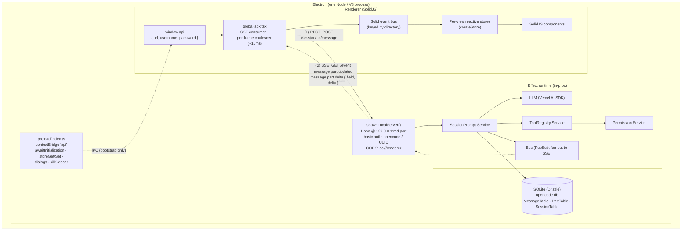

# OpenCode (Electron) Chat Architecture — Reference Notes

Research notes on how [OpenCode](./temp/opencode) wires chat inside its Electron desktop app. Written as background for the v2 chat transport rearchitecture (see `host-service-chat-architecture.md`, `chat-mastra-rebuild-execplan.md`, and the companion `t3code-chat-architecture-reference.md`). All paths below are relative to `temp/opencode/` unless noted.

## TL;DR

OpenCode runs its agent runtime **in the same Node process as the Electron main process**. On startup, main calls `spawnLocalServer()` which binds a Hono HTTP server to `127.0.0.1:<random-port>` with HTTP Basic auth (username `opencode`, password = a UUID generated per app launch). The renderer talks to that server over plain HTTP + **Server-Sent Events** — not IPC, not WebSockets. Writes are REST; reads are a single long-lived SSE subscription to a global event bus. Client state is SolidJS + a lightweight event bus; no Redux/Zustand. Partial assistant output streams as **`message.part.delta`** events (field + delta string) that the client applies token-by-token, coalesced to one flush per animation frame.

## Architecture diagram

```
┌────────────────────────── Electron (one Node / V8 process) ──────────────────────────┐
│                                                                                      │
│  ┌─────────────── MAIN ─────────────┐            ┌────────── RENDERER ──────────┐    │
│  │                                  │            │                              │    │
│  │  preload/index.ts                │            │  SolidJS app                 │    │
│  │  └─ contextBridge "api":         │            │                              │    │
│  │       awaitInitialization()  ────┼─ IPC ────▶ │  window.api                  │    │
│  │       storeGet / storeSet        │  (bootstrap│    { url, username, password }   │    │
│  │       dialogs, killSidecar       │   only)    │           │                  │    │
│  │                                  │            │           ▼                  │    │
│  │  spawnLocalServer()              │  ◀── REST ─│  global-sdk.tsx              │    │
│  │  └─ Hono @ 127.0.0.1:<rnd port>  │  ── SSE ──▶│    SSE consumer              │    │
│  │     basic auth: opencode / UUID  │            │    per-frame coalescer (~16ms)│   │
│  │     CORS: oc://renderer          │            │           │                  │    │
│  │           │                      │            │           ▼                  │    │
│  │           ▼                      │            │  Solid event bus             │    │
│  │  Effect runtime  (in-proc)       │            │   (keyed by directory)       │    │
│  │  └─ Bus  (PubSub, fan-out)       │            │           │                  │    │
│  │     SessionPrompt.Service        │            │           ▼                  │    │
│  │     Permission.Service           │            │  Per-view reactive stores    │    │
│  │     ToolRegistry.Service         │            │   (SolidJS createStore)      │    │
│  │     LLM  (Vercel AI SDK)         │            │           │                  │    │
│  │           │                      │            │           ▼                  │    │
│  │           ▼                      │            │  SolidJS components          │    │
│  │  SQLite  (Drizzle)               │            │                              │    │
│  │  └─ opencode.db                  │            │                              │    │
│  │       MessageTable · PartTable · │            │                              │    │
│  │       SessionTable               │            │                              │    │
│  │                                  │            │                              │    │
│  └──────────────────────────────────┘            └──────────────────────────────┘    │
│                                                                                      │
│  ───────────────── transport between the two halves (loopback) ─────────────────     │
│                                                                                      │
│  (1) REST  (write path)   POST /session/:sessionID/message                           │
│                           body:    PromptInput                                       │
│                           returns: MessageV2.WithParts  (final turn, synchronous)    │
│                                                                                      │
│  (2) SSE   (read path)    GET /event   (10s server heartbeat, 15s client timeout)    │
│                           data: { type: "message.part.updated", properties: {part}}  │
│                           data: { type: "message.part.delta",                        │
│                                   properties: { partID, field, delta } }             │
│                           data: { type: "session.updated", ... }                     │
│                           data: { type: "lsp.updated", ... }                         │
│                                                                                      │
└──────────────────────────────────────────────────────────────────────────────────────┘
```

Two things to notice. First, there is no process boundary between `spawnLocalServer()` and the rest of main — the "server" is just another Effect layer inside the same V8 isolate, not a child process or a separate binary. Second, the renderer never uses IPC for chat: bootstrap goes over `contextBridge`, but all message traffic rides the loopback HTTP interface with the basic-auth credentials handed to it at startup.

### Same thing as a Mermaid diagram



Solid arrows = request / command direction. Dotted arrows = server-pushed events or IPC bootstrap. The renderer's only IPC call is to pick up `{ url, username, password }`; everything chat-shaped rides REST and SSE over loopback.

## Topology

Three tiers, but only two processes:

1. **Electron main** — `packages/desktop-electron/src/main/index.ts`. Manages windows, lifecycle, IPC. Also hosts the agent server *in-process*.
2. **Sidecar server** — `packages/desktop-electron/src/main/server.ts::spawnLocalServer()` imports the Hono server from a virtual module (`virtual:opencode-server`) and calls `Server.listen()`. Not a child process; same Node runtime as main.
3. **Renderer** — `packages/desktop-electron/src/renderer/index.tsx`. SolidJS app. Talks to the sidecar over HTTP with credentials from the preload bridge.

Boundaries:

- `packages/opencode/src/server/server.ts` — the Hono server definition.
- `packages/desktop-electron/src/preload/index.ts` — `contextBridge.exposeInMainWorld("api", …)`. The only IPC surface is *bootstrap* (`awaitInitialization` returns `{ url, username, password }`, plus store get/set, dialogs, clipboard, `killSidecar`). Chat itself never goes through IPC.

Port is chosen dynamically (TCP port 0, OS picks). CORS on the server is restricted to the custom scheme `oc://renderer`. Main waits on `GET /global/health` in a ~100 ms poll loop before allowing the renderer to finish initialization (`main/index.ts` ~145-196).

## Transport

Two channels:

- **REST (request/response)** — session CRUD, message listing, metadata, and *sending* a user message. The key endpoint is `POST /session/:sessionID/message` (`packages/opencode/src/server/routes/instance/session.ts` ~846-891). It validates via Zod, calls `SessionPrompt.Service.prompt()`, and returns the final `MessageV2.WithParts` object. The handler *does* use Hono's `stream()` helper, but only calls `stream.write(JSON.stringify(msg))` once, after the turn completes — so functionally it behaves like a non-streamed JSON body. Real-time updates come over SSE, not over this stream.

- **SSE (server → client push)** — one global event stream at `GET /event` (`packages/opencode/src/server/routes/instance/event.ts`). Started once on app init in `packages/app/src/context/global-sdk.tsx` (~140). All state changes — message parts created/updated, session status, LSP, etc. — are published to the internal `Bus` and flushed to every connected SSE client.

SSE headers worth noting (`event.ts` ~36-38):

```
Cache-Control: no-cache, no-transform
X-Accel-Buffering: no
```

A 10 s server-side heartbeat (~51-58) keeps proxies from killing idle connections. Client treats >15 s of silence (`global-sdk.tsx` ~111) as dead and reconnects.

Effectively: **writes are REST, reads are one always-on SSE pipe**. There is no WebSocket, no tRPC, no polling.

## Server runtime

Built on **Effect** (Effect-ts) plus the **Vercel AI SDK**. Not Mastra, not a bespoke harness loop in the style of `packages/chat` in our repo.

Key services (all Effect Layers):

- `SessionPrompt.Service` — `packages/opencode/src/session/prompt.ts` (~80+). Exposes `prompt(input)` for a one-shot user→AI turn, `loop(input)` for the agentic multi-step loop, and defers cancellation to `SessionRunState.Service`.
- `ToolRegistry.Service` — tool definitions and dispatch.
- `Permission.Service` — gatekeeper for tool execution; emits events when approval is needed.
- `LLM` — wraps Vercel AI SDK for model calls.
- `Bus` — `packages/opencode/src/bus/index.ts`. A layer-based PubSub: one unbounded Effect `PubSub` per event type plus a wildcard channel. Every state change goes through it, and the SSE route subscribes to all.

The flow from `POST /session/.../message` is: parse → resolve session → hydrate history from SQLite → kick `SessionPrompt.prompt()` → Effect runtime drives the agent loop → each state change publishes events on the `Bus` → SSE fan-out pushes them to every connected renderer → server finally returns the terminal message on the REST response.

## Message / event model

The canonical shape is `MessageV2` (`packages/opencode/src/session/message-v2.ts`):

- Each message has `.info` (metadata) and `.parts[]`.
- Part kinds (the `type` discriminator on each part): `text`, `reasoning`, `file`, `agent`, `compaction`, `subtask`, `retry`, `step-start`, `step-finish`, `tool`, `snapshot`, `patch`. Tool calls and their results live on the single `tool` part, not a separate `tool_result` kind — the result is carried in a nested `state` field whose shape changes as the tool runs.

Two event types carry updates:

- **`message.part.updated`** — full `Part` object. Used for part creation, tool results, and final snapshots.
- **`message.part.delta`** (~602-611):
  ```ts
  {
    type: "message.part.delta",
    properties: { sessionID, messageID, partID, field, delta }
  }
  ```
  `field` is the part field being updated (typically `"text"`); `delta` is the string to append. This is how token streaming is expressed — not full text replacement, not a unified diff. Just `append(delta)` into `part[field]`.

A typical assistant turn looks like:

```
message.part.updated { part: { id, type: "text", text: "" } }
message.part.delta   { field: "text", delta: "Hello" }
message.part.delta   { field: "text", delta: " world" }
message.part.updated { part: { id, type: "text", text: "Hello world" } }
```

No global sequence numbers, no per-session counters. SSE ordering is the ordering guarantee. There is no `replayEvents` RPC and no gap detection on the client.

## Client state: SolidJS + event bus

No Redux, no Zustand, no central store. The renderer uses:

- **SolidJS** fine-grained reactivity with `createStore` for reactive objects.
- **Solid Query** (`@tanstack/solid-query`) for REST fetches (session lists, history hydration).
- **`@solid-primitives/event-bus`** for the event stream: `event.on(directory, listener)` / `event.listen(directory)` exposed from `global-sdk.tsx`.

On app init:

1. `useServer()` picks an active server (there can be several — the same renderer can attach to multiple).
2. `useGlobalSDK()` builds the SDK client and starts the SSE subscription.
3. SSE events are dispatched onto the event bus keyed by `directory` (project/worktree).
4. Session views subscribe to the bus for their directory and mutate reactive stores accordingly.
5. SolidJS picks up the reactive read and re-renders only the affected DOM nodes.

The pattern is unusual but coherent: each UI screen is its own little reducer over the event stream, keeping its own local reactive store. There is no global chat state object.

### Event coalescing

`global-sdk.tsx` (~54-95) batches incoming events by key and flushes once per animation frame (~16 ms). For a given `partID` field, intermediate deltas may be discarded if a full `message.part.updated` arrives before flush (~170-172). This keeps the UI smooth under high-frequency LLM token streams but is a place where an overeager renderer will miss intermediate states.

## Send flow, end-to-end

1. **Compose.** SolidJS composer captures text, attachments, context.
2. **REST call.** `sdk.session.prompt({ sessionID, parts: [{ type: "text", text: "hello" }] })` → `POST /session/{sessionID}/message`.
3. **Server accepts.** `session.ts` handler validates, loads history from SQLite, calls `SessionPrompt.Service.prompt()`.
4. **Agent loop runs.** `LLM.stream()` via the Vercel AI SDK drives token generation. For each incremental chunk, the loop publishes `PartDelta` to the `Bus`. Tool execution publishes `PartUpdated` events with tool-result parts.
5. **Fan-out.** The SSE route (`/event`) is already subscribed to the Bus; each event is serialized as `data: {...}\n\n`.
6. **Renderer consumes.** A `for await (const event of events.stream)` loop in `global-sdk.tsx` dispatches to the Solid event bus.
7. **Local reducers.** Page-level stores (session view, message list) update themselves reactively.
8. **SolidJS renders.** Fine-grained reactivity means only the affected DOM node updates.
9. **REST returns.** The original `POST /message` resolves with the final `MessageV2.WithParts`. The UI usually already reflects this state from the SSE stream by the time REST returns.

Note the ordering: the SSE stream is often *ahead of* the REST response. The REST call is effectively a synchronous "start this and wait for completion" with the real-time updates coming out-of-band.

## Tool approvals and interrupts

Approval *requests* ride the SSE bus; approval *replies* are a dedicated typed REST endpoint.

- When a tool is about to run, the agent loop consults `Permission.Service`. If the user hasn't allowed this tool, a permission event is published to the Bus and the agent loop blocks on the Effect primitive waiting for the user's response.
- Client sees the event via SSE, shows inline UI or a dialog, and submits the reply via `POST /permission/:requestID/reply` (`packages/opencode/src/server/routes/instance/permission.ts`, operationId `permission.reply`). Body shape: `{ reply: Permission.Reply, message?: string }`. `Permission.Service.reply({ requestID, reply, message })` resolves the blocked Effect.
- `GET /permission` (operationId `permission.list`) lets the client enumerate all pending approvals across sessions.
- Cancellation: `SessionRunState.Service.cancel(sessionID)` flips a cancellation flag; the agent loop checks it at natural boundaries and exits. The renderer calls this via the session API.

So the approval protocol is actually quite disciplined — it's a typed `(requestID, reply)` request/response, just carried on the REST side rather than in a single orchestration command stream like t3code's `thread.approval.respond`.

## Persistence

SQLite via Drizzle ORM.

- Drizzle schema at `packages/opencode/src/session/session.sql.ts`. SQL table names are lowercase (`session`, `message`, `part`); the TS exports are `SessionTable`, `MessageTable`, `PartTable`.
- `MessageTable` columns: `id`, `session_id`, `data` (JSON, typed as `InfoData` — role/streaming/etc. live inside the JSON blob), plus `Timestamps`.
- `PartTable` columns: `id`, `message_id`, `session_id`, `data` (JSON, typed as `PartData` — the part kind lives inside the JSON blob), plus `Timestamps`.
- `SessionTable` carries richer metadata: `id`, `project_id`, `workspace_id`, `parent_id`, `slug`, `directory`, `title`, `version`, `share_url`, summary counters, `revert` snapshot, permission ruleset, plus `Timestamps`.
- Path: `$XDG_DATA_HOME/opencode/opencode.db` (defaults under `~/.local/share/opencode/`).
- On app start, main ensures the file exists; `JsonMigration.run()` initializes or upgrades the schema (`main/index.ts` ~140-217).
- History is loaded on demand: `Session.list()` for the sidebar, `Session.get(sessionID)` hydrates a session with all its parts joined.

No event log, no projections, no replay. Once a `message.part.updated` commits, the prior deltas are forgotten. Deltas in flight during a crash are lost — the REST response is the commit boundary, not the individual SSE events.

## Reconnect and resumability

Minimal. The client simply reopens the SSE stream on failure:

- Retry loop with 250 ms delay (`global-sdk.tsx` ~201).
- 15 s heartbeat timeout; if no server event in that window the client aborts and reconnects.
- On reconnect, the client re-fetches message history via REST — there is no "resume from sequence N" mechanism. If the server crashed mid-turn, the turn is just gone.

This works because SQLite is the source of truth for completed messages and because users tolerate the occasional lost in-flight turn. It would not work in a collaborative setting where multiple clients share a session and need identical state.

## Electron-specific wiring

- **Preload** (`src/preload/index.ts`) exposes a minimal `api` via `contextBridge`. All chat traffic bypasses IPC; only bootstrap, settings, and platform features (dialogs, clipboard, notifications) cross the bridge.
- **Sidecar boot** (`src/main/server.ts::spawnLocalServer`, `src/main/index.ts` ~44-50):
  - Random port via `getSidecarPort()` (OS-assigned).
  - Server instance lives in the same V8 isolate as Electron main.
  - Password: random UUID generated per launch; handed to renderer via preload.
  - Health check: poll `GET /global/health` every ~100 ms until 200.
- **Custom protocol**: `oc://renderer` is registered and used as the sole allowed CORS origin. `opencode://` deep links are also registered for file associations and external launch URLs (`main/index.ts` ~114).
- **Shutdown**: `killSidecar` IPC handler triggers a graceful server stop on app quit.

## Noteworthy patterns

- **In-process sidecar.** Zero IPC overhead; the "server" is just another Effect layer running in the same process. Radically simple to deploy and reason about. Tradeoff: crash in main kills the runtime; no independent restart.
- **HTTP + single global SSE pipe.** One durable subscription for *all* state, filtered on the client by session/directory. Much simpler than per-resource subscriptions.
- **Delta events with a `field` selector.** Token streaming expressed as `append(delta)` into a named field on a part, rather than as token objects or diffs. The client's apply function is three lines.
- **Per-frame event coalescing (`~16 ms`).** Caps render cost regardless of server output rate.
- **Custom URL scheme as CORS origin.** Keeps the sidecar inaccessible from stray `http://localhost` origins even if the port leaked.
- **Effect-first codebase.** Services, DI, and error handling are all Effect; the same patterns compose from REST handlers down into LLM calls.

## Things that are fragile (or that we'd do differently)

- **No sequence numbers.** SSE ordering is the only ordering guarantee. A dropped event between heartbeats is silently lost; the client only self-heals by re-fetching history. For a local single-user app this is fine; for anything with multiple clients or mobile backgrounding it isn't.
- **No replay protocol.** Once the connection drops you refetch the whole session. Fine for small histories, rough for long agent sessions with many parts.
- **REST body is the final message.** The "send" call blocks until the turn completes. Any UI that doesn't already consume the SSE stream will look frozen during long turns.
- **Random-port + password in memory.** Elegant but means closing and reopening the window invalidates the credentials; everything downstream has to refetch them through the preload bridge. No way to share session with a second client process.
- **Delta coalescing can drop intermediate states.** If a full `message.part.updated` lands before the frame flush, pending deltas for that part are discarded. Usually what you want; occasionally surprising when debugging.
- **Approval transport is split across two channels.** Request events come over SSE; replies go over a separate REST endpoint (`POST /permission/:requestID/reply`). It's fully typed — not ad-hoc — but a client has to wire both sides independently, unlike t3code where request and reply are both commands/events on the same orchestration stream.

## Signal for our rearchitecture

Ranked by relevance to our current problem:

1. **Single global event stream, scoped on the client.** Similar to t3code's shell-plus-detail split. For our workspace-scoped chat, this would become one host-service subscription the client routes by session/workspace. This is the transport shape we probably want.
2. **Delta-as-append.** `{ field, delta }` is dead simple and avoids both token-object complexity and unified-diff complexity. Compare to t3code's unified-diff stream — OpenCode's is considerably cheaper to implement.
3. **REST write + SSE read.** If we don't want tRPC subscriptions on WebSockets, this is a viable alternative: keep mutations as plain tRPC queries/mutations and open one SSE endpoint for events. Host-service already has Hono; adding an SSE route is trivial.
4. **In-process sidecar architecture.** Close cousin of our host-service direction. Ours is explicitly a separate process for reasons (multi-client, mobile, web parity), but the *ownership* story is the same: one runtime, multiple subscribers.
5. **What NOT to take.** The lack of sequence numbers and replay. This is the main thing t3code does better and the main thing we need given our desktop/web/mobile story and reconnect requirements.
