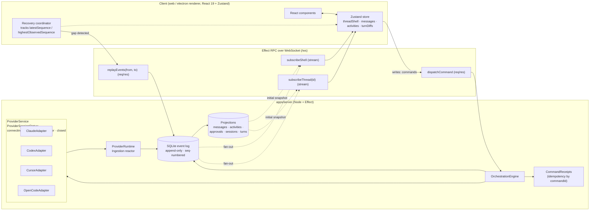
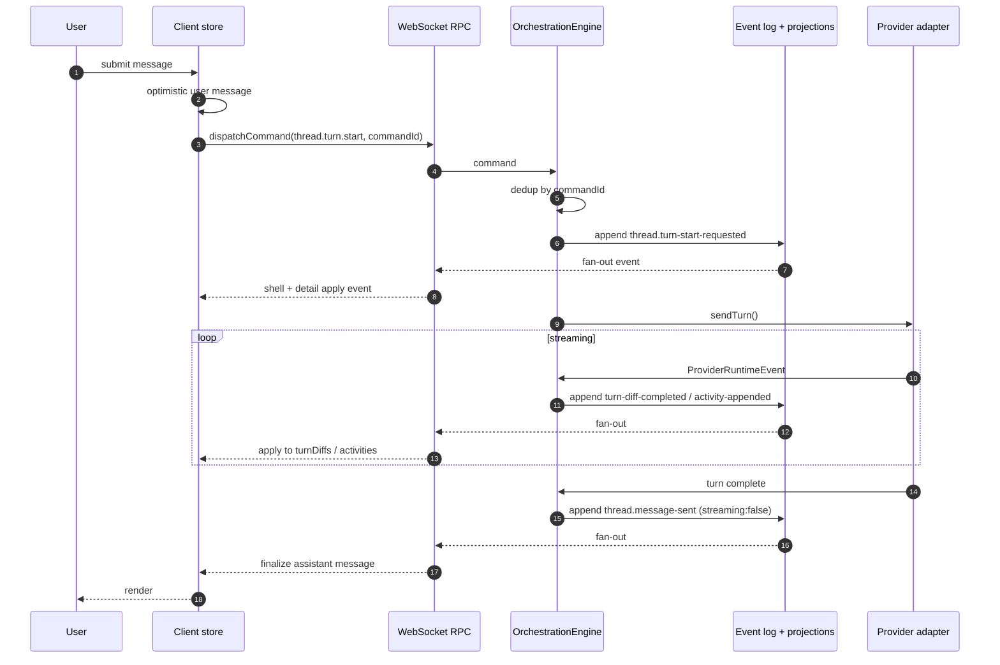

# T3 Code Chat Architecture — Reference Notes

Research notes on how [T3 Code](./temp/t3code) implements its chat system. Written as background for the v2 chat transport rearchitecture (see `host-service-chat-architecture.md` and `chat-mastra-rebuild-execplan.md`). All file paths below are relative to `temp/t3code/` unless noted.

## TL;DR

T3 Code is **event-sourced**. The server owns an append-only, sequence-numbered event log in SQLite. Clients connect via an **Effect-native WebSocket RPC** (not tRPC), open two long-lived subscriptions, and apply each event to a **Zustand store**. User actions are commands that dispatch through the same RPC; their effects come back as events. On reconnect, clients detect sequence gaps and call `replayEvents(from, to)` to catch up. There is no polling.

## Architecture diagram



Solid arrows = request / command direction. Dotted arrows = server-pushed events or snapshots. Note the two **independent** subscription streams (`subscribeShell` and `subscribeThread`): they both read from the same event log but the client treats them as disjoint writers into different regions of the store.

### Same thing in plain text

```
┌──────────────── CLIENT  (apps/web, apps/desktop renderer) ────────────────┐
│                                                                           │
│   React components                                                        │
│          ▲                                                                │
│          │                                                                │
│   Zustand store   (partitioned by which stream writes it)                 │
│     ├─ threadShellById / sidebarThreadSummaryById   ◀─ shell stream only  │
│     ├─ messageByThreadId / messageIdsByThreadId     ◀─ detail stream only │
│     ├─ activityIdsByThreadId                        ◀─ detail stream only │
│     └─ turnDiffSummaryByThreadId                    ◀─ detail stream only │
│          ▲                                                                │
│          │                                                                │
│   reducers:                                                               │
│     applyEnvironmentOrchestrationEvent(state, event, env)   per-event     │
│     syncServerThreadDetail(state, thread, env)              full snapshot │
│          ▲                                                                │
│          │                                                                │
│   createOrchestrationRecoveryCoordinator(...)                             │
│     latestSequence · highestObservedSequence                              │
│     classify each event: ignore / defer / recover / apply                 │
│                                                                           │
└──────┬────────────────────────────────────────────────────────────▲───────┘
       │                                                            │
       │ commands                                            events │
       ▼                                                            │
 ┌─────────────── Effect RPC over WebSocket  (/ws) ─────────────────────┐
 │                                                                      │
 │  (1) dispatchCommand          req/res  client → server               │
 │  (2) replayEvents(from, to)   req/res  client → server  (on gap)     │
 │  (3) subscribeShell           stream   server → client  (1 per conn) │
 │  (4) subscribeThread(id)      stream   server → client  (per open)   │
 │                                                                      │
 └────┬─────────────────────────────────────────────────────────▲───────┘
      │                                                         │
      ▼                                                         │
┌──────────────────── SERVER  (apps/server, Node + Effect) ──────────────────┐
│                                                                            │
│   ws.ts   (Effect RPC handler)                                             │
│      │                                                                     │
│      ▼                                                                     │
│   OrchestrationEngine                                                      │
│      ├─ CommandReceipts    (idempotency by commandId)                      │
│      │                                                                     │
│      ├──▶  SQLite event log  (append-only, global monotonic `sequence`)    │
│      │       ├─ thread.message-sent             { streaming: bool }        │
│      │       ├─ thread.turn-start-requested                                │
│      │       ├─ thread.turn-diff-completed      { diff: unified diff }     │
│      │       ├─ thread.activity-appended        (tool calls, errors, …)    │
│      │       ├─ thread.approval-response-requested                         │
│      │       ├─ thread.user-input-response-requested                       │
│      │       ├─ thread.session-set · thread.reverted                       │
│      │       └─ project.*                                                  │
│      │            │                                                        │
│      │            ▼                                                        │
│      │       Projections   (materialized reads in SQLite)                  │
│      │         projection_thread_messages   · …_activities                 │
│      │         projection_pending_approvals · …_thread_sessions            │
│      │         projection_thread_turns                                     │
│      │                                                                     │
│      └──▶  ProviderService    (per-thread ProviderSessionStatus:           │
│                                connecting · ready · running · error · closed)│
│             ├─ ClaudeAdapter                                               │
│             ├─ CodexAdapter                                                │
│             ├─ CursorAdapter                                               │
│             └─ OpenCodeAdapter                                             │
│                    │                                                       │
│                    ▼                                                       │
│            ProviderRuntimeIngestion                                        │
│              translates ProviderRuntimeEvent → orchestration events        │
│              and appends them back into the event log                      │
│                                                                            │
└────────────────────────────────────────────────────────────────────────────┘
```

## Topology

- `apps/server` — Node.js + Effect process. Single source of truth.
- `apps/web` — Vite/React client.
- `apps/desktop` — Electron shell around the web app.
- `packages/contracts` — shared schemas (events, commands, errors).
- `packages/client-runtime` — shared client wiring.

Both clients (web + desktop renderer) talk to the server the same way: one WebSocket to `/ws`. The server can back any number of concurrent clients on the same environment.

## Transport: Effect RPC over WebSocket

Not tRPC. T3 uses `effect/unstable/rpc` with `effect/unstable/socket/Socket`.

- Client: `apps/web/src/rpc/wsTransport.ts`, `apps/web/src/rpc/protocol.ts` (WS endpoint `/ws`, line ~46).
- Server: `apps/server/src/ws.ts`.
- Connection lifecycle / backoff: `apps/web/src/rpc/wsConnectionState.ts`.

The transport exposes two shapes:

1. **Request/response** — used for all write paths (e.g. `dispatchCommand`, `replayEvents`, `thread.approval.respond`).
2. **Subscriptions** — hot streams the server pushes to. Two are used in practice: `subscribeShell` and `subscribeThread(threadId)`.

Writes are commands the client pushes; reads are event streams the server pushes. The client never polls.

## Server runtime

Chat is agent-agnostic. The server does not use Mastra or the Vercel AI SDK. Instead, each supported agent has an adapter implementing `ProviderAdapter`:

- `apps/server/src/provider/Services/ProviderAdapter.ts` (interface)
- `apps/server/src/provider/Services/ClaudeAdapter.ts`
- `apps/server/src/provider/Services/CodexAdapter.ts`
- `apps/server/src/provider/Services/CursorAdapter.ts`
- `apps/server/src/provider/Services/OpenCodeAdapter.ts`

`ProviderService` (`apps/server/src/provider/Services/ProviderService.ts`) is a cross-provider facade. Per thread it owns a `ProviderSession` whose status is one of `connecting | ready | running | error | closed` (see `ProviderSessionStatus` in `packages/contracts/src/provider.ts` ~26-32). A command like `thread.turn.start` calls `sendTurn()` on the chosen provider, which runs the agent and produces a stream of `ProviderRuntimeEvent`s. Those are ingested and turned into orchestration events (see next section).

## The event log

The central abstraction. Every state change — user message, assistant message, approval request, approval response, tool call, plan upsert, session state transition, revert — is a single `OrchestrationEvent`:

```ts
// EventBaseFields — shared by every event in the union
{
  sequence:         NonNegativeInt          // monotonic, global
  eventId:          EventId
  aggregateKind:    "project" | "thread"
  aggregateId:      string
  occurredAt:       IsoDateTime
  commandId:        CommandId               // the command that produced this event
  causationEventId: EventId | null          // event that caused this one (if chained)
  correlationId:    CorrelationId           // groups a whole causal chain
  metadata:         { providerTurnId?, adapterKey?, ingestedAt?, requestId?, providerItemId?, ... }
}
// ...plus a type-specific discriminator and payload fields per event variant.
```

Schema: `packages/contracts/src/orchestration.ts` — `EventBaseFields` at ~945-955, event union at ~957+. Events are tagged structs (Effect `Schema.TaggedStruct` per variant), not a single `{ type, payload }` shape. There is no explicit `actor` field — the originating actor is inferred from `commandId` / `metadata`.

Key event types:

- `thread.message-sent` — user or assistant message added (assistant emits with `streaming: true` first, then `false` on completion).
- `thread.turn-start-requested` — turn initiated.
- `thread.turn-diff-completed` — streaming content delivered as a unified diff (see §streaming).
- `thread.activity-appended` — tool calls, errors, setup-script activity, etc.
- `thread.approval-response-requested` / `thread.approval.respond` — tool-call approvals.
- `thread.user-input-response-requested` / `thread.user-input.respond` — structured user input.
- `thread.proposed-plan-upserted` — plan generation.
- `thread.session-set` — FSM transitions.
- `thread.reverted` — revert to a checkpoint.
- Project events: `project.created`, `project.meta-updated`, `project.deleted`.

Events are **immutable** and append-only. Sequence numbers are globally monotonic, not per-session. This makes cross-thread ordering straightforward and replay trivial.

## Persistence

SQLite. One event table plus a handful of projection tables that are derived from it for fast reads:

- Event store interface: `apps/server/src/persistence/Services/OrchestrationEventStore.ts`.
- Projections:
  - `projection_thread_messages`
  - `projection_thread_activities`
  - `projection_pending_approvals`
  - `projection_thread_sessions`
  - `projection_thread_turns`

On startup (`serverRuntimeStartup.ts`) the server replays the log to rebuild the read models in memory. The shell stream is served from these projections so a freshly-connected client gets the computed sidebar state in one shot.

## Client state: Zustand + two streams

Store: `apps/web/src/store.ts` (~2k lines; state shape at ~40-90).

```ts
interface EnvironmentState {
  // Sidebar / session-level — written by shell stream
  threadShellById:           Record<ThreadId, ThreadShell>
  sidebarThreadSummaryById:  Record<ThreadId, SidebarThreadSummary>

  // Per-thread content — written only by detail stream
  messageIdsByThreadId:      Record<ThreadId, MessageId[]>
  messageByThreadId:         Record<ThreadId, Record<MessageId, ChatMessage>>
  activityIdsByThreadId:     Record<ThreadId, string[]>
  proposedPlanIdsByThreadId: Record<ThreadId, string[]>
  turnDiffSummaryByThreadId: Record<ThreadId, Record<TurnId, TurnDiffSummary>>

  bootstrapComplete: boolean
}
```

The client runs two independent subscriptions:

- **Shell stream** (`subscribeShell`) — one per connection. Broadcasts session state, sidebar summaries, and pending flags for every thread in the environment. Cheap and always-on.
- **Detail stream** (`subscribeThread(threadId)`) — one per currently-open thread. Delivers the full per-thread payload (messages, activities, turn diffs).

Convention (documented in the store-file architecture comment): only the detail stream writes to per-thread content fields, only the shell stream writes to sidebar summary fields. Both may write to `threadShellById` / `threadSessionById`, but writes go through `writeThreadState()` which does structural equality to avoid redundant re-renders.

This split is the thing that kills the race-condition class our current design has. The two streams don't fight for the same state, and cross-arriving events from the wrong stream are ignored by convention.

Reducers:

- `applyEnvironmentOrchestrationEvent(state, event, environmentId)` — per-event reducer for the shell stream.
- `syncServerThreadDetail(state, thread, environmentId)` — full-snapshot reducer for the detail stream; used on initial subscribe and on sequence-gap recovery.

## Message send flow, end-to-end



Primarily in `apps/web/src/components/ChatView.tsx` (around 2610+).

1. **Compose.** Client generates `messageId` and `commandId` (`newCommandId()`), inserts an optimistic user message into the store immediately.
2. **Dispatch.** RPC call `api.orchestration.dispatchCommand({ type: "thread.turn.start", threadId, message: { messageId, text, attachments }, modelSelection, titleSeed, runtimeMode, interactionMode, bootstrap?, createdAt })`. Note `messageId` / `text` / `attachments` are nested under `message`, not top-level on the command.
3. **Server accepts.** `apps/server/src/ws.ts` (~548) validates, deduplicates by `commandId` (see `OrchestrationCommandReceipts`), handles bootstrap (thread creation, worktree setup) if present, emits `thread.turn-start-requested`, routes to the provider adapter.
4. **Provider runs.** Adapter emits `ProviderRuntimeEvent`s. The ingestion reactor translates them into orchestration events: `thread.message-sent` (streaming), `thread.turn-diff-completed` (diffs), `thread.activity-appended` (tool calls), etc.
5. **Publish.** Events are appended to the event store, projections updated, pushed to all subscribers.
6. **Client applies.** Detail subscription gets the stream first (it's already open for the focused thread). Shell subscription updates the sidebar summary shortly after.
7. **Complete.** A final `thread.message-sent` with `streaming: false` is the authoritative terminal state for the assistant turn.

If `dispatchCommand` fails the optimistic message is rolled back and the composer is restored.

## Streaming assistant output

`thread.turn-diff-completed` carries a **unified diff** against the in-progress turn, not token deltas or full snapshots. Schema: `ThreadTurnDiff` in `packages/contracts/src/orchestration.ts` (~1100).

```ts
ThreadTurnDiff = TurnCountRange.mapFields(Struct.assign({
  threadId: ThreadId,
  diff:     Schema.String,   // unified diff
}))
```

The client accumulates diffs into `turnDiffSummaryByThreadId`. When the authoritative `thread.message-sent` with `streaming: false` lands, that becomes the source of truth and the in-progress diff buffer is reconciled.

The diff format keeps the wire size bounded even for long responses, which matters because the event log persists every event.

## Tool calls, approvals, interrupts

All in the same event stream. No side channels.

Agent-initiated request → `thread.approval-response-requested` or `thread.user-input-response-requested` event. Client derives pending-approval UI via `derivePendingApprovals` in `apps/web/src/session-logic.ts`.

User responds:

```ts
dispatchCommand({
  type:      "thread.approval.respond",
  threadId,
  requestId,
  decision:  "accept" | "decline" | "acceptForSession" | "cancel",
})
```

`ProviderService.respondToRequest()` routes the answer back to the adapter, which unblocks the agent or fails the turn.

Cancellation is `thread.turn.interrupt` → the provider session stops and emits `thread.session-stop-requested`.

## Reconnect and replay

Handled by `createOrchestrationRecoveryCoordinator` (a factory, not a class) in `apps/web/src/orchestrationRecovery.ts` (~88+). It returns a coordinator object that owns the recovery state.

Client tracks two cursors:

- `latestSequence` — highest sequence successfully applied.
- `highestObservedSequence` — highest sequence seen (may be ahead if events arrive out of order across the two streams).

Every incoming event is classified as `ignore | defer | recover | apply`. If a gap is detected, the coordinator calls the RPC `replayEvents(fromSequence, toSequence)` to fetch the missing slice, applies it, and drains the deferred queue.

Commands are idempotent by `CommandId` via the server-side `OrchestrationCommandReceipts` table, so retries on reconnect don't duplicate effects.

This is the pattern that lets t3 be rude with the network and still be correct.

## Things worth stealing

- **Single monotonic sequence per environment.** Makes gap detection a subtraction.
- **Command IDs with server-side dedup.** Retries are free.
- **Dual stream (shell + detail) with a written-by-who convention.** Removes the race between session-level state and per-thread content that `getDisplayState()` + `listMessages()` causes today. This is the single highest-value idea.
- **Diff-based streaming in the event log.** Bounded wire size, full auditability.
- **Projections as a pattern, not just a perf trick.** Keeps the client's initial render cheap without coupling clients to the log shape.
- **One event type for approvals / questions / tool calls.** Not a side channel.
- **Explicit provider status (`connecting | ready | running | error | closed`).** Makes "is the agent running" a boolean derived from one field, not an inference across two polls.
- **Causation + correlation IDs on every event.** `causationEventId` chains events back to the event that spawned them; `correlationId` groups a whole causal chain (e.g. a turn). Useful for debugging and for ordering beyond bare sequence numbers.

## Things to approach carefully

- **Effect RPC.** Nice ergonomics for t3, but we're already tRPC-shaped. Porting the *patterns* (subscriptions, sequenced events, replay RPC) to tRPC subscriptions over WS gets us 90% of the value without switching RPC systems.
- **Event-sourced everything.** t3 pays a persistence cost on every state change. For us, only the *transport* race needs fixing; whether the chat store becomes fully event-sourced on disk is a separate question from whether the wire protocol is event-driven.
- **Global sequence vs per-session sequence.** Global is cleaner for multi-thread clients (sidebars), but per-session is simpler to implement on top of the existing harness subscription. Pick one and commit.
- **Unified-diff streaming format.** Clever, but requires a diff library on client and server and adds complexity vs. "emit a `message_updated` event with latest full content." Worth it only if we care about wire size for very long turns.
