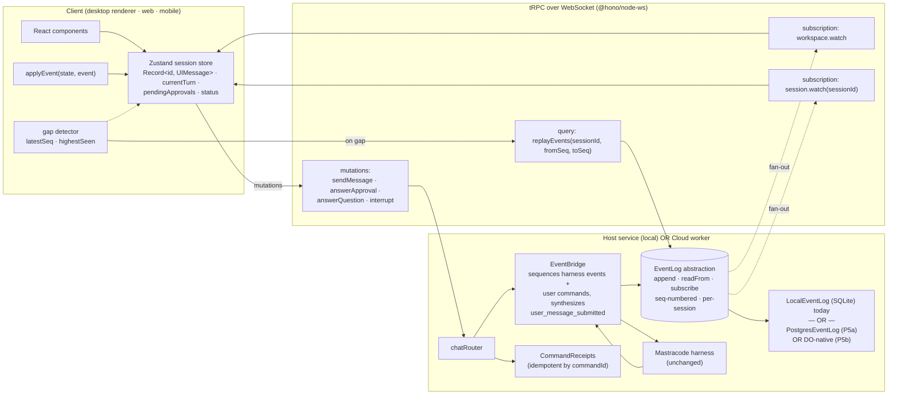
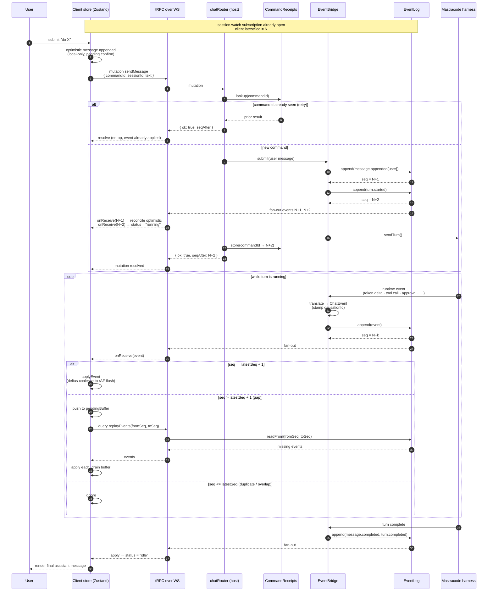

# V2 Chat — Greenfield Architecture Proposal

Proposed transport + state architecture for v2 chat. Builds on `host-service-chat-architecture.md` and `chat-mastra-rebuild-execplan.md`, and takes specific patterns from `t3code-chat-architecture-reference.md`, `opencode-electron-chat-architecture-reference.md`, and `background-agents-chat-architecture-reference.md`. Starting point is the current v2 chat in `packages/chat` + `packages/host-service`, which polls `getDisplayState()` and `listMessages()` at 4 fps from two independent harness sources — that's the thing this proposal replaces.

## Goals

1. **Kill the polling race.** Single server-side source of truth per session; client reducer applies events in order.
2. **Keep the wire protocol stable across runtime locations.** Same `ChatEvent` shape whether the runtime is the user's laptop host-service or a cloud worker spun up for handoff.
3. **Support multi-device + multi-client on the same session.** A session opened on desktop, web, and mobile simultaneously must converge to identical state.
4. **Enable device handoff at turn boundaries.** Close laptop → continue on phone → return to laptop, with a cloud worker picking up in between. Mid-turn handoff is explicitly out of scope (see §P7).
5. **Host-service keeps owning the agent runtime and filesystem.** No change to the `host-service-chat-architecture.md` direction of travel — this is the *transport + state* layer that sits above it. (In the P5b DO path, host-service's authority scopes *down* slightly, see §Cloud-backed EventLog.)
6. **Reuse what we have.** tRPC everywhere, `@hono/node-ws` already in host-service, Zustand already in the dep tree.

## Non-goals

- Not migrating off tRPC. t3code's Effect-RPC is nice but the wire shape is what matters; we can get 90% of the value with tRPC subscriptions.
- Not replacing Mastracode. The harness stays — we wrap its event subscription, we don't rewrite the agent loop.
- Not event-sourcing the whole database. The *transport* is event-driven; persistence strategy is a separate decision (see §Persistence).
- Not inventing a new message shape. We already use Vercel AI SDK v6's `UIMessage` and its part types (`TextUIPart`, `ReasoningUIPart`, `ToolUIPart`, `FileUIPart`) throughout the chat UI — `ai-elements` renders them directly. We keep that as the canonical message shape.
- Not adopting `useChat` from `@ai-sdk/react`. It's built for client-initiated single-subscriber request/response. Our model is multi-subscriber, event-driven, with replay and approvals — outside its vocabulary.

## Recommended architecture



The five load-bearing ideas, each earned from the reference docs:

1. **Event log as the single source of truth.** Per-session, append-only, monotonically numbered. Both `getDisplayState()` and `listMessages()` become *projections of the log*, not independent queries. — from t3code.
2. **Append-style streaming deltas.** `{ messageId, partIndex, field, delta }` → client applies `messages[id].parts[i][field] += delta`. No unified diffs, no token objects. — from opencode.
3. **Dual subscription scope.** One workspace-wide stream for session summaries (sidebar), one per-session stream for message content. Each region of client state is written by exactly one stream. — from t3code.
4. **Command IDs + server dedup.** Mutations are idempotent by `commandId`; retries on reconnect don't duplicate effects. — from t3code.
5. **Gap detection + `replayEvents` RPC.** Client tracks `latestSeq` / `highestSeen`; on gap, fetch the slice. Non-negotiable for multi-device. — from t3code.

And the four load-bearing things *we* add:

6. **`EventLog` as an abstract interface** — swappable backend: local ring buffer + SQLite snapshot today, `s2.dev` durable stream tomorrow, without changing a line of client or router code.
7. **Writes stay as tRPC mutations.** No subscription-based commands. Everything the user does is a regular typed mutation that returns fast; its effect shows up as events on the subscription.
8. **Single session reducer per open session** (not a monolithic global store). Multiple sessions = multiple stores — keeps memory bounded and reducers small.
9. **`UIMessage` on the wire, our reducer on top.** Event payloads carry `UIMessage` and AI SDK part types verbatim. The reducer is ~150 lines of Zustand over a `Record<MessageId, UIMessage>`. `ai-elements` renders the result unchanged. No translation layer between wire and render.

## Wire protocol

### Events (server → client)

Every event conforms to a base envelope, then a discriminated payload. Message and part shapes are AI SDK v6's `UIMessage` and its part union (`TextUIPart | ReasoningUIPart | ToolUIPart | FileUIPart | ...`) — not a custom type.

```ts
import type { UIMessage } from "ai"
// UIMessage["parts"][number] is the canonical part union from AI SDK v6.
type UIPart = UIMessage["parts"][number]

type ChatEvent = {
  seq:            number        // monotonic per sessionId, gaps possible after replay
  eventId:        string
  sessionId:      SessionId
  workspaceId:    WorkspaceId
  occurredAt:     string        // ISO
  commandId:      CommandId | null   // null for harness-internal events
  causationId:    string | null      // event that caused this, for tracing
} & EventPayload

type EventPayload =
  // Message lifecycle — uses UIMessage verbatim
  | { type: "message.appended";       message: UIMessage }                               // full message added (user msg, assistant msg shell)
  | { type: "message.part.appended";  messageId: UIMessage["id"]; partIndex: number; part: UIPart }   // new part on an existing message
  | { type: "message.part.delta";     messageId: UIMessage["id"]; partIndex: number; field: "text" | "reasoning"; delta: string }  // append into part[field]
  | { type: "message.part.updated";   messageId: UIMessage["id"]; partIndex: number; part: UIPart }   // replace a part wholesale (tool state transitions, final snapshots)
  | { type: "message.completed";      messageId: UIMessage["id"] }
  // Turn lifecycle
  | { type: "turn.started";           turnId: TurnId }
  | { type: "turn.completed";         turnId: TurnId; status: "ok" | "error" | "cancelled" }
  // Approvals / questions (out-of-band requests from the agent)
  | { type: "approval.requested";     requestId: ApprovalId; tool: string; args: unknown }
  | { type: "question.requested";     requestId: QuestionId; prompt: string }
  // Session status — projection of turn/approval state, exposed for convenience
  | { type: "status.changed";         status: "idle" | "running" | "waiting" | "error" }
  | { type: "error";                  error: ChatError }
```

Notes on the AI-SDK-aligned choices:

- **`messageId` + `partIndex`** — `UIMessage.parts` is an ordered array, so parts are identified by position within a message, matching how `ai-elements` renders them. If we later need a stable `PartId` we can add it in `UIPart.metadata`, but it's not needed for the reducer to work.
- **`message.part.delta` uses `field: "text" | "reasoning"`** — both `TextUIPart` and `ReasoningUIPart` expose a string body that deltas append to. Tool parts (`ToolUIPart`) don't stream via delta — they emit `message.part.updated` events as their `state` transitions (`input-streaming → input-available → output-available | output-error`), which matches AI SDK v6's own tool state machine.
- **`message.appended` carries the full `UIMessage`** — cheap and unambiguous for initial user message insertion or for snapshot replay. Subsequent streaming uses `part.appended` / `part.delta` / `part.updated` to avoid re-sending the whole message.

`seq` is per-session. Using per-session (not global) because:
- The harness emits per-session already; adding a global counter introduces a cross-session lock.
- Multi-device replay is always scoped to one session anyway.
- Matches s2.dev's per-stream sequence model cleanly.

Workspace-level events (`session.created`, `session.metadata.changed`, `session.deleted`) ride a *separate* per-workspace log with its own `seq`. Analogous to t3code's shell vs detail split.

### Commands (client → server, tRPC mutations)

```ts
chat.session.sendMessage({ commandId, sessionId, text, attachments? })
chat.session.answerApproval({ commandId, sessionId, requestId, reply: "accept" | "acceptForSession" | "decline" | "cancel", message? })
chat.session.answerQuestion({ commandId, sessionId, requestId, answer: string })
chat.session.interrupt({ commandId, sessionId })
```

Every command carries a client-generated `commandId` (ULID). Server checks `CommandReceipts` before acting — retries after reconnect are free. The returned value is trivial (`{ ok: true, seqAfter }`) so the UI doesn't depend on it; all real state arrives on the subscription.

### Subscriptions

```ts
chat.workspace.watch(workspaceId) -> stream of WorkspaceEvent     // sidebar
chat.session.watch({ sessionId, sinceSeq? }) -> stream of ChatEvent // open chat
```

`sinceSeq` is optional. If omitted, server sends a `snapshot` envelope first (`{ snapshot: ProjectedState, seqAfter: number }`), then live events. If `sinceSeq` is passed and is still in the server's replay window, server streams from there. If it's older than the window, server falls back to snapshot.

### Replay

```ts
chat.session.replayEvents({ sessionId, fromSeq, toSeq? }) -> ChatEvent[]
```

Called only when the client detects a gap (received `seq = N+2` while holding `latestSeq = N`). Subscription stream carries recent events; this query fills holes. Server implementation just reads the log.

## Client-side design

One Zustand store per currently-open session, plus one shared workspace store. Zustand is already the house pattern (direct dep in `packages/panes` and `apps/desktop`, ~20+ existing stores in `apps/desktop/src/renderer/stores/`), so no new primitives.

Store shape uses `UIMessage` directly so `ai-elements` can render it without translation:

```ts
import type { UIMessage } from "ai"

interface SessionState {
  status: "connecting" | "idle" | "running" | "waiting" | "error"
  messages: Record<UIMessage["id"], UIMessage>   // authoritative per-message state
  messageOrder: UIMessage["id"][]                // insertion order for rendering
  pendingApprovals: Record<ApprovalId, ApprovalRequest>
  pendingQuestions: Record<QuestionId, QuestionRequest>
  currentTurn: { turnId: TurnId; messageId: UIMessage["id"] } | null
  latestSeq: number
  highestSeen: number
  pendingBuffer: ChatEvent[]   // events received out of order
}

const useSessionStore = (sessionId: SessionId) => create<SessionState & Actions>((set, get) => ({
  // ... initial state ...

  applyEvent(event: ChatEvent) {
    // Pure reducer. Switch on event.type:
    //   message.appended     → messages[id] = event.message, messageOrder.push(id)
    //   message.part.appended→ messages[id].parts[partIndex] = event.part
    //   message.part.delta   → messages[id].parts[partIndex][field] += event.delta
    //   message.part.updated → messages[id].parts[partIndex] = event.part   (tool state transitions)
    //   message.completed    → (nothing — message already reflects terminal state)
    //   turn.started/.completed → currentTurn = … / status = …
    //   approval.requested / question.requested → add to pendingApprovals / pendingQuestions
    //   status.changed       → status = event.status
  },

  onReceive(event: ChatEvent) {
    // 1. update highestSeen
    // 2. if seq == latestSeq + 1: apply, drain pendingBuffer
    // 3. if seq >  latestSeq + 1: push to pendingBuffer, fire chat.session.replayEvents
    // 4. if seq <= latestSeq:     ignore (duplicate / reconnect overlap)
  },
}))
```

Selectors replace `useChatDisplay`:

```ts
const messages = useSessionStore(sessionId, s => s.messageOrder.map(id => s.messages[id]))  // UIMessage[]
const isRunning = useSessionStore(sessionId, s => s.status === "running")
const pendingApproval = useSessionStore(sessionId, s => firstOf(s.pendingApprovals))
```

Because `messages` is already `UIMessage[]`, it flows straight into existing `ai-elements` components (`<Message from={m.role}>…</Message>`, `<ToolUIPart>`, etc.). No adapter layer.

This kills `withoutActiveTurnAssistantHistory` — the active assistant message is just the most-recent entry in `messages` whose parts are still mutating. There's no duplication between `currentMessage` and history to reconcile.

**Per-frame coalescing.** Borrow from opencode: if `message.part.delta` events arrive faster than the browser can render, batch them and flush once per `requestAnimationFrame`. For non-delta events, apply immediately. Straight in the `onReceive` path, not in the reducer.

**Why not `useChat` from `@ai-sdk/react`?** `useChat` holds `UIMessage[]` state and knows how to apply text deltas, but its mental model is "this client initiated this turn, this client owns the stream." Turns in our system can originate from another device; events arrive for approvals/questions/interrupts that `useChat` has no concept of; we need `sinceSeq` replay on reconnect; multiple open tabs share one session. Bending `useChat` to that model is strictly more work than owning the reducer — and the reducer over `UIMessage` is ~150 lines.

## Host-service side

`packages/host-service/src/runtime/chat/` grows an `EventBridge` alongside the existing `ChatRuntimeManager`:

```ts
interface EventLog<TEvent> {
  append(streamId: string, event: TEvent): Promise<{ seq: number }>
  readFrom(streamId: string, fromSeq: number, toSeq?: number): Promise<TEvent[]>
  subscribe(streamId: string, fromSeq?: number): AsyncIterable<TEvent>
}
```

Two implementations from day 1:
- `LocalEventLog` — in-memory ring buffer (N events or M minutes) with a SQLite durable backing store. Default.
- `S2EventLog` — `s2.dev` client (or whichever durable stream provider we pick). Swapped in via config when running against cloud.

The `EventBridge`:

1. Subscribes to `harness.subscribe()` for the session.
2. Translates raw harness events into typed `ChatEvent`s, adding `seq` (from the log) and `causationId`.
3. Appends to the `EventLog`.
4. Synthesizes `user_message_submitted` **before** calling the harness (fixes the gap called out in `chat-mastra-rebuild-execplan.md`), so user messages and assistant responses share the same ordering guarantee.
5. Serializes appends per session with an async queue — the bug call-out in the rebuild plan.

tRPC router changes:

- `chat.session.watch` becomes a `.subscription()` over WebSocket (host-service already has `@hono/node-ws`).
- `chat.session.replayEvents` is a regular query.
- Existing `chat.session.sendMessage` mutation wraps the `EventBridge` submission path with `CommandReceipts` dedup.
- `getDisplayState` and `listMessages` are **deleted**. If any internal code still needs a point-in-time snapshot, it reads from the projection (see §Persistence).

## Message send flow, end-to-end



Reading notes:

- **Steps 1-3.** Optimistic user message lands in the store immediately — no round-trip wait for the first pixel. It gets reconciled (not replaced) when the server-authored `message.appended` arrives at step 12 with the real `seq` and server-authored `messageId`.
- **Steps 4-7.** `commandId` dedup makes the whole mutation idempotent. A flaky network can retry `sendMessage` all day; the server runs the turn exactly once.
- **Steps 13 onwards.** The subscription is the hot path for everything that happens after submission. The mutation's `{ ok: true, seqAfter }` return is a hint, not the data; the UI never blocks on it.
- **Gap branch (step 22-27).** This is the reconnect / out-of-order-delivery path. Client detects `seq > latestSeq + 1`, buffers the new event, fetches the missing slice, applies in order. Same mechanism handles "backgrounded for 10 minutes, WS died" as "one dropped packet."
- **Tool approvals / user questions** follow the same loop — `approval.requested` is just another event on the stream. The user's reply is a separate `answerApproval` mutation (not shown), which produces an `approval.responded` event that unblocks the harness.

Every box outside of `Harness` is code we write. `Harness` is unchanged Mastracode.

## Persistence

The event log is the wire protocol. Storage is separate.

Short-term: SQLite table `chat_events (stream_id, seq, event_json, occurred_at)` with index on `(stream_id, seq)`. Projection tables (messages, sessions) rebuilt on startup by replaying the log, cached in memory for reads.

This mirrors t3code but lighter — we only need projections where we need fast server-side reads, not for every aggregate. The `messages` projection probably matters; `pendingApprovals` doesn't (keep it in memory).

Long-term (cloud): the `EventLog` interface gets a second implementation backed by a cloud-shared durable store (Postgres on Neon, by default), or alternatively the whole control plane moves to Cloudflare Durable Objects. Both are covered in detail below.

The *client* never sees persistence directly — it always talks to `EventLog` through the tRPC/WS surface.

## Cloud-backed `EventLog`: two paths

Once we want cross-device visibility (same session on laptop + phone simultaneously) or a cloud-hosted agent runtime, `LocalEventLog` on host-service's SQLite is no longer enough — the log has to be reachable from any process that might own a runtime or serve a subscription. We have two credible paths; they are genuinely different and worth choosing between with eyes open.

### Path A — Postgres-backed EventLog (`PostgresEventLog`)

Stay on the existing stack (Neon). Add one table and adapt the `EventLog` implementation:

```sql
CREATE TABLE chat_events (
  stream_id   TEXT NOT NULL,
  seq         BIGINT NOT NULL,
  event_json  JSONB NOT NULL,
  occurred_at TIMESTAMPTZ NOT NULL DEFAULT now(),
  PRIMARY KEY (stream_id, seq)
);
CREATE INDEX chat_events_stream_time_idx ON chat_events (stream_id, occurred_at);
```

- `append()` → `INSERT` + `pg_notify('chat_session_<sessionId>', ...)` for live fan-out.
- `readFrom()` → `SELECT WHERE stream_id = $1 AND seq BETWEEN $2 AND $3`.
- `subscribe()` → open a `LISTEN`, stream rows as they arrive. If many subscribers per host is painful, bounce through an in-process broadcaster per session.
- Per-session write ordering → an in-process async queue in whichever host-service or cloud worker currently owns the session's writes, plus a lease row in Postgres (`chat_session_ownership`) to prevent two processes racing on the same session.
- Command dedup → same `CommandReceipts` table we already have.

Who owns the `EventLog`:

- Host-service continues to own its sessions locally and writes events to both `LocalEventLog` (SQLite) and `PostgresEventLog` (for cross-device visibility).
- When host-service isn't reachable, a cloud worker can claim the lease and take over writes.

**What this buys:** cross-device read, cross-device replay, cloud-runtime handoff, and no new vendor. Everything builds on Neon, which is already in the stack.

**What you still build:**
- Lease-based session ownership across processes.
- Per-session write serialisation inside whichever process holds the lease.
- A subscription-fan-out tier (probably host-service's tRPC WS server, or a parallel cloud Node service).
- Idle-cost story: any Node process holding N WebSockets for idle sessions is paying to be idle.

### Path B — Durable Objects as the whole control plane

Adopt Cloudflare Workers + Durable Objects. The `EventLog` *and* the subscription transport *and* the session-ownership story all collapse into a single primitive: one DO per session.

```
Clients (phone / web / desktop renderer)
     │  WebSocket direct to SessionDO
     ▼
┌─────────────────────── Cloudflare ──────────────────────────┐
│                                                             │
│  Stateless Worker                                           │
│    auth · ws-token mint · routing                           │
│                                                             │
│  SessionDO (one per sessionId)                              │
│    SQLite storage (events · messages · command_receipts)    │
│    WebSocket hub (browsers + agent runtime)                 │
│    Single-threaded — ordering free, no locks                │
│    Hibernates when idle — near-zero cost per idle session   │
│                                                             │
│  WorkspaceDO (one per workspaceId)                          │
│    sidebar index + session-list events                      │
│                                                             │
│  D1 (global)                                                │
│    users · workspaces · session directory · encrypted creds │
└─────────────────────────────────────────────────────────────┘

Laptop host-service (unchanged filesystem + Mastracode ownership)
     ▲
     │  WebSocket connects to SessionDO as a "runtime participant"
     │  subscribes for user messages, runs turns, streams events back

Cloud runtime (Modal/Daytona/Fly container, spun up on handoff)
     ▲
     │  Same "runtime participant" role; same protocol
```

Shifts vs. Path A:

- Event log = the DO's per-session SQLite. No Postgres table for events.
- Transport = browsers connect WebSocket directly to the DO via a CF Worker. No host-service-hosted tRPC subscription server for chat.
- Session ownership = platform-guaranteed. Every request for `session/abc-123` goes to the same DO instance. No lease table.
- Per-session write serialisation = free. DOs are single-threaded.
- Fan-out = free. The DO owns the WebSockets and broadcasts natively.
- Idle cost = near-zero. DO hibernation holds WebSockets open while the compute sleeps.
- Host-service role = **downgrades from "source of truth + runtime" to "runtime participant only."** It connects to the SessionDO like any other client, listens for user messages, runs turns, streams events back. It no longer owns the chat event log; SessionDO does.
- Relay role = not used for chat (browsers hit DOs directly). Still used for filesystem tools and terminal.

**What this buys on top of Path A:**
- Multi-device fan-out as a platform feature (no custom broker).
- Ownership coordination as a platform feature (no lease protocol).
- Hibernation as a platform feature (thousands of idle sessions effectively free).
- Handoff between devices / runtimes is essentially free — both laptop and cloud worker just subscribe to the same SessionDO.
- Multiplayer (multiple humans in one session) is essentially free if ever wanted.

**What it costs:**
- **New cloud vendor.** Cloudflare enters the stack with its own deployment tooling (Wrangler), observability story, secrets model, and debugging surface.
- **Lock-in.** DOs are Cloudflare-specific. Portable to no other cloud without a rewrite.
- **Chat becomes cloud-dependent.** Host-service's local SQLite is no longer authoritative. Laptop-offline-but-chatting stops working unless we build a local-cache shadow layer. Most teams going DO-native accept this; it's a real regression worth being explicit about.
- **Agent still runs elsewhere.** DO CPU limits prevent Mastracode turns from running inside the DO. Runtime is still host-service (or cloud worker on handoff).

### Decision framing

The `EventLog` interface (defined in P0) fits both paths without modification, so nothing in P0-P4 is gated on which cloud path we pick. When we do pick:

- Path A (Postgres) is the default if we want to stay on our current vendors, are willing to write the ownership + fan-out + idle-cost code ourselves, and don't need the platform-level multi-device ergonomics DOs provide.
- Path B (DOs) is the default if we're open to Cloudflare in the stack and want to shave several piles of custom infrastructure in exchange for that lock-in.

Both are real choices. See §Phased migration — P5a and P5b — for what shipping each one actually involves.

## Phased migration

Phases are sequential. P0-P1 can interleave a little; P2 depends on P1; P3 depends on P2; P4 is pure cleanup; P5 is independent from P4 (can ship before or after).

### Blockers to resolve before P0

These are the three questions that will bite us if we skip them:

- [ ] **Decide `seq` ownership: in-memory counter vs. log-assigned.** Recommendation: log-assigned, returned from `append()`. Keeps `EventBridge` single-source and avoids a second counter to keep in sync.
- [ ] **Resolve provider credential scoping** for renderer ↔ host-service direct WS (the open question from `host-service-chat-architecture.md`). If we don't, P1 stalls.
- [ ] **Pick the event-type ownership location.** Recommendation: a new `packages/chat-protocol` (schema + TypeScript types only, no runtime) importable by host-service, renderer, mobile, and future cloud worker. Current `packages/trpc` is router-level, not protocol-level.

### P0 — Protocol & EventLog interface (server-side only, no wire changes)

**Goal:** define the contract and the local implementation, verified by a parity test against the current polling output.

- [ ] Create `packages/chat-protocol` with:
  - [ ] `ChatEvent` envelope type (seq, eventId, sessionId, workspaceId, occurredAt, commandId, causationId).
  - [ ] `EventPayload` union (using AI SDK `UIMessage` and its part types — no invented message types).
  - [ ] `WorkspaceEvent` union for the sidebar stream.
  - [ ] Command input schemas (`sendMessage`, `answerApproval`, `answerQuestion`, `interrupt`) with `commandId: string` required.
  - [ ] Zod schemas alongside TypeScript types (so tRPC inputs validate).
- [ ] Define `EventLog<T>` interface in `packages/chat-protocol`:
  - [ ] `append(streamId, event): Promise<{ seq }>`
  - [ ] `readFrom(streamId, fromSeq, toSeq?): Promise<T[]>`
  - [ ] `subscribe(streamId, fromSeq?): AsyncIterable<T>`
  - [ ] `snapshot(streamId): Promise<{ state, seq }>` — serves snapshot-on-subscribe.
- [ ] Implement `LocalEventLog` in `packages/host-service/src/runtime/chat/event-log/`:
  - [ ] In-memory ring buffer (default: last 500 events + 15 min, configurable).
  - [ ] SQLite durable backing table `chat_events(stream_id, seq, event_json, occurred_at)` via existing Drizzle setup.
  - [ ] `subscribe()` implemented as a hot async iterable with pull-based backpressure.
- [ ] Implement `EventBridge` in `packages/host-service/src/runtime/chat/`:
  - [ ] Wrap each `RuntimeSession`'s `harness.subscribe()` in a translator that produces typed `ChatEvent`s.
  - [ ] Per-session serialized async queue (fixes the ordering bug flagged in `chat-mastra-rebuild-execplan.md`).
  - [ ] Synthesize `user_message_submitted` / `message.appended` events *before* calling into the harness so the log ordering is deterministic.
  - [ ] Stamp `causationId` where a new event chains from an earlier one.
- [ ] Implement `CommandReceipts` in host-service:
  - [ ] SQLite table `command_receipts(command_id PK, session_id, result_seq, created_at)`.
  - [ ] Dedup middleware on mutations: if `commandId` exists, return the stored `{ ok: true, seqAfter }` without re-executing.
  - [ ] TTL sweep (e.g. 24h).
- [ ] Parity harness:
  - [ ] Test that runs a recorded session (user message → tool calls → assistant response) through `EventBridge`, then projects the resulting log through a reducer.
  - [ ] Asserts the projected state equals the current `getDisplayState()` + `listMessages()` output for the same inputs.

**Acceptance:** projection-from-log matches polling-output byte-for-byte on a corpus of ≥5 recorded sessions, including an approval flow and an interrupt.

### P1 — tRPC surface on host-service (transport, still no client changes)

**Goal:** expose the event log as typed tRPC subscriptions and replay query. Old polling procedures still work.

- [ ] Add tRPC subscription procedures in `packages/host-service/src/trpc/router/chat/`:
  - [ ] `chat.session.watch({ sessionId, sinceSeq? })` → `Observable<ChatEvent | SnapshotEnvelope>`.
  - [ ] `chat.workspace.watch({ workspaceId, sinceSeq? })` → `Observable<WorkspaceEvent | SnapshotEnvelope>`.
- [ ] Add the replay query:
  - [ ] `chat.session.replayEvents({ sessionId, fromSeq, toSeq? })` → `ChatEvent[]`.
- [ ] Wire subscriptions onto `@hono/node-ws` in host-service's app.ts (the terminal route already shows the pattern).
- [ ] Add typed mutations with `commandId` on every input:
  - [ ] `chat.session.sendMessage`
  - [ ] `chat.session.answerApproval`
  - [ ] `chat.session.answerQuestion`
  - [ ] `chat.session.interrupt`
  - Each wraps the equivalent existing mutation, adds `CommandReceipts` dedup, and returns `{ ok: true, seqAfter }`.
- [ ] Leave `getDisplayState` / `listMessages` intact for now.
- [ ] Write a Node test client (checked in under `packages/host-service/test/`):
  - [ ] Connects via WS, subscribes, sends `sendMessage`, asserts expected event sequence arrives.
  - [ ] Drops the WS mid-stream, reconnects with `sinceSeq`, asserts no duplicates and no gaps.
  - [ ] Simulates a gap (forces server to skip), asserts client-side replay call fills it.
  - [ ] Double-submits the same `commandId`, asserts only one effect.

**Acceptance:** test client green across all four scenarios. No existing chat code has changed.

### P2 — Client store, reducer, and gap detector (client-side, no UI swap yet)

**Goal:** everything a UI component would need to render chat off the event stream, shipped as a drop-in hook.

- [ ] Create `packages/chat/src/client/session-store/` (or similar; can also live in `apps/desktop/src/renderer/stores/chat-session/` if it stays desktop-only — recommend the package to keep web/mobile aligned):
  - [ ] Zustand store factory `createSessionStore(sessionId)` with the shape defined in §Client-side design.
  - [ ] Pure reducer `applyEvent(state, event)` covering every `EventPayload` variant. Use Immer or structural-clone helpers; keep it obviously pure.
  - [ ] `onReceive(event)` with gap detection (`seq vs latestSeq`), pendingBuffer, dedup on `seq <= latestSeq`.
  - [ ] Replay trigger: on gap, fires `chat.session.replayEvents`, applies result, drains buffer.
- [ ] Per-frame coalescer:
  - [ ] Batch `message.part.delta` events by `(messageId, partIndex, field)` and flush on `requestAnimationFrame`.
  - [ ] Non-delta events apply synchronously.
- [ ] Subscription hook `useChatSessionSubscription(sessionId)`:
  - [ ] Opens the tRPC subscription, wires events into `onReceive`.
  - [ ] Handles WS disconnect → reopen with `sinceSeq = latestSeq + 1`.
  - [ ] Surfaces `status: "connecting" | "live" | "replaying" | "error"` for UI affordances.
- [ ] Workspace store (analogous, smaller) for the sidebar.
- [ ] Compatibility shim `useChatDisplay_v2(sessionId)` that exposes the same selector keys today's `useChatDisplay` returns (`messages`, `isRunning`, `currentMessage`, etc.) — this makes P3 a flag flip rather than a rewrite.
- [ ] Unit tests:
  - [ ] Apply a recorded event stream to the reducer, snapshot the resulting state.
  - [ ] Fuzz: randomized ordering with one missing event, assert store converges to canonical state after replay.
  - [ ] Coalescer: 1000 deltas, assert at most 60 flushes per second.

**Acceptance:** reducer tests green; compatibility shim renders an identical `ChatPane` against a scripted event stream in a Storybook story.

### P3 — Swap UI consumers

**Goal:** chat in the app is driven by the event stream; old polling is gated off.

- [ ] Add a feature flag `chat.useEventStream` (off by default).
- [ ] Swap ChatPane in v2-workspace to use `useChatDisplay_v2` under the flag.
- [ ] Swap any other `useChatDisplay` consumers (grep: `apps/desktop/src/renderer/**/useChatDisplay`).
- [ ] Dogfood on the v2-chat-architecture branch for ≥1 week across desktop.
- [ ] QA matrix:
  - [ ] Golden path: send message, get response, render tokens.
  - [ ] Tool approval flow.
  - [ ] Mid-turn interrupt.
  - [ ] Reconnect during active turn.
  - [ ] Two windows open on the same session (should converge).
  - [ ] Rapid consecutive messages (no lost events).
- [ ] Flip the flag default to on once QA is green; keep the flag for two releases as an escape hatch.

**Acceptance:** no regressions in the chat QA matrix vs. current main for two full releases.

### P4 — Delete the old surface

**Goal:** one code path for chat, not two.

- [ ] Remove the `chat.useEventStream` flag (and any dead branches it gated).
- [ ] Delete `getDisplayState` and `listMessages` tRPC procedures.
- [ ] Delete `packages/chat/src/client/hooks/use-chat-display/`.
- [ ] Delete `withoutActiveTurnAssistantHistory` and related helpers.
- [ ] Delete the legacy surface in `packages/chat/src/server/trpc/service.ts` (the desktop-only tRPC service). Host-service is the only owner — this finishes Phase 3 of `host-service-chat-architecture.md`.
- [ ] Remove `@superset/chat/client/provider` re-exports that nothing else imports.
- [ ] Update `AGENTS.md` / relevant docs to point at the new surface.

**Acceptance:** zero references to the deleted surface in `apps/` or `packages/` (excluding `temp/`). CI green.

### P5 — Cloud-backed EventLog (pick A or B; independent of P4)

P5 is where cross-device visibility and cloud-runtime handoff become possible. Two alternative paths — choose one; they're not additive. See §Cloud-backed `EventLog` above for the comparison.

#### P5a — Postgres-backed EventLog (stay on current stack)

**Goal:** ship `PostgresEventLog` behind the existing `EventLog` interface so host-service and cloud processes can read/write the same session log.

- [ ] Add Drizzle migration for `chat_events(stream_id, seq, event_json, occurred_at)` with `PRIMARY KEY (stream_id, seq)` and a secondary index on `(stream_id, occurred_at)`.
- [ ] Add `chat_session_ownership(stream_id, owner_id, lease_expires_at)` for single-writer ownership.
- [ ] Implement `PostgresEventLog`:
  - [ ] `append` → INSERT + `pg_notify('chat_stream_' || stream_id, seq)`.
  - [ ] `readFrom` / `snapshot` → range SELECT.
  - [ ] `subscribe` → `LISTEN` + in-process fan-out to multiple local subscribers on the same process.
  - [ ] Ownership lease acquisition + heartbeat; lease-loss callback so the losing owner stops writing immediately.
- [ ] Dual-write for host-service: `LocalEventLog` stays the primary when host-service is reachable; `PostgresEventLog` mirrors events for cross-device visibility. (Alternative: make Postgres authoritative and drop `LocalEventLog` — simpler, but breaks laptop-offline chat.)
- [ ] Stand up a thin cloud "chat node" (small Fly / Cloudflare Worker service) that serves subscriptions to browsers when host-service is unreachable. Reads from `PostgresEventLog`; forwards writes to whichever process holds the lease.
- [ ] Per-environment config toggle for which `EventLog` implementation each process uses.
- [ ] Multi-device end-to-end test: desktop + web attached to the same session, events converge identically across both; simulated network partition on one device.
- [ ] Operational runbook: lease renewal, stuck-lease recovery, replay-window sizing, disaster recovery.
- [ ] Capacity / cost model: events per session per day × session count × retention window against Neon's pricing.

**Acceptance:** two clients on the same session converge to identical state after a scripted sequence with a simulated network partition on one side.

#### P5b — Durable-Objects-native control plane (Cloudflare)

**Goal:** replace the cloud subscription tier entirely by making each session live in its own Cloudflare Durable Object. Host-service becomes a runtime participant connecting to the DO instead of a source of truth.

- [ ] Stand up a new Cloudflare Workers deployment with Durable Objects bindings and a D1 database.
- [ ] Implement `SessionDO`:
  - [ ] SQLite storage (events, messages queue, command_receipts, participants, ws_client_mapping).
  - [ ] `fetch` handler for tRPC-style mutations (sendMessage, answerApproval, answerQuestion, interrupt).
  - [ ] `webSocketMessage` handler for live client messages (subscribe, prompt, stop, typing, presence).
  - [ ] Fan-out helper that iterates connected WSs on every event append.
  - [ ] Hibernation enabled; `ws_client_mapping` persists `wsId → participantId` for rehydration.
- [ ] Implement `WorkspaceDO` for per-workspace sidebar events.
- [ ] Implement `D1` schema for users, workspaces, session directory, encrypted credentials.
- [ ] Stateless auth Worker: validate OAuth / JWT, mint WS tokens (short TTL), route to the correct DO.
- [ ] Adapt host-service to connect to `SessionDO` as a runtime participant:
  - [ ] Open a long-lived WS with a runtime-auth-token (issued per-session).
  - [ ] Subscribe to user-message events; feed them to Mastracode.
  - [ ] Write harness events back to the DO via the same WS.
  - [ ] Handle "another runtime claimed this session" eviction gracefully.
- [ ] Adapt clients (browser, mobile) to open WebSockets directly to `SessionDO` via the Worker surface, not through host-service / the relay.
- [ ] Decide local-offline story: accept that chat requires cloud connectivity, OR ship a `LocalCacheEventLog` shadow layer that mirrors the DO to host-service's SQLite and serves reads when offline. Recommend starting with "accept cloud dependency" and adding local cache only if users push back.
- [ ] Migrate the chat portion of the relay out — browser traffic for chat stops going through the relay. Filesystem / terminal traffic stays on the relay.
- [ ] Multi-device end-to-end test: desktop + web + phone on the same session, convergent state, simulated partition, simulated laptop-off with cloud worker handoff.
- [ ] Operational runbook: DO storage limits, wrangler deploy process, observability + logging, secrets rotation, Cloudflare-specific failure modes.
- [ ] Capacity / cost model: request count × DO-hours × storage × egress.

**Acceptance:** same as P5a, plus one additional scenario: session active on laptop → laptop disconnects → phone continues seeing the event stream without any latency beyond DO wake-from-hibernation.

**Note on going from P5a to P5b later:** the `EventLog` interface is implementation-agnostic, so moving from Postgres to DOs *is* possible later, but it's not a drop-in swap — P5b specifically changes who owns the transport (browser connects direct to DO, not through host-service), which is a bigger shift than just swapping the storage. If there's any chance we'll go DO-native, pick it the first time through P5.

### P6 — Device handoff (turn-boundary + git courier)

**Goal:** when the primary runtime (laptop host-service) becomes unreachable, subsequent turns can be served by a cloud worker without losing session continuity or uncommitted work. Not mid-turn — turn-boundary only.

Depends on P5 (either P5a or P5b) — the event log has to be cloud-reachable.

- [ ] Add event types to the protocol:
  - [ ] `runtime_registered { runtimeId, kind: "host" | "cloud", capabilities }` — emitted when a runtime attaches to a session.
  - [ ] `runtime_unregistered { runtimeId, reason }` — emitted on graceful disconnect or heartbeat timeout.
  - [ ] `handoff_ready { branchName, commitSha, fromRuntimeId }` — emitted when a runtime stashes in-progress work for handoff.
  - [ ] `turn_interrupted { turnId, reason }` — emitted when a turn is abandoned mid-flight due to runtime loss.
- [ ] Runtime ownership protocol:
  - [ ] Only one `runtime_registered` is active per session at a time.
  - [ ] Ownership renewal via heartbeat events every N seconds.
  - [ ] New runtime can claim after heartbeat timeout + grace window.
- [ ] Laptop host-service handoff trigger:
  - [ ] On graceful shutdown (lid close via macOS power notification, quit, explicit "handoff" command): stage + commit dirty workspace files to `superset/handoff/<sessionId>`, push, emit `handoff_ready`.
  - [ ] On ungraceful loss (network drop + grace window expires): cloud coordinator declares the runtime dead, emits `turn_interrupted` if a turn was mid-flight.
- [ ] On-demand cloud runtime spawn:
  - [ ] Coordinator service watches sessions with pending user messages and no active runtime.
  - [ ] Spawns a Modal/Daytona/Fly-container sandbox, clones the repo, checks out the handoff branch (or `main` if no handoff branch), runs `.superset/setup.sh` if present.
  - [ ] New cloud runtime registers with the session via `runtime_registered`, picks up the pending message, runs the turn, streams events back.
- [ ] Return-to-laptop flow:
  - [ ] Host-service reconnects, sees later events in the log authored by a cloud runtime.
  - [ ] Pulls any ephemeral branches the cloud runtime pushed (e.g. `superset/cloud/<sessionId>/<turnId>`).
  - [ ] UI surface: "your session ran in the cloud while you were away; here's the diff — merge or discard?"
- [ ] Speculative runtime warming: when phone sends `typing` and no local runtime is reachable, emit a warming signal so the cloud coordinator starts spawning a sandbox speculatively. Hides cold-start latency.
- [ ] Honest limitations to document:
  - [ ] Mid-turn handoff not supported — interrupted turns are lost, user re-prompts.
  - [ ] Untracked / gitignored files are lost on handoff (only committed state travels).
  - [ ] Long-running processes (dev server, watch modes) started inside a turn don't survive the handoff.
- [ ] Tests: laptop-closes-mid-session convergence; return-to-laptop merge UX; simultaneous runtime-claim race; cloud runtime timeout + re-spawn.

**Acceptance:** user can close laptop mid-chat, continue from phone, see cloud-run turns land in real time, return to laptop and pull cloud-authored commits without conflict in the golden path.

### P7 (speculative) — Event-sourced agent for mid-turn handoff

Deliberately not in scope for the first pass. Covered in conversation because it keeps coming up.

Seamless mid-turn handoff requires the agent's in-flight state (LLM stream position, partially-applied tool results) to be reconstructible from the event log, which in turn requires the agent to emit *intent* events before acting and to be designed around replay-safe tools. That's a ~quarter-scale of work on top of P6 and produces a quality regression on re-prompted LLM streams. Worth revisiting only if long autonomous runs + device handoff become first-class product requirements.

### Summary timeline

Rough sizing (for a single engineer, not including meetings / reviews):

| Phase | Est. | Can parallelize? | Ships behind flag? |
|-------|------|------------------|--------------------|
| Blockers | 1-2 days | — | n/a |
| P0 | 1-2 weeks | No | n/a (no wire change) |
| P1 | 1 week | Partial with P0 end | n/a (additive) |
| P2 | 1-2 weeks | After P1 | n/a |
| P3 | 1 week + bake time | After P2 | Yes |
| P4 | 2-3 days | After P3 bake | n/a |
| P5a (Postgres) | 2-3 weeks | Any time after P2 | Yes (config) |
| P5b (Durable Objects) | 4-6 weeks | Any time after P2; mutually exclusive with P5a | Yes (config) |
| P6 (handoff) | 2-3 weeks | After P5 | Yes |
| P7 (event-sourced agent) | quarter-scale | Speculative / not on critical path | n/a |

P0-P4 is the critical path for killing the race condition and unblocking same-machine multi-window. P5 is where cross-device + cloud-runtime becomes possible; P5a and P5b are alternatives, not additive. P6 delivers the close-laptop-continue-on-phone handoff UX on top of whichever P5 path was chosen. P7 is explicitly not on the roadmap — listed so we don't accidentally rediscover why it's hard.

## Open questions

- **P5 path: Postgres or Durable Objects?** The single biggest deferred decision. Postgres keeps us on our current vendors and requires more custom infra (ownership leases, fan-out tier, idle-cost story). DOs replace several layers with platform primitives but bring Cloudflare into the stack and make chat cloud-dependent. Worth resolving before P5 starts, but not before — P0-P4 is the same either way.
- **Local-offline chat in the DO path.** If we go P5b, do we accept that chat requires internet, or build a `LocalCacheEventLog` shadow layer that mirrors the DO? Recommend starting without it and adding only if users surface friction.
- **Ownership of `commandId` dedup window.** Keep `CommandReceipts` in our own durable store regardless of P5 path — cleaner semantics, survives backend swaps, less magic.
- **Subscription granularity for workspace stream.** One subscription per workspace or one per user-across-workspaces? Recommend per-workspace — matches the current sidebar scope and keeps events small.
- **Backpressure.** If a slow client can't keep up with token deltas, do we drop, coalesce, or disconnect? Recommend server-side (or DO-side) ring-per-subscriber with coalesce-latest-wins on delta events, hard-drop on sustained overflow with an `error` event sent down the wire.
- **Mobile background reconnect.** When iOS backgrounds the app for 20 minutes, the WS dies. On resume: reopen + `sinceSeq` + replay. Should be free with this design, but worth an explicit test plan.
- **Provider credential scoping for renderer-direct connection.** The open question from `host-service-chat-architecture.md` still applies — if the renderer talks to host-service WS directly (P5a) or a DO directly (P5b), provider creds need to be scoped cleanly. Resolve before P1.
- **Handoff workspace state.** P6 uses git as the filesystem courier. Fine for committed state; what's our story for untracked files the agent wrote but hadn't committed? Options: auto-stash to a handoff branch, snapshot workspace to object storage, or accept the loss. Resolve before P6.

## Summary

tRPC subscriptions over the WebSocket we already have, wrapping an `EventLog` abstraction. `LocalEventLog` on SQLite for the local case. Two cloud options: **`PostgresEventLog` on Neon (P5a)** to stay on current vendors, or **Durable Objects (P5b)** to fold event log + subscription transport + session ownership + hibernation into one Cloudflare primitive at the cost of vendor lock-in. Per-session event streams with monotonic `seq`, `commandId`-keyed idempotent mutations, `replayEvents` on gap, and a Zustand reducer over `UIMessage` that applies events in order. Two subscription scopes — workspace for the sidebar, session for the open chat — each writing to a disjoint region of client state. On top of P5, a **P6 handoff flow** (turn-boundary, git as filesystem courier, on-demand cloud runtime) covers close-laptop-continue-on-phone. Mid-turn handoff is explicitly out of scope. Everything above is justification.
